# TradingWorkFlow (TWF)

# Broker Workspace Architecture

**Version 0.3 — Reviewed normative architecture, reconciled 2026-09-26; not Git-frozen**

Supersedes the supplied v0.2 Markdown. The DOCX is a synchronized v0.3 presentation
companion; this Markdown remains the normative source. Update both formats together
when this architecture changes.
[Independent review and reconciliation](TWF_BROKER_WORKSPACE_ARCHITECTURE_REVIEW.md)
records findings, repository evidence, deferrals and the bounded implementation gate.
GO means ready to implement section 34's synthetic foundation, not permission to
activate a real broker or live orders. Provider names and instrument examples are
illustrative; no provider API, permission, market-data licence or sandbox support
has been verified by this documentation review.

Repository evidence: HEAD `e3852d3` records TWF-1.6 acceptance and annotated tag
`twf-1-application-foundation` records TWF-1 acceptance. Entry documents were stale
at review start and are reconciled in this change. Historical implementation records
remain unchanged; UX-B1 is still partial and UX-B2/B3 are not completed.

> **Core invariants**
>
> 1. TWF supports multiple broker providers and multiple broker accounts concurrently; no permanent broker-count limit is hard-coded into architecture.
> 2. Each broker account is an isolated operational room. The Unified Broker Control Room may observe and aggregate across rooms, but it never performs ambiguous cross-broker execution.
> 3. TWF canonical instrument identities exist for reporting, search and aggregation. Live execution always resolves to the explicitly selected broker account and that broker's native instrument identity.
> 4. Broker-confirmed state is execution truth. TWF never converts a request into a successful order/position state until broker truth supports it.
> 5. Baseline TWF execution-safety checks protect order submission; TM later adds managed-trade governance and supervision. The two responsibilities must not be duplicated.
> 6. A failure, authentication expiry or degradation in one broker account must not disable unrelated broker accounts.

---

## 1. Executive Summary

The Broker Workspace is the first major user-value layer above the accepted TWF application foundation. Its purpose is to make TWF useful as a professional trading application even before Scanner, TI or advanced intelligence are connected.

A user should be able to configure supported brokers, connect one or many broker accounts, inspect broker-native dashboard information, holdings, positions, orders and funds, search the selected broker's own instrument master, maintain broker-specific executable watchlists, create and safely submit broker-scoped orders, and review a unified control-room summary across all active brokers.

The architecture deliberately separates **operational broker truth** from **analytical aggregation**. Zerodha, Dhan, Fyers or any future broker remain independent execution rooms. A unified dashboard can answer questions such as “What is my combined HAL exposure across brokers?” but it cannot issue an unqualified “Buy HAL” command. Any live order must be created inside a selected broker account and resolved to that broker's exact symbol/instrument identifier.

The Broker Workspace also introduces TWF canonical instrument identities. `KALYANJEWEL` identifies Kalyan Jewellers for TWF reporting irrespective of broker or exchange. `NSE:KALYANJEWEL` qualifies the exchange listing. `ZERODHA:NSE:KALYANJEWEL` qualifies the broker-facing TWF reference. Execution still uses the actual Zerodha-native symbol/token stored in an explicit broker-instrument binding.

The architecture is broker-neutral in its common domain contracts but does not pretend all brokers are identical. Provider manifests describe authentication, capabilities, schema, supported segments and operational characteristics. Broker-specific behavior lives in adapters; TWF UX and workflows consume normalized domain models and capabilities.

---

## 2. Scope and Product Intent

### 2.1 In scope

The Broker Workspace architecture covers:

- supported-broker catalog and settings cards;
- broker-provider and broker-account separation;
- multiple concurrently active broker accounts;
- provider-specific authentication and secure credential/token references;
- broker connection lifecycle and health;
- broker-native Dashboard, Watchlist, Instrument Search, Holdings, Positions, Orders, Funds and New Order surfaces;
- broker-specific instrument-master/catalog synchronization and search;
- broker-specific executable watchlists built from that broker's master;
- unified broker control-room summaries;
- canonical instrument identity and broker-native instrument bindings;
- normalized holdings, positions, orders, funds and account snapshots;
- order creation, preview, confirmation, submission, modification, cancellation and reconciliation boundaries;
- basic TWF execution-safety/risk checks;
- data freshness, provenance and stale-observation handling;
- broker isolation, security and failure containment;
- future TM integration seams.

### 2.2 Explicit non-goals for the first Broker Workspace architecture

This architecture does **not** imply:

- automatic broker selection or smart order routing;
- cross-broker failover for live orders;
- cross-broker margin netting or fund transfer assumptions;
- treating analytical net exposure as operational position truth;
- duplicating TM's advanced managed-trade governance inside TWF;
- requiring a complete universal market-master solution before the first broker is usable;
- Scanner/TI dependency for manual trading;
- billing or final subscription-plan design.

---

## 3. Master Broker Workspace Architecture

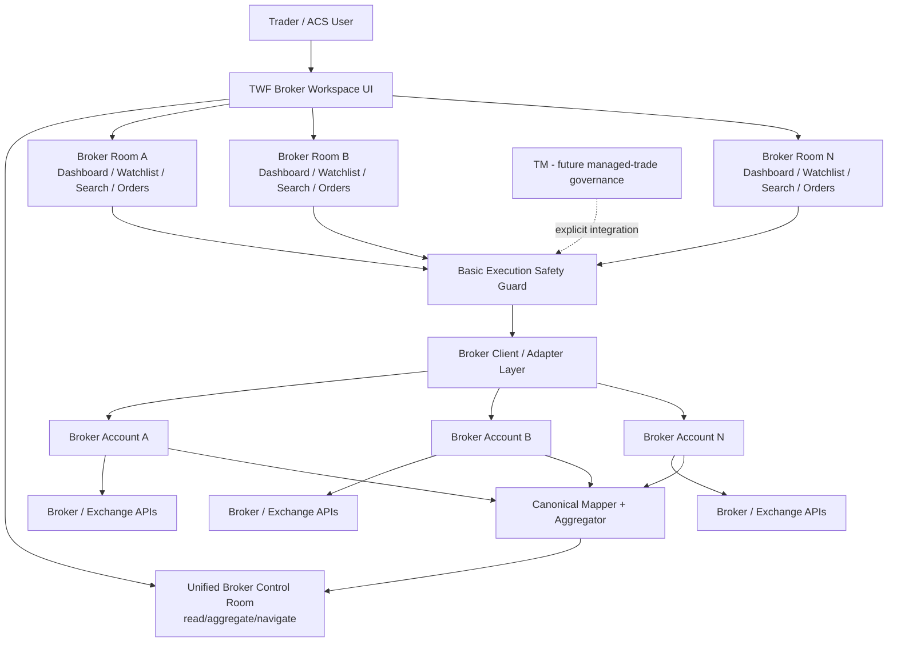

**Figure 1 — Master Broker Workspace architecture: control room above isolated broker rooms.**

The control room observes all rooms. Execution always descends into exactly one broker room. The solid command path depicts manual unmanaged rooms; the dashed TM edge is an extension seam, not a concurrent command route. Section 18.3 governs exclusive command ownership. Broker-room internals include broker-native Instrument Search and Broker Watchlists as defined in Section 9.

---

## 4. Architectural Dimensions

| Dimension | Question | Representative values |
|---|---|---|
| Provider | Which broker integration exists? | Zerodha, Dhan, Fyers, Angel One, future providers |
| Broker account | Which actual trading account? | “Primary Zerodha”, “Dhan Trading” |
| Connection state | Can TWF currently use it? | Not configured, Auth required, Connected, Degraded, Expired, Error |
| Capability | What does this provider/account support? | Holdings, Funds, Market order, Options, GTT, Commodity |
| Instrument identity | At what qualification level? | `HAL`, `NSE:HAL`, `ZERODHA:NSE:HAL`, broker-native token |
| Operational domain | What broker truth is represented? | Holdings, positions, orders, funds |
| Aggregation | What derived view is produced? | Combined P&L, HAL exposure, broker counts |
| Freshness | How current is the observation? | Fresh, stale, unknown |
| Execution safety | What must pass before submission? | Connection, quantity, funds, capability, duplicate protection |
| Governance | Who supervises accepted trades later? | TM |

---

## 5. Supported Broker Catalog and Settings

The **Broker** area in Setup/Settings presents supported providers as cards. The catalog itself comes from the deployed platform capability surface; subscribers choose among the brokers made available to their account by future entitlement policy. Architecture does not hard-code a permanent maximum broker count.

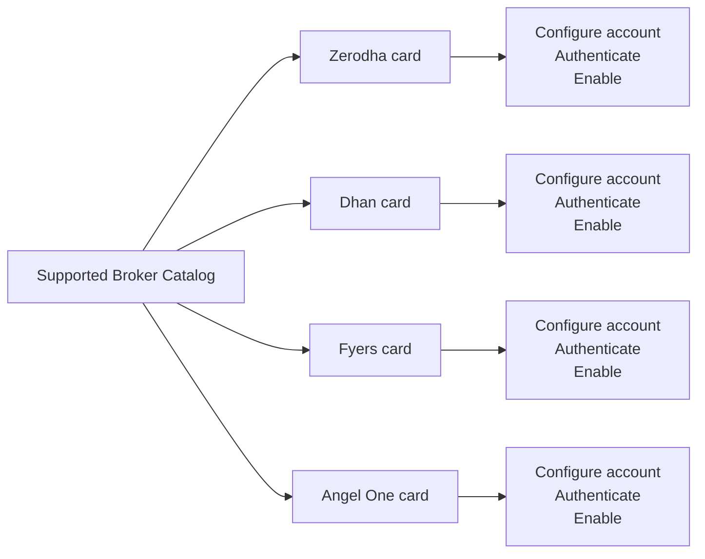

**Figure 2 — Supported broker cards lead to provider-specific account configuration.**

### 5.1 Separate provider and account states

A broker can be **supported** without being configured. A configured account can be **enabled** without currently being connected. These states must not be collapsed.

| Concept | Meaning |
|---|---|
| SUPPORTED | Adapter/provider exists in the deployed TWF release |
| CONFIGURED | Required account settings and secret references exist |
| ENABLED | User/account wants this broker account available at runtime |
| CONNECTED | Authentication/session is currently usable |
| HEALTHY/DEGRADED | Operational quality of the active connection |

### 5.2 Recommended broker-card status presentation

A professional UI may use a small light plus text:

| Indicator | Meaning |
|---|---|
| Green + “Connected” | Authenticated and healthy |
| Amber + “Degraded” / “Reconnect soon” | Usable with warning, token near expiry or partial degradation |
| Red + “Error” / “Auth expired” | Cannot safely use for live operations |
| Gray + “Not configured” / “Disabled” | Supported but not currently active |

Color is supplementary; text/icon semantics remain required for accessibility.

---

## 6. Broker Provider vs Broker Account

`BrokerProvider` and `BrokerAccount` are different domain concepts.

```text
BrokerProvider
    provider_id = zerodha
    name = Zerodha
    capabilities = ...
    auth_schema = ...
    config_schema = ...

BrokerAccount
    broker_account_id = <immutable TWF id>
    provider_id = zerodha
    display_name = Primary Zerodha
    enabled = true
    secret_refs = ...
    broker_account_ref = ...
```

The architecture must not assume one provider equals one account. The first synthetic slice proves two accounts under one provider as well as a second provider. A finite demo roster or operational quota is not a permanent broker-count limit.

### 6.1 BrokerProviderManifest

A provider manifest should describe at least:

- stable provider identity and adapter version;
- authentication mechanism;
- configuration schema;
- secret schema/reference requirements;
- supported exchanges/segments;
- broker capabilities;
- instrument-master/catalog synchronization, freshness, search and resolver behavior;
- broker-native watchlist support and limits where exposed by the provider;
- order capability mapping;
- connection/health mapping;
- test-connection or authentication lifecycle support;
- compatibility/version metadata.

Schema-driven setup avoids scattering `if broker == ...` logic through the UI.

---

### 6.2 Ownership and account identity

Use `broker_account_id` for the immutable TWF trading-account ID; `acs_account_id`
means the consumer tenant, not a trading account or user. An initial personal account
has explicit `owner_user_id`; no tenant membership is fabricated. Shared accounts
require verified memberships and operation permissions before exposure. The provider's
authenticated account reference must match the configured binding after every login.
Within a deployment, verified operational identity (provider, environment and broker
account reference) resolves to one command-ownership record, even if labels differ.
An unrelated owner cannot register a duplicate independent command path; shared access
requires the verified membership gate. Reject conflicts without exposing another
owner's account details. Never double count aliases or create competing owners.

Manifest fields are data, not executable UI/schema code. Pin supported schema and
adapter versions, dependencies, destination allowlists, idempotency support/limits,
rate-limit scope, endpoint health dimensions, pagination and observation semantics.
Distinguish configure, view, connect, trade, cancel and audit permissions. Eligibility
intersects deployed capability, grant, permission, enabled state, applied revision,
auth and operation-specific health. Neither a green card nor an entitlement grants
execution permission.

## 7. Broker Authentication and Connection Lifecycle

Each provider can use its own authentication mechanism, but TWF maps provider-specific conditions to a common lifecycle.

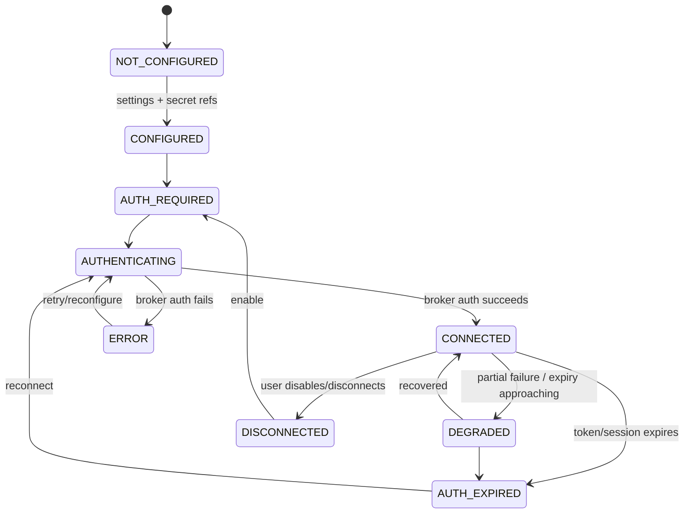

**Figure 3 — Canonical broker connection lifecycle.**

### 7.1 Secret handling

Broker API secrets, access tokens and refresh/session material are **not ordinary settings values**. Account configuration stores secret references; sensitive material belongs in the secret facility defined by the TWF configuration architecture.

The UI may display `Configured`, expiry time and reconnect status, but should not reveal reusable raw tokens after provisioning.

---

### 7.2 Callback and refresh contract

Before real authentication, bind each attempt to the authenticated TWF actor, owning
scope, broker account, provider, environment, configuration revision and connection
generation. Use unpredictable, expiring, single-use server-held callback correlation.
Allowlisted exact callback/return destinations prevent open redirects. Use PKCE and
issuer validation where the provider protocol supports them; a non-OAuth flow needs
equivalent replay/account-binding checks. Reject stale, swapped, duplicate or disabled
account callbacks. Exchange codes on the backend; redact callback query/body material
at application, proxy and tracing boundaries, apply no-store/referrer controls and
redirect immediately to a clean TWF URL. Do not retain codes in application state or
persistent navigation URLs; test the provider-specific browser flow. Callback success
does not imply trading permission or healthy order endpoints.

After authenticating, verify the broker's actual account identity before saving a
secret reference. Tokens and refresh material belong in an authorized secret store,
with expiry/version and rotation/revocation. Refresh is single-flight per connection
generation; failed or stale refresh cannot overwrite a newer credential. Reconnect
does not resubmit an order, change accounts or restore expired approvals. Provider-
specific expiry/refresh rules must be documented and tested at its read-only gate.

### 7.3 Independent state dimensions

The lifecycle diagram is a presentation vocabulary, not a single authorization enum.
Retain enabled state, auth state, read health, command health, catalog freshness and
applied revision separately. Reads may work while order submission is unavailable.
Every consequential action rechecks server-side policy and active generation.
Disconnect invalidates in-flight auth attempts; disabling prevents new dispatch.
Operations already sent remain subject to reconciliation, never reported as cancelled
merely because the user disconnected. No automatic reconnect after intentional disable.

## 8. Multi-Broker Concurrency and Isolation

TWF should support multiple concurrently enabled/connected broker accounts. There is no architectural maximum. Future plans may apply entitlement or quota policy without changing the broker domain model.

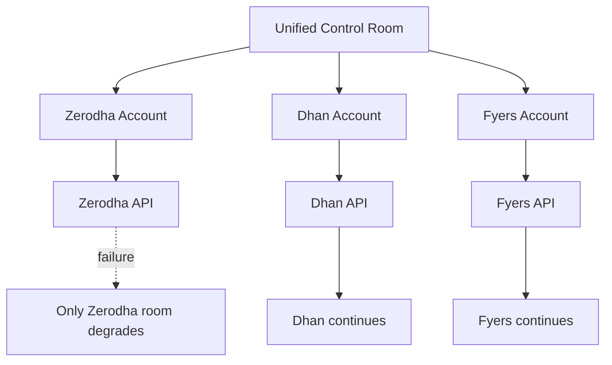

**Figure 4 — Broker rooms are failure-isolated; the control room observes but does not merge operational authority.**

### 8.1 Hard isolation invariants

- Broker A credentials never authorize Broker B.
- Broker A outage never triggers an automatic live order through Broker B.
- Broker A order IDs are meaningful only within Broker A/account context.
- Broker A funds are not spendable by Broker B.
- Broker A margin cannot be operationally netted with Broker B margin.
- Broker-specific reconciliation is independent.
- Unified views preserve the originating broker/account for every underlying record.

---

### 8.2 Bounded resources and lifecycle

No permanent account-count cap does not mean unlimited concurrent requests. Use
pagination, bounded concurrency/timeouts and fair per-account scheduling, plus
provider/API-key budgets when a broker shares a rate limit across accounts. Respect
provider retry guidance for safe reads with bounded backoff; command retries follow
section 19. One slow account cannot monopolize the aggregate response or starve
reconciliation. Cancellation of a browser request is not cancellation of a broker order.

Disable, entitlement loss or account suspension blocks new risk-increasing commands.
Separately authorized reconciliation and necessary safety actions must have an explicit
operational policy before live use. Revoked credentials cannot be bypassed; display
loss of control and instructions for direct broker access. Do not liquidate, abandon
unresolved requests, or reroute because a plan or connection changed.

## 9. Broker-Native Workspace UX

The top-level product area is **Brokers**.

```text
Brokers
├── Overview                     ← unified control room
├── Primary Zerodha
│   ├── Dashboard
│   ├── Watchlist
│   ├── Instrument Search
│   ├── Holdings
│   ├── Positions
│   ├── Orders
│   ├── Funds
│   └── New Order
├── Dhan Trading
│   ├── Dashboard
│   ├── Watchlist
│   ├── Instrument Search
│   ├── Holdings
│   ├── Positions
│   ├── Orders
│   ├── Funds
│   └── New Order
└── Broker Settings
```

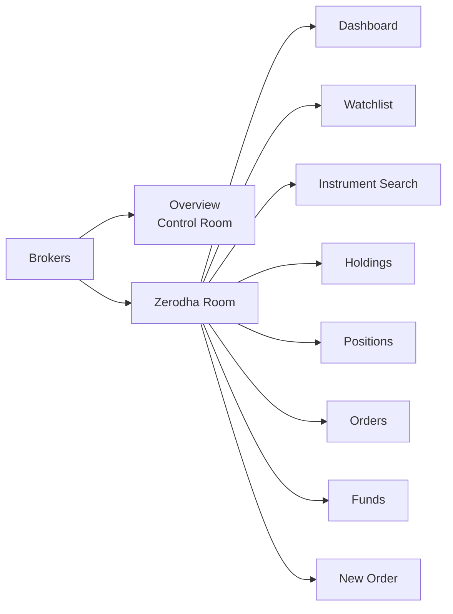

**Figure 5 — Core broker-terminal information architecture; broker-native Search/Watchlist extensions are defined in Sections 9.1–9.4.**

A user should recognize the structure immediately. TWF's differentiation comes from consistency across brokers, stronger order workflow, aggregation, risk safety and later TM/TI integration.

### 9.1 Broker-native Instrument Catalog and Search

Each broker room owns an instrument-search experience backed by **that broker provider's current instrument master/catalog**. Search is execution-oriented: it must return the exact tradable identities that the selected broker can accept for live orders.

The catalog may include broker-native equities, futures, options and, later, commodities. TWF normalizes the search UX but does not force brokers to expose identical symbol strings. A result retains the broker's exact symbol/instrument token, segment, exchange, lot size, tick size, expiry, strike and option/future metadata where applicable.

```text
Broker Account
    ↓
Broker Instrument Catalog / Master
    ↓
Search / structured filters
    ↓
Exact broker-native tradable instrument
    ↓
Broker Watchlist or New Order
```

For derivatives, search should support structured filters rather than relying only on free text:

```text
Underlying → Segment → Expiry → Strike → CE/PE/FUT
```

A valid broker-native instrument may be used for execution even if its optional TWF canonical mapping has not yet been established. Canonical mapping is required for canonical cross-broker netting, not for proving that the selected broker itself can trade the instrument. Unmapped rows remain visible in scoped reporting and aggregate completeness.

| Concern | Authority / source | Required for live execution? | Required for unified reporting? |
|---|---|---:|---:|
| Broker instrument catalog | Selected broker/provider master | Yes | No |
| Broker-native symbol/token | Selected broker/provider | Yes | No |
| TWF canonical mapping | TWF mapping registry | No | Yes |
| Broker watchlist membership | TWF user/account preference | No | No |

### 9.2 Broker-specific Watchlists

Each broker room may provide one or more **broker-specific watchlists** containing exact executable instruments selected from that broker's instrument catalog.

A watchlist item should retain at least:

```text
broker_account_id
broker_instrument_binding_id / broker-native instrument id
broker_symbol
exchange / segment
optional canonical_instrument_id
user-defined list / ordering metadata
```

The watchlist is not a cross-broker execution abstraction. A Zerodha watchlist item remains a Zerodha-room instrument; a Dhan watchlist item remains a Dhan-room instrument. Clicking **Buy**, **Sell** or **New Order** from a watchlist keeps broker/account context explicit and opens that room's order workflow.

### 9.3 Broker Watchlist vs future TWF Global Watchlist

The architecture distinguishes two concepts:

- **Broker Watchlist** — exact executable instruments for one broker account; useful for quote monitoring and order creation.
- **TWF Global Watchlist** — future canonical securities/contracts such as `HAL` or `KALYANJEWEL` for cross-broker monitoring, Scanner/TI workflows and analysis.

Broker-specific watchlists are prioritized at BW-3, after the read-only BW-1/BW-2 foundations and before a global watchlist. A future global watchlist must never become an implicit broker router; execution still enters an explicit broker room.

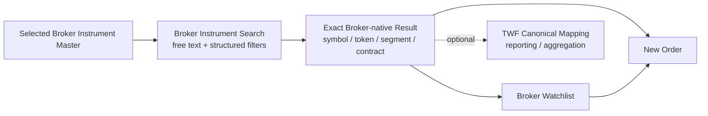

**Figure 5A — Broker-native instrument discovery, watchlist and order-entry flow.**

### 9.4 Instrument-catalog Freshness

The broker instrument catalog is operational input and therefore carries provenance and freshness. TWF should know when the master was obtained/refreshed and from which provider source. Expired derivatives, stale masters or missing native bindings must fail safe rather than being guessed. Missing optional canonical mapping has the narrower reporting consequence described in section 11.5.

Execution-time validation should confirm that the selected broker-native instrument remains valid/tradable according to the currently usable broker catalog or provider lookup.

---

### 9.5 Catalog publication and watchlist persistence

Catalog imports have provider/source, exchange/segment, retrieved/source-as-of times,
schema/version, content fingerprint and validation/completeness outcome. Validate
off to the side and publish a coherent revision atomically; a partial/bad import
cannot replace a valid catalog with apparent empty success. Mark the last usable
revision stale and disable affected live actions when its policy expires. Keep
native token/symbol, lot/tick and contract terms exactly; unknown fields are not
guessed. Search pages/cursors bind to a catalog revision. Shared public master caches
are permitted only when the provider permits sharing and no account-private fields
or entitlements leak. Account tradability is still checked separately.

Native tokens may be reused. A binding has an immutable TWF ID, provider/market
namespace, catalog revision or validity interval and resolved contract terms; it
does not equate a bare token with eternal identity. Detect token reuse, renamed
symbols, expired/new contracts and corporate-action changes. Preserve superseded
bindings for history. An execution resolver must return the current unambiguous native
binding and terms; ambiguity blocks dispatch even if a canonical label looks familiar.

TWF owns broker-watchlist membership initially; provider watchlist synchronization
is deferred and never implied by provider support. Support multiple named lists with
immutable IDs, explicit personal/account ownership and optimistic revisions. Item
uniqueness is per list and native binding, while the same instrument may appear in
different lists/accounts. Re-adding an existing item is an explicit no-op/conflict,
not another order. Lists retain ordering; stale edits conflict. Removal/delisting
tombstones a reference rather than deleting its audit history. A watchlist selection
does not guarantee current tradability. Any refresh that changes a binding requires
a new order preview, not silent retargeting.

### 9.6 Context and accessibility

Show provider, account alias and masked verified broker account reference, plus
LIVE/SYNTHETIC/SANDBOX mode on every room and confirmation. Route, form, API request,
cache and resulting order agree on the immutable account ID. Switching rooms or
tabs invalidates mismatched preview/selection; server validation does not trust a
label or browser-selected owner. New Order from a watchlist preserves context.
Unreadable provider errors are mapped to safe reasons; empty, denied, stale and
partial are distinct. Dense tables scroll locally with headers; mobile detail/confirm
views retain account, instrument, quantity and action summary. Use the accepted dark/
light tokens, keyboard focus, non-color cues and restrained live announcements at
390, 768, 1024, 1440, 1920 and 2560+ widths.

## 10. Unified Broker Control Room

The Unified Broker Overview is a **read/aggregate/navigate** surface. It is never an ambiguous execution surface.

### 10.1 Suitable unified summaries

- connected/degraded broker count;
- available funds per broker and an explicitly analytical total;
- holdings value;
- open position count;
- open/pending order count;
- realized/unrealized P&L;
- canonical-security exposure such as HAL across all brokers;
- stale/freshness warnings;
- risk summaries later;
- links to the exact broker room that owns an item.

### 10.2 Unsuitable control-room actions

The control room must not expose commands such as:

```text
Buy HAL
Sell KALYANJEWEL
Place best-price order
Automatically use another broker
```

A control-room action may instead be:

```text
Open HAL in Zerodha room
Open position details
Go to Dhan Orders
```

Execution begins only after broker/account context is explicit.

### 10.3 Analytical totals are not fungible operational resources

A displayed “Total available funds across brokers” is a summary, not a single spendable pool. TWF must not imply that Zerodha funds can satisfy a Dhan order or that margins can be cross-netted.

---

## 11. Canonical Instrument Identity Model

TWF needs normalized instrument identity for reporting, search and aggregation while preserving broker-native execution identity.

The model has four layers:

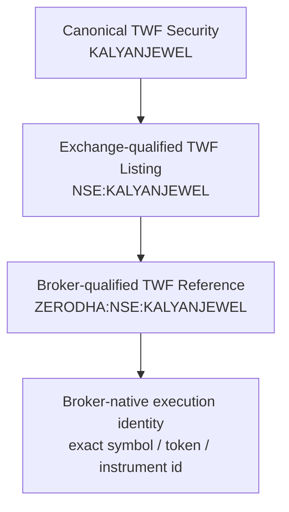

**Figure 6 — TWF identity qualification ends in an explicit broker-native execution binding.**

### 11.1 Canonical equity name

`KALYANJEWEL` is the TWF canonical stock name. It means Kalyan Jewellers for TWF reporting irrespective of broker or exchange.

Example canonical security fields:

| Field | Example |
|---|---|
| security_id | immutable TWF ID |
| canonical_name | `KALYANJEWEL` |
| short_name | `KALYANJEWEL` or user-friendly short label |
| long_name | `Kalyan Jewellers` |
| instrument_class | Equity |

### 11.2 Exchange-qualified name

`NSE:KALYANJEWEL` means the TWF canonical KALYANJEWEL security as traded/reported on NSE, independent of broker.

### 11.3 Broker-qualified name

`ZERODHA:NSE:KALYANJEWEL` means the Zerodha-facing TWF reference for the NSE listing. This is still a TWF-qualified reference, not necessarily the exact value transmitted to Zerodha.

### 11.4 Broker-native execution identity

Execution uses explicit provider data such as:

- broker instrument token;
- broker symbol/trading symbol;
- segment/exchange identifiers;
- lot size/tick size where required;
- provider-specific contract metadata.

Names are human-readable references. Immutable internal IDs are the durable relational identity.

---

### 11.5 Durable identity and unmapped execution

`SecurityIdentity`, `ExchangeListing`, `CanonicalContract` and native binding have
separate immutable IDs. Symbols, broker-qualified display names and aliases are
effective-dated labels, never database keys or sufficient account selection.
Listings distinguish venue, segment, currency, instrument class and applicable
series/share class; equal tickers do not establish equality. Mergers/splits create
explicit lineage and effective terms, not a rewrite of historical fills.

Canonical IDs in holdings, positions, watchlists and intents are nullable. A
`BrokerInstrumentBinding` may exist with no canonical link. Execution without one
is permitted only if current native identity, account eligibility and all safety
checks succeed. Unmapped facts remain visible in per-account and unclassified
reporting with provenance; exclude them from canonical netting and disclose coverage.
Never drop them or merge by display symbol. Suspect native identity blocks orders;
missing analytical mapping alone does not.

## 12. Derivative Canonical Identity

The same identity model extends to futures and options.

### 12.1 Human/reporting alias

A compact option display alias can use:

```text
SEP_29_HAL_4800_CE
SEP_29_HAL_4800_PE
```

The user's base pattern is:

```text
<expiry>_<canonical stock name>_<strike price>
```

with option type appended to remove CE/PE ambiguity.

### 12.2 Strict canonical contract identity

Because `SEP_29` repeats across years, the durable canonical identity should include year:

```text
2026_SEP_29_HAL_4800_CE
2026_SEP_29_HAL_4800_PE
2026_SEP_29_HAL_FUT
```

These strings are durable human-readable references, not primary keys. The immutable contract ID plus structured terms defines identity. The short alias may omit the year only when the displayed context remains unambiguous.

### 12.3 Structured fields remain authoritative

The formatted name is derived from structured contract data rather than being the only source of truth:

```text
contract_id
instrument_type
underlying_security_id
expiry_date
strike_price
option_type
exchange_listing_id
```

Example qualified references:

```text
NSE:2026_SEP_29_HAL_4800_CE
ZERODHA:NSE:2026_SEP_29_HAL_4800_CE
```

The final broker binding resolves this to the actual broker-native contract symbol/token.

---

### 12.4 Contract terms and evolution

Support equity and index underlyings with typed immutable underlying IDs. Contract
identity includes instrument type, actual expiry date/year, venue/segment, currency,
option right and exact decimal strike where applicable. Futures have no invented
CE/PE or strike. Weekly/monthly classification is metadata; do not infer expiry from
a naming convention or last year's calendar. Preserve exchange timezone and trading
cut-off separately from UTC observations. Provider/exchange calendar evidence governs
holiday-shifted expiries and market sessions.

Lot size, multiplier, tick and quantity units are versioned effective terms. Orders
capture the terms used for validation; old fills are not reinterpreted after a change.
Adjusted contracts require distinct identities or explicit versioned successor
relations. Decimal values and explicit units avoid float rounding and lot-versus-unit
ambiguity. Commodity delivery/settlement units and complex derivative exposure need
a later reviewed extension; current contracts must reject unsupported types.

## 13. Instrument Registry and Mapping Responsibilities

TWF should maintain enough canonical identity/mapping to support instruments that appear in user workflows. It does not need a complete perfect universal market master before the Broker Workspace becomes useful. Each broker adapter/catalog remains free to expose its own complete broker-native instrument master for search and execution; TWF canonical mapping is layered on top for reporting and aggregation.

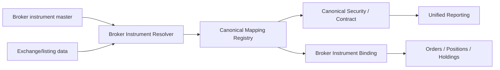

**Figure 7 — Incremental canonical mapping supports both broker execution and unified reporting.**

Corporate actions, symbol changes, delistings and contract expiry should update aliases/mappings without rewriting historical broker records. Broker instrument catalogs should be refreshable/cacheable independently per provider/account, with explicit source and freshness metadata.

---

## 14. Normalized Broker Domain Models

Normalization applies to common business meaning while preserving broker-native fields and provenance.

### 14.1 Holding

```text
Holding
├── broker_account_id
├── canonical_security_id
├── exchange_listing_id
├── broker_instrument_binding_id
├── broker_symbol
├── quantity
├── average_cost
├── last_price
├── current_value
├── unrealized_pnl
├── broker_raw_ref / optional diagnostics
└── observation metadata
```

### 14.2 Position

```text
Position
├── broker_account_id
├── canonical instrument/contract id
├── broker instrument binding
├── product type
├── quantity
├── average price
├── last price
├── realized/unrealized pnl
├── broker position identifiers
└── observation metadata
```

### 14.3 FundsSnapshot

Common fields may include cash/available balance, used margin and collateral, but provider-specific detail remains available. Any global total is analytical only.

### 14.4 BrokerSnapshot

A broker account snapshot carries:

```text
broker_account_id
provider
observed_at
health/freshness
holdings summary
positions summary
orders summary
funds summary
```

---

## 15. Canonical Order Model

TWF should normalize common order semantics without hiding broker-specific capability differences.

```text
OrderIntent
├── client_order_request_id
├── broker_account_id
├── broker_instrument_binding_id
├── canonical_instrument_id
├── side
├── quantity
├── order_type
├── price
├── trigger_price
├── product_type
├── validity
├── optional user note / workflow ref
└── expected revision / safety metadata
```

```text
BrokerOrder
├── TWF order intent id
├── broker account
├── broker order id
├── broker-native instrument
├── normalized fields
├── provider-specific state/details
├── status
└── timestamps / provenance
```

The canonical model is not permission to submit unsupported order types. Broker capabilities gate the UI and validation.

---

### 15.1 Command and observation separation

Persist immutable intent ID, owner scope, actor, explicit execution mode/command owner,
broker account, native binding/terms revision, payload fingerprint, preview revision,
confirmation expiry, capability/policy/configuration revisions and correlation.
`canonical_instrument_id` is optional. Money/prices use decimal plus currency;
quantity states its units. Provider extensions are typed, versioned and namespaced;
an arbitrary JSON blob cannot bypass validation or select a provider.

`BrokerOrder` is an observation, not a TWF promise. Its external key is account +
provider order ID + any documented session/trading-day namespace where IDs repeat.
Orders placed outside TWF may have no TWF intent ID. Preserve external orders/fills
without inventing intents, including cumulative filled/remaining quantities, average
fill price and separately identified fills/corrections. Absence from one paginated
response never proves cancellation. Unknown provider states are retained as unknown
and trigger reconciliation rather than mapped to success.

Cancel/modify requests have their own durable command IDs, target account/order,
expected observed revision, payload and uncertain-outcome handling. An accepted
cancel request is not cancellation; a modify request cannot erase concurrent fills.

## 16. Broker Capability Model

Not every broker/account supports the same segments or order features. TWF should query capabilities rather than scatter provider-specific UI branches.

Representative capability keys:

| Category | Examples |
|---|---|
| Data | DASHBOARD, HOLDINGS, POSITIONS, ORDERS, FUNDS |
| Segment | EQUITY, FUTURES, OPTIONS, COMMODITIES |
| Order type | MARKET, LIMIT, STOP, STOP_MARKET |
| Lifecycle | MODIFY_ORDER, CANCEL_ORDER |
| Broker features | GTT, AMO, IOC, basket/order features later |
| Instrument support | instrument master/catalog, search, structured derivative filtering, broker watchlists, quote/LTP if exposed |

The BrokerProviderManifest declares capability support; runtime/account state may further constrain availability.

---

## 17. New Order UX and Execution Workflow

Live order creation occurs only inside a selected broker room/account. Instrument selection may begin from that room's Instrument Search, Broker Watchlist, Holdings or Positions surface, but the final order always retains the exact selected broker-native instrument identity.

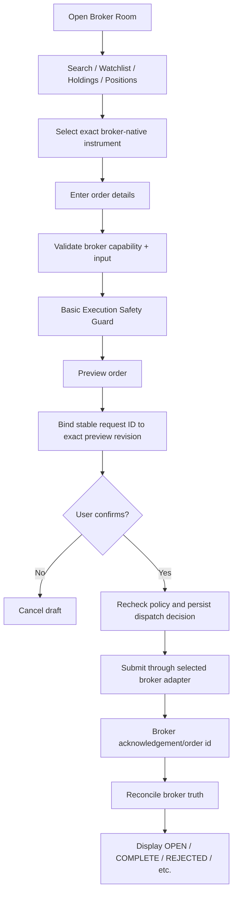

**Figure 8 — Broker-scoped order creation with validation, safety, preview and reconciliation.**

### 17.1 Initial order-entry fields

Depending on capabilities/segment:

- broker account;
- instrument selected from broker-native search/watchlist or another broker-owned surface;
- side;
- quantity/lots;
- market/limit/stop order type;
- price/trigger;
- product type;
- validity;
- optional advanced broker features.

### 17.2 Preview before submission

Safe default flow:

```text
Create → Validate → Safety checks → Preview → Confirm → Submit
```

Faster trading modes may be considered later, but the baseline architecture keeps explicit confirmation.

---

### 17.3 Confirmation binds an exact command

Create the stable request identity once for the logical action before confirmation;
browser retries/double clicks reuse it. Bind server-side confirmation to account,
mode, native terms, exact parameters, actor and revisions. Edits, context changes,
expiry, altered lot/tick or changed permission invalidate confirmation. Immediately
before dispatch recheck eligibility, required freshness and command ownership.
Fresh validation never silently changes the confirmed order. Mandatory blocks cannot
be dismissed by a warning checkbox. See section 19 for durable claim-before-send.

## 18. Basic Execution Safety / Risk Guard

A safety layer is required before TM integration, but it must remain bounded so TWF does not duplicate TM.

### 18.1 TWF basic execution safety

Representative checks:

- broker account connected and usable;
- instrument binding valid for that broker;
- segment/order type supported;
- quantity/lot/tick sanity;
- positive and bounded order value;
- required price/trigger fields present;
- available-funds/margin information considered where broker provides reliable data;
- duplicate-click/idempotency protection;
- block stale mandatory execution inputs; warn on non-critical stale display data;
- confirmation of high-impact or suspicious values;
- no implicit broker fallback.

### 18.2 TM advanced governance

TM later owns managed-trade concerns such as:

- position adoption/ownership;
- trading authority;
- portfolio risk policy;
- SL/target supervision;
- managed trade state machine;
- daily loss/max-position rules;
- broker reconciliation for managed positions;
- dynamic trade management and exit governance.

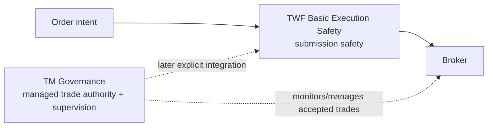

**Figure 9 — TWF execution safety protects submission; TM governs managed trades.**

---

### 18.3 Manual execution and managed execution

This revision explicitly extends the earlier TM-only broker path for **manual,
unmanaged** operation. The authenticated trader must hold a separately authorized
broker trade permission and confirm the exact order. TWF enforces submission safety,
but never claims portfolio-risk approval, TM approval, automatic protection or adoption.
Scanner/TI/LLM output is advisory and cannot dispatch a command.

For a TM-managed workflow, TM remains the sole governance and command authority,
including pre-submit assessment. Direct TWF manual submit/modify/cancel is unavailable
for that managed scope. The first TM integration uses exclusive command ownership
per broker account; finer position/product partitions require a later reviewed
conflict model. Read-only broker observations can coexist with TM views, clearly
labelled. Transfer to/from TM requires reconciled outstanding intents/orders,
explicit acceptance and a durable ownership revision; an unknown transfer state
blocks new commands. TM downtime never switches an account to manual mode.

No TWF component writes TM state or runs a parallel managed-trade control loop.
TWF reconciliation resolves its own transport/command outcomes and displays broker
facts; TM reconciliation governs managed exposure. Public TM contracts must still be
reconciled against committed TM sources before integration.

### 18.4 Safety policy before live use

Each live provider gate fixes a versioned allow/warn/block policy: capability/auth,
native identity, expiry, quantity/lot/tick/price/trigger, product/validity, market
session, notional caps, required data age and confirmation. Unknown mandatory inputs
block; unsupported market/session behavior is not guessed. Funds/margin values are
observations, not a reservation or a promise of acceptance. An estimate is labelled
with source/as-of and exclusions. A fresh quote or broker bound is required wherever
a notional check needs price; unknown price cannot satisfy that check.

The initial live slice limits segments/order types and requires explicit high-impact
confirmation. Threshold values and any permitted warning override are approved and
tested before activation; they are not left to a frontend default. TWF does not
implement TM portfolio sizing, SL/target supervision, daily loss or autonomous exits.

## 19. Order Lifecycle and Reconciliation

The Orders page should represent the full broker order lifecycle, not only completed trades.

Representative normalized states:

```text
DRAFT
VALIDATING
SUBMITTING
SUBMISSION_UNKNOWN
OPEN / PENDING
TRIGGER_PENDING
PARTIALLY_FILLED
COMPLETE
REJECTED
CANCEL_PENDING
CANCELLED
MODIFY_PENDING
EXPIRED
```

Provider-specific states are mapped carefully; TWF should retain the raw/provider state for diagnostics when useful.

### 19.1 Broker truth rule

A UI action does not equal broker success.

```text
TWF intent/request
    ↓
broker acknowledgement
    ↓
broker order id/state
    ↓
reconciliation
    ↓
TWF observed order state
```

### 19.2 Uncertain submission outcome

If the network fails immediately after submission, TWF must not blindly resubmit. The order may already exist at the broker.

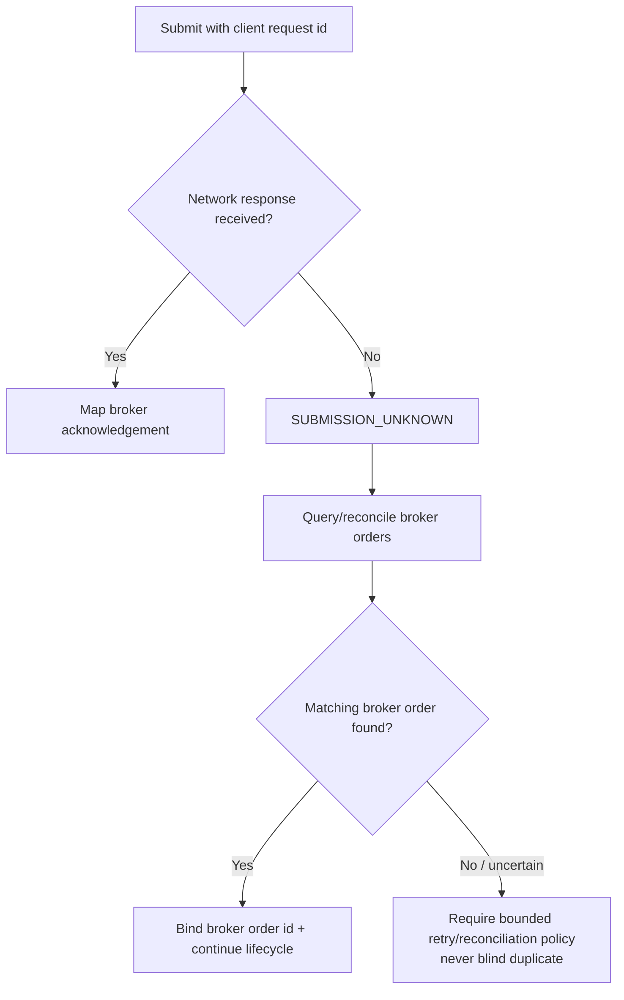

**Figure 10 — Uncertain submission is reconciled before any retry.**

Idempotent request identity is therefore a first-class execution-safety concept.

### 19.3 Durable dispatch and restart rules

Before any live command, atomically persist intent/confirmation, normalized payload
fingerprint, client request ID, safety decision and audit event. Uniqueness is scoped
to owner + environment + client request ID; the ID is immutably bound to its broker
account and action. Return the existing result/status for the same ID and payload;
reuse with different account/action/payload is rejected. Re-authorize
replay reads; the key is not an access token. Different keys are different intents:
similar-order warnings across tabs aid duplicate prevention but cannot prove intent
equivalence or silently merge deliberate trades.

Use an atomic expected-revision claim and single dispatch owner. Commit a durable
SUBMITTING/attempt marker **before** the network call; no database transaction is held
across broker I/O. A process-local mutex is insufficient across workers. A durable
reconciler has bounded leases/fencing for state updates; lease expiry never authorizes
a second send of an uncertain command. Durable records/database failure before send
blocks dispatch. Failure to persist an acknowledgement after send leaves an unresolved
attempt to reconcile. Audit and minimal required records must survive restart.

On startup, unfinished SUBMITTING attempts become/re-enter SUBMISSION_UNKNOWN and
are reconciled, not blindly replayed. Query provider order history/fills using an exact
client tag/idempotency reference if supported and within its documented retention and
scope. Preserve broker IDs and evidence. Provider tags may only correlate, not dedupe.
No matching row, a lagging list or a timed-out query is not proof of non-submission.
Ambiguous/multiple matches stay unresolved for authorized manual investigation.

A provider without usable idempotency or reliable lookup may safely remain blocked;
live support can be withheld. Never promise exactly-once execution across a broker
network boundary. A provider-proven idempotent replay, or definitive proof that an
attempt was never sent/was rejected, is required before a retry under the approved
policy. Exhausted reconciliation budget keeps UNKNOWN, alerts the trader and exposes
direct broker-verification instructions. Manual resolution records actor, evidence,
time and reason; it cannot relabel uncertainty as a fill or make unsafe replay safe.

### 19.4 Reconciliation and concurrent lifecycle actions

A bounded durable reconciliation job path is mandatory before live orders, not
necessarily a distributed queue platform. Persist unresolved work and resume it
independently of an open browser. Rate-limit queries; preserve unresolved state when
the broker is unreachable. Multiple processes must claim work safely and not resend.
Test crash points before/after local commit, send, acknowledgement and state update.

Treat submission status, execution/fill quantities and pending cancel/modify commands
as separate dimensions rather than a single mutually exclusive enum. Fill can win a
cancel race; a partial fill survives cancellation of the remaining quantity. Serialize
conflicting commands using expected revisions, then refresh broker truth. Dedupe
events/fills by provider identity/sequence where available; preserve corrections.
Out-of-order or contradictory evidence triggers a fresh snapshot without regressing a
confirmed fill to OPEN. Store provenance and observation order; a callback alone is
not proof of a complete history. Broker-side edits/trades are external facts, not TWF
approvals. A stopped UI or disconnected stream never stops required reconciliation.

---

## 20. Holdings, Positions, Orders and Funds Surfaces

### 20.1 Holdings

Minimum columns:

```text
Canonical name | Exchange | Broker symbol | Qty | Avg cost | LTP | Value | P&L | P&L %
```

### 20.2 Positions

Minimum columns:

```text
Canonical contract | Product | Qty | Avg | LTP | Realized P&L | Unrealized P&L | Broker state
```

Future TM columns can add:

```text
Managed/Unmanaged | TM state | SL | Target | Authority
```

### 20.3 Orders

Show pending/open/partial/complete/rejected/cancelled states, broker order ID, timestamps and failure/rejection reason.

### 20.4 Funds

Show the broker's available/used/collateral/margin dimensions as normalized core values plus broker-specific detail. Global sums remain analytical and explicitly non-fungible.

---

## 21. Unified Canonical Reporting Across Brokers

Canonical identity allows the control room to aggregate without merging operational ownership.

Example:

```text
HAL
Combined analytical quantity/exposure: +125

├── Zerodha / NSE:HAL   +100
├── Dhan / NSE:HAL       +50
└── Fyers / NSE:HAL      -25
```

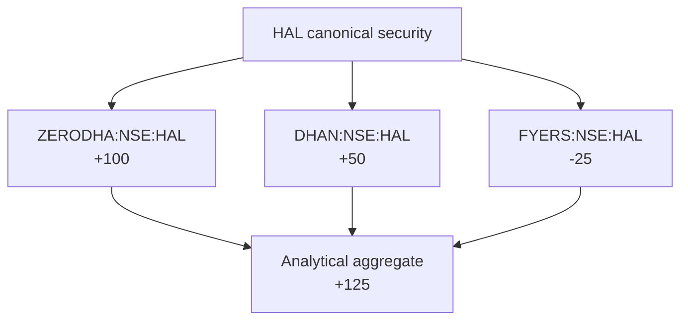

**Figure 11 — Canonical aggregation preserves each broker position while deriving a control-room summary.**

Operational records remain broker/account-specific. Analytical netting never alters broker truth.

For derivatives, exact contract aggregation occurs at canonical contract level; underlying-level exposure can later be analytical and must not oversimplify option/future economics.

---

### 21.1 Aggregation eligibility and completeness

The +125 example assumes identical equity quantity units, compatible economic
identity, currency and snapshot window. Keep exchange, segment, product, settlement
and account breakdowns; a cash holding and an intraday short are not operationally
offset or assumed deliverable against each other. Do not double count holdings and
positions that represent the same broker inventory. Define included population and
provider P&L conventions before totals; unknown values stay unknown, never zero.

Aggregates include contributor IDs/revisions, as-of range, included/excluded/stale/
unmapped counts and completeness. Preserve the prior observation on partial failure
with a stale/partial label, not a silently smaller 'total'. Sum money only in the same
currency and valuation basis; FX conversion, charges-inclusive performance and
underlying option delta exposure are deferred pending methodology and data. Derivatives
aggregate only exact compatible contract/terms/units, never by underlying symbol alone.
Corrections recompute derived totals without rewriting source history.

## 22. Freshness and Provenance

Every observed broker fact used in UI or aggregation should carry source and observation time.

```text
source/provider
broker_account_id
observed_at / as_of
health
freshness
```

The TWF-1.6 principle applies here: health and freshness are separate. A broker can be connected but a particular snapshot may be stale.

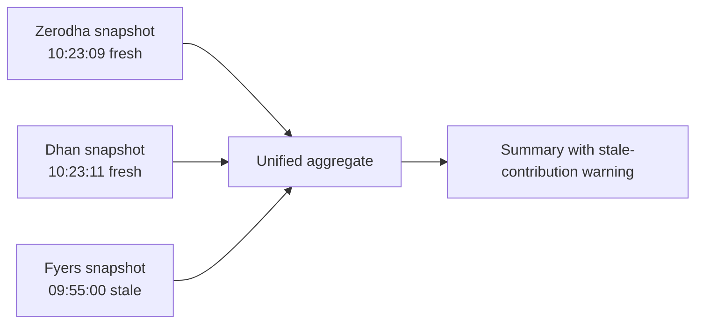

**Figure 12 — Unified aggregates retain source provenance and disclose stale contributors.**

A combined number must not look fully current when one of its contributing broker observations is stale or unavailable.

---

### 22.1 Per-dataset policy

Record provider source-as-of, TWF received/fetched-at, account, operation, revision,
health and completeness; missing source timestamps remain explicitly unknown.
Receiving a cached payload now must not make the payload fresh. Store aware instants
and expose UTC/offset or an explicitly named display zone. Future times outside
permitted skew are unknown; clock anomalies block critical execution checks.

Policy is versioned per dataset/provider/operation: instrument master, order/fill,
position, funds, holdings and quotes have different expiry and invalidation rules.
Distinguish display grace from maximum age for a command. The TWF-1.6 five-minute
health display rule is not reused as a universal broker-data SLA. Fix actual thresholds
and trading-session/holiday behavior at the relevant provider/live gate. Missing or
stale mandatory execution evidence blocks until revalidated; browsing may retain
labelled last-known data. Refreshing one dataset cannot refresh the others.

## 23. Security and Isolation

### 23.1 Credential boundaries

- broker credentials/tokens are secret references, not ordinary profile fields;
- raw tokens are never exposed in normal UI/logs;
- browser cookies, TWF sessions, arbitrary browser headers and user/tenant identity headers are never forwarded to broker APIs;
- each adapter receives only the credentials and context needed for its own broker account;
- broker callback/auth flows must validate state/CSRF-equivalent correlation as appropriate to the provider.

### 23.2 Authorization

Broker account access is user/account scoped. A user must not access another ACS account's broker configuration, holdings, positions, orders or funds through guessed IDs.

### 23.3 Failure containment

Broker/provider failures are isolated. Optional broker degradation does not make the entire TWF application unready.

### 23.4 Logging

Safe logs may include broker provider/account alias, operation, duration, result and correlation ID. They must exclude reusable secrets, cookies, authorization tokens and sensitive payloads.

---

### 23.5 Mandatory integration security gate

Read/configure/connect/trade/cancel/resolve-unknown/export permissions are separately
checked against the authenticated owner for every API, job, secret resolution and
stream subscription. Cross-account IDs and mismatched foreign references fail closed.
Personal ownership may use the existing user foundation; shared ACS resources require
membership/RBAC first. APS operations and plan changes cannot grant trading authority.

Only the account-scoped backend broker adapter resolves approved secret references
and constructs provider authentication headers. General frontend/application DTOs
never contain reusable tokens. A dedicated credential entry or OAuth redirect may
be necessary; that flow is separately protected, never an ordinary settings value,
URL endpoint override or echoed response. Production secrets require a vault before
even a read-only real connection, with rotation/revocation and redacted audit.

Use fixed approved provider origins, TLS, explicit auth/market-data/stream destination
allowlists, constrained redirects and egress/DNS controls against metadata/internal
targets. Treat provider symbols, errors, redirects, callback payloads and master files
as untrusted bounded input. No vendor HTML execution. Webhooks require the provider's
verified authenticity/replay scheme or a broker re-query before accepting consequential
state; unverified pushes are hints only. Browser streams carry TWF authorization, not
broker credentials. Scope caches, job keys, audit access and topic revocation to owner,
account and environment. Live, sandbox and synthetic credentials/data never mix.

## 24. Logical Component Architecture

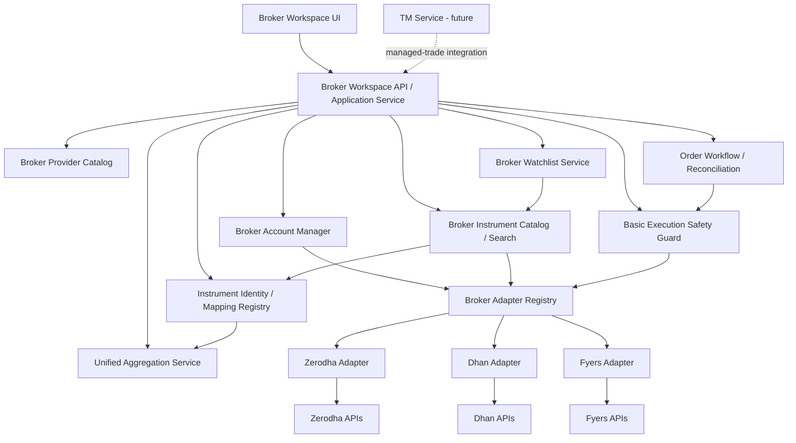

**Figure 13 — Logical Broker Workspace components. These are responsibilities, not mandatory microservices.**

---

### 24.1 Compatibility with implemented TWF-1.6

Current source implements `foundation.health.v1`, four SCANNER/TI/TM/LLM kinds,
request correlation, typed failures and LOCAL/REMOTE/SYNTHETIC health clients.
Its finite configuration has a 16-descriptor process limit and a remote `/health`
probe; it contains no BrokerClient, trade authority, broker credentials or tenant
registry. Do not interpret that descriptor limit as a broker-account limit or send
orders through this health API.

Add a separately versioned broker logical contract/registry at the broker milestone.
Reuse the architecture of bounded adapters, correlation, sanitized errors and
dependency injection, with explicit authorization/account context on the TWF side.
Do not forward that context wholesale to providers. Business rejection, stale state,
rate limiting, unsupported capability and **uncertain command outcome** need broker
semantics; a post-send timeout must not become an ordinary safely-retryable TIMEOUT.
Vendor SDK types stay in adapters. Contract additions/versioning are reviewed without
silently changing accepted foundation health callers.

Commands and queries have distinct timeout/cancellation/retry policies. Broker health
includes read/command/auth dimensions without changing application-only `/ready`.
No new dependency, SDK or worker framework is selected by this architecture.

## 25. Domain Concepts

The architecture recognizes the following logical domain concepts. They are not automatically database tables.

| Concept | Purpose |
|---|---|
| BrokerProvider | Supported broker integration definition |
| BrokerProviderManifest | Auth/config/capability/compatibility schema |
| BrokerAccount | User/account-specific configured broker account |
| BrokerConnectionState | Canonical runtime connection/auth condition |
| BrokerCapability | Feature/segment/order ability |
| BrokerInstrumentCatalog | Provider/account-specific tradable instrument master, freshness and search boundary |
| BrokerWatchlist | User/account-owned list within one broker room |
| BrokerWatchlistItem | Exact broker-native instrument reference plus optional canonical mapping |
| SecurityIdentity | Canonical TWF security, e.g. `HAL` |
| ExchangeListing | Exchange-qualified identity, e.g. `NSE:HAL` |
| CanonicalContract | Future/option identity |
| BrokerInstrumentBinding | Mapping from TWF identity to exact broker-native instrument |
| Holding | Normalized broker holding observation |
| Position | Normalized broker position observation |
| OrderIntent | TWF user's broker-scoped order request |
| BrokerOrder | Reconciled broker order state |
| FundsSnapshot | Broker funds/margin observation |
| BrokerSnapshot | Account-level observation bundle |
| UnifiedBrokerSnapshot | Derived multi-broker summary |
| ExecutionSafetyCheck | One bounded pre-submit safety check |
| ExecutionSafetyDecision | Allow/warn/block result |

---

## 26. Data Ownership and Authority Matrix

| Data / decision | Authoritative owner | TWF role |
|---|---|---|
| Broker order status | Broker | Observe, normalize, reconcile, display |
| Broker position | Broker | Observe, normalize, aggregate |
| Broker holdings | Broker | Observe, normalize, aggregate |
| Broker funds/margin | Broker | Observe, normalize, summarize |
| TWF canonical instrument identity | TWF | Authoritative reporting identity |
| Broker instrument master/catalog | Broker/provider | Consume/cache/search with provenance and freshness |
| Broker watchlist membership/order | TWF user/account configuration | Persist broker-scoped user preference |
| Broker instrument mapping | TWF mapping + broker master evidence | Resolve/maintain binding |
| Order intent/request ID | TWF | Authoritative workflow identity |
| Unified dashboard totals | TWF derived | Analytical only |
| Basic execution-safety decision | TWF | Pre-submit guard |
| Managed-trade authority/state | TM (future) | Consume/display/orchestrate |

---

### 26.1 Persistence required at each gate

Persist personal/shared broker configuration only with its explicit owner, immutable
provider account identity, secret references, schema/applied revision and change
history. Canonical security/listing/contract and native bindings retain versioned
evidence; watchlists are TWF-owned revisioned data. TWF records intents, confirmations,
command attempts, external order/fill links, reconciliation cursors and ownership
transfers; broker snapshots remain immutable evidence/cache, not mutable broker truth.

Before live orders, durable intent/idempotency uniqueness, transactional audit,
dispatch claims, reconciliation recovery and secret ownership must be implemented
and tested under restart and concurrent dispatch on the intended deployment DB.
Alembic owns evolution; no production auto-migration. SQLite may serve a bounded
single-instance development setup; PostgreSQL concurrency/restore evidence is required
for production live operation. Database portability does not mean assuming identical
locking. No database transaction spans provider I/O.

Define retention before live onboarding: unresolved requests and execution/audit
evidence cannot expire under a short cache TTL. Preserve provider dedupe-window and
reconciliation references, migrations and redacted captures needed to reconstruct a
decision. Secret deletion/revocation does not erase order history. Backup restore
must reconcile against current broker truth before allowing new commands. Deletion
of an account with exposure/unresolved intents needs an explicit handoff and retention
policy. Numeric retention/legal obligations remain deployment-specific gates, not an
invented universal period. Selective snapshots are allowed; full market-data warehousing
and indiscriminate raw-response retention are excluded.

## 27. Representative Use Cases

### 27.1 Configure and connect a broker

```text
Open Settings → Brokers
→ choose supported provider card
→ configure provider/account fields
→ store secret references
→ authenticate/reconnect
→ validate capability/health
→ account becomes Connected
→ broker room appears in Brokers navigation
```

### 27.2 View all brokers

```text
Open Brokers → Overview
→ inspect broker health/freshness
→ review combined summary
→ expand HAL
→ see broker-by-broker HAL records
→ navigate into one broker room
```

### 27.3 Search instruments and maintain a broker watchlist

```text
Open Zerodha → Instrument Search
→ search HAL or choose Options filters
→ select expiry / strike / CE-PE where relevant
→ TWF resolves exact Zerodha-native instrument from current broker master
→ optionally map it to TWF canonical identity for reporting
→ Add to Zerodha Watchlist
→ watchlist retains exact broker/account/instrument context
→ New Order opens with that same broker-native instrument preselected
```

### 27.4 Place a live order

```text
Open Zerodha → New Order
→ select exact current broker-native instrument (canonical mapping optional)
→ enter order details
→ validate capabilities
→ execution-safety checks
→ preview
→ confirm
→ submit with idempotent request ID
→ reconcile broker acknowledgement/state
→ display broker-confirmed result
```

### 27.5 Broker outage does not cross-connect

```text
Zerodha becomes unavailable
→ Zerodha room shows degraded/error
→ Zerodha order actions disabled
→ Dhan/Fyers remain usable
→ no automatic reroute
```

### 27.6 Future TM adoption

```text
Broker position observed in TWF
→ position initially operational/unmanaged
→ user chooses Adopt/Manage later
→ TM validates authority/risk
→ TM becomes managed-trade governor
→ TWF displays managed state
```

The exact TM workflow is intentionally deferred for a later rigorous architecture pass. Section 18.3's exclusive command ownership and explicit transfer are mandatory constraints on that later design.

---

## 28. Professional Failure and Edge Cases

| Risk / edge case | Architectural treatment |
|---|---|
| Token expires intraday | Canonical auth-expired state; explicit reconnect; other brokers unaffected |
| Broker API outage | Degrade only that room; no cross-broker fallback |
| Stale positions/funds | Preserve `as_of`; disclose stale data in broker room and aggregates |
| Double-click submit | Idempotent client request identity |
| Response lost after broker accepted order | `SUBMISSION_UNKNOWN`; reconcile before retry |
| Partial fill | Keep broker order lifecycle and filled/pending quantities |
| Symbol changes/corporate action | Update aliases/mappings, preserve immutable identities/history |
| Broker master mismatch | Fail safe; do not trade using guessed mapping |
| Broker instrument master stale | Mark stale; refresh/revalidate before live use where required |
| Expired derivative still in cached search/watchlist | Disable live order action and require current broker-native resolution |
| Canonical mapping missing | Permit broker-native execution if broker identity is valid; unified reporting remains unmapped/qualified until mapping exists |
| Watchlist item no longer tradable | Preserve item/history but disable execution until a valid current broker instrument resolves |
| Unsupported order type | Capability gate hides/blocks it |
| Cross-account ID probing | Backend account/user authorization rejects |
| Combined funds misunderstood | Clearly label analytical total as non-fungible |
| Clock/timezone ambiguity | Store aware timestamps; name display zone; treat excessive future skew as unknown |
| Read API works but orders fail | Separate read/command health; disable only affected command path |
| Crash before/after send or lost acknowledgement | Durable attempt; reconcile UNKNOWN on restart, no automatic resend |
| Cancel/modify races with fill | Preserve fills and command state separately; expected revision and re-query |
| Disabled account during confirmation/auth | Recheck revision/generation at dispatch/callback; reject stale work |
| Shared provider rate limit | Fair bounded budgets, safe read backoff; never blind command retries |
| Broker order-status lag | Missing result is not rejection; retain UNKNOWN and bounded investigation |
| Duplicate/out-of-order events | Dedupe and preserve corrections; reconcile conflicts without reversing fills |
| Market closed/holiday/session mismatch | Provider-specific calendar/order validity; no implicit AMO conversion |
| Reused token or changed lot/tick | Versioned binding/terms; invalidate preview and re-resolve |
| Partial paginated response | Report incomplete coverage; do not erase unobserved positions/orders |
| External terminal changes | Reconcile external facts; do not infer TWF or TM approval |
| Cross-tab double click/new request key | Stable logical action key plus similar-order warning; no false exactly-once claim |
| Credential rotation / late callback | Connection-generation check; reject old result and preserve newer binding |
| DB commit fails or restored backup is old | No pre-send commit means no send; reconcile restored attempts before dispatch |
| Unsupported/new provider status | Preserve unknown raw code safely; block unsafe consequential assumptions |

---

## 29. Relationship to TM, Scanner and TI

The Broker Workspace must be useful independently.

```text
TWF + Broker
    → broker-native trading workspace

TWF + Broker + Basic Execution Safety
    → safer live order workflow

TWF + TM + Broker
    → managed-trade governance and supervision

Scanner / TI / LLM
    → optional discovery and intelligence layers added later
```

The [roadmap](TWF_DETAILED_ROADMAP.md#18-broker-workspace-delivery-overlay) now prioritizes bounded Broker Workspace and Basic Execution Safety before TM integration, then Scanner and TI. Existing milestone IDs retain their meanings; section 34 gates each broker slice. TM integration deserves a separate rigorous architecture pass before its operational workflow is frozen.

---

## 30. UX Principles

- Familiar broker-terminal information architecture reduces learning cost.
- Broker context must always be visually obvious on execution screens.
- Unified control-room views are observational/analytical, never ambiguous order-entry surfaces.
- Connection, health and freshness are shown separately and truthfully.
- Broker/provider capability differences are visible through available controls, not hidden errors after submit.
- Instrument search is broker-native and may use free text plus structured derivative filters.
- Broker watchlists preserve broker/account context; order creation from a watchlist never loses that context.
- Destructive/live actions require explicit feedback and broker-confirmed result state.
- Color is never the sole status cue.
- The UI must support keyboard/accessibility and responsive layouts established by UX-B1.

---

## 31. Security and Operational Invariants

- No permanent broker-count limit is hard-coded into architecture.
- Future subscription policy may grant/limit brokers through capability/entitlement rules.
- BrokerProvider is distinct from BrokerAccount.
- Supported, configured, enabled, connected and healthy are distinct states.
- Broker rooms remain operationally isolated.
- Unified dashboard does not place unqualified orders.
- Execution is always bound to an explicit broker account and broker instrument binding.
- Live execution requires a valid broker-native instrument from the selected broker's current catalog/resolver; canonical mapping alone is never enough.
- TWF canonical names are reporting/search/aggregation identities; broker-native identifiers execute orders.
- Broker-specific watchlists contain broker-native executable references and remain isolated by broker account.
- Canonical mapping may be absent without blocking a valid broker-native order; the limitation affects unified reporting rather than broker execution.
- Broker truth governs orders, positions, holdings and funds.
- Analytical aggregation never replaces underlying operational records.
- Cross-broker funds/margin are not treated as one fungible pool.
- No automatic cross-broker failover for live orders.
- Order submission is idempotency-aware and uncertain outcomes are reconciled before retry.
- TWF basic safety does not duplicate TM's managed-trade governance.
- Secrets remain separate from ordinary settings.
- Freshness/provenance accompanies broker observations and aggregates.

---

## 32. Reviewed Architecture Decisions

1. Broker Workspace is a first-class TWF product area.
2. Multiple broker providers/accounts may be simultaneously active; architecture has no fixed maximum.
3. Broker settings use supported-provider cards and provider-specific schema/authentication.
4. Provider and account are distinct domain concepts.
5. Individual broker rooms expose Dashboard, Watchlist, Instrument Search, Holdings, Positions, Orders, Funds and New Order.
6. Unified Broker Control Room aggregates and navigates; it does not issue ambiguous brokerless orders.
7. Canonical identity uses TWF reporting names such as `KALYANJEWEL`, qualified forms such as `NSE:KALYANJEWEL`, and broker-qualified forms such as `ZERODHA:NSE:KALYANJEWEL`.
8. Broker-native execution identity remains explicit and authoritative for submission.
9. Derivatives use structured canonical contracts with readable names such as `2026_SEP_29_HAL_4800_CE`; short aliases may omit year when unambiguous.
10. Normalized common models coexist with provider-specific fields/capabilities.
11. Broker truth is final for operational state.
12. Baseline execution safety exists before TM; TM remains the future managed-trade governor.
13. Freshness and provenance are mandatory for broker observations and unified aggregates.
14. No cross-broker automatic routing/fallback.
15. Order workflow includes preview, idempotent submission and uncertain-outcome reconciliation.
16. Every broker room provides broker-native Instrument Search backed by that provider's current instrument master/catalog.
17. Broker-specific watchlists preserve exact broker/account/instrument context and may launch order creation without cross-broker ambiguity.
18. Canonical mapping is required for canonical netting; unmapped observations remain visible and a valid broker-native instrument may execute without canonical mapping.

---

### 32.1 Realtime extension contract

REST remains the command/query boundary. SSE/WebSocket may later deliver authenticated,
account-scoped quote, order, position and connection observations with event identity,
schema/version, source-as-of, received-at, sequence/cursor and connection generation.
Reconnect revalidates permission and resumes or obtains a complete snapshot after gaps.
Bound queues, subscriptions and backpressure; coalesce quotes where safe but never
silently drop fills/audit. Dedupe and re-query on uncertain ordering. Entitlement,
logout or account revocation tears down affected subscriptions without exposing
provider credentials. Polling can support the first live order gate if durable,
bounded and reconciled; a full event platform is not required for the first slice.

## 33. Remaining TBDs

The following are intentionally not frozen by this document:

- final list/order of supported brokers;
- final commercial broker entitlements/quotas;
- exact first production broker, selected through documented API/auth/catalog/idempotency and permission evidence before BW-2; no provider is endorsed or verified by this review;
- secret-manager implementation details;
- exact token refresh/re-auth flows for each provider;
- final broker-specific order capability matrix;
- exact per-broker instrument-master ingestion/refresh/cache policy and retention;
- exact canonical mapping automation/reconciliation process;
- final ergonomic/operational watchlist limits; TWF-owned membership is fixed initially and provider sync requires a separate future conflict contract;
- timing and scope of a future TWF Global Watchlist;
- advanced quote/streaming architecture;
- exact charges/margin-estimation UX;
- advanced order types/baskets/GTT details;
- commodities delivery scope;
- detailed Basic Execution Safety policy thresholds;
- detailed TM adoption/authority workflow;
- analytical derivative exposure/netting methodology;
- historical broker-data retention policy;
- notification policy for broker events.

---

## 34. Bounded Delivery and Acceptance Gates

These are broker-workstream labels, not replacements for TWF-0 through TWF-10 IDs.
The roadmap maps them into TWF-2 workspace and TWF-6 execution targets, with later
TM/Scanner/TI priorities explicit.

| Gate | Exact bounded delivery | Required evidence / next gate |
|---|---|---|
| BW-1 Synthetic Broker Read-Only Foundation | Versioned broker identity, capability, auth/operation health, observations and typed query contract; deterministic injected-clock adapter; authenticated personal room/overview showing Dashboard, Holdings, Positions, Orders and Funds | Three fixture accounts across two fictional providers, including two accounts of one provider; both themes/six widths; negative ownership and failure/isolation tests; no provider network or real credential path |
| BW-2 One real broker read-only | One chosen provider's verified auth/account binding, vault references, bounded read adapters and versioned catalog/search; optional canonical mapping | Official public API mapping, credential/callback/revocation review, source/completeness/rate-limit fixtures, isolated real read smoke; provider and permission selected before implementation |
| BW-3 Broker watchlists and draft/preview | Revisioned owned watchlists; exact native instrument resolution; backend draft validation and preview, no live dispatch | Persistence/migration/isolation tests, duplicate/stale/expired/token-reuse cases; no generic global-watchlist routing |
| BW-4 Synthetic command and recovery foundation | Durable intent/request/confirmation/audit, synthetic accept/reject/partial/unknown/cancel/modify, dispatch claims and reconciliation | Crash/restart and multi-worker tests, policy-expiry and concurrent commands; actual secret-free synthetic behavior remains labelled |
| BW-5 Controlled live manual orders | One provider, explicit personal ownership, restricted segments/order types, separately enabled LIVE mode and approved safety policy | All live prerequisites in sections 7, 18, 19, 23 and 26; provider contract/sandbox evidence where available; operator recovery runbook; explicit approval and independent acceptance before live activation |
| BW-6 Second real broker proof | Add second provider adapter/manifest and contract fixtures | Section 34.3 proof before claiming multi-provider operational acceptance |
| Later managed workflow | Reviewed TM public-contract integration and exclusive command transfer | No automatic manual/TM fallback; separate TWF-5 acceptance |

### 34.1 First implementation target: BW-1

Implement only the first row. Use existing authenticated users with isolated,
explicitly owned synthetic fixture bindings; no inferred ACS tenant, broker-account
administration, shared account exposure or new production credential store. No
durable broker schema is required for this read-only fixture slice; persistence
interfaces/evidence will be fixed before BW-2/3 writable state. Existing service
health and personal settings stay backward compatible. There is no Broker SDK,
live order endpoint, provider OAuth, catalog import, watchlist CRUD, draft submission,
WebSocket or background platform in BW-1. Unimplemented room tabs are honestly unavailable.

Contract tests cover connection/degraded/auth-expired, empty and populated observations,
missing/partial datasets, stale timestamps, funds unknown, rate-limit/timeout/denied/
incompatible outcomes and sibling isolation. Fixtures may use versioned native
instrument references with unmapped canonical links; a universal registry is not a
prerequisite. The backend authorizes fixture account access; UI shows provider/account,
synthetic mode, source/time and completeness. Read-only orders remain observations.
Two different provider field/state layouts must normalize through the same consumer.
The first acceptance report separates fixture correctness from real broker support.

### 34.2 Synthetic is mandatory; paper and sandbox are different

A deterministic SyntheticBroker is mandatory before real integration. BW-1 implements
read scenarios; BW-4 adds command/fill/unknown/cancel/modify and restart scenarios before
any live-order milestone. Test it without network, live secrets, sleep-based clocks or
random market outcomes. An optional paper engine with simulated market fills/P&L is
a later product, not a synonym for these fixtures. A provider sandbox is useful only
if its availability and limitations are verified; it cannot replace synthetic race/
failure tests or prove live behavior. Synthetic fixture approval never grants live authority.

### 34.3 Second broker proof

A second real provider must pass the same versioned contract suite and room UI
without changing shared order meaning, UI account semantics, ownership, persistence
authority or canonical identity. A new manifest and adapter normalize its native
differences; no common frontend provider-name branches. Repeat malformed data,
unsupported order types, native token/terms, auth expiry, rate limits, partial/unknown
outcomes and cross-account denial. Test simultaneous providers and multiple accounts
of one provider, with one failing while others remain usable. If a genuinely missing
common concept appears, version/review that contract explicitly; do not hide it in
untyped fields or claim the neutrality proof passed unchanged.

### 34.4 Deferred decisions are gate-bound

Provider choice/API mapping, numeric safety/freshness thresholds, vault, calendar,
rate budgets and recovery evidence must be resolved before the first slice that
uses them, especially BW-5. They do not block BW-1. GO_BROKER_WORKSPACE is architecture
readiness for this progression and BW-1 scope only, not acceptance of future runtime.

---

## 35. Closing Principle

> **TWF must first become an excellent broker-neutral trading workspace. Each broker remains a separate operational room with its own broker-native instrument catalog, search and executable watchlists; the unified control room provides canonical reporting and situational awareness; execution always enters a specific room, uses that broker's exact current instrument identity, passes TWF safety checks and is reconciled against broker truth. TM, Scanner and TI then add governance, discovery and intelligence without weakening this operational foundation.**
