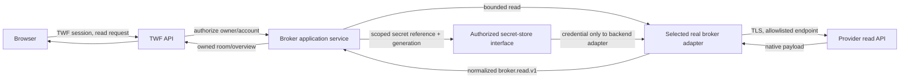

# BW-2 — Zerodha Read-Only Planning and Design Gate

**Status:** GO_BW2_IMPLEMENTATION for bounded implementation starting with secure prerequisites; **not** approval to activate a real account. Zerodha was explicitly selected by the user. Broker Workspace Architecture v0.3 remains normative, and no runtime integration is implemented by this document.

**Version history:** v0.1 (2026-09-26) identified unresolved provider/scope/security/contract gates and held implementation. v0.2 (2026-09-26) resolves the design gates under accepted v0.3 authority, adds the Zerodha security and contract decisions below, and reconciles BW-1 status. The historical v0.1 findings remain traceable in the earlier sections; the dedicated **BW-2 Gate Resolution** section supersedes their decision wording.

## A. Repository-derived starting state

On 2026-09-26, `main`, HEAD `44e53d5a30f13d4c3ad6fc66da192db828fec5c4`, and `origin/main` coincide. The working tree was clean before this planning record. The annotated `twf-bw1-synthetic-broker-readonly` tag points at HEAD, confirming BW-1 acceptance/freeze. Broker Workspace Architecture v0.3 is tagged `twf-broker-workspace-architecture-v0.3` at `0b73492` and remains authoritative. No provider is selected by the repository; named firms and identifiers in architecture examples do not constitute a selection. No commit, tag, or push is part of this task.

At v0.1, the [README](../README.md), [roadmap](TWF_DETAILED_ROADMAP.md), [UX roadmap](TWF_UX_BUCKET_ROADMAP.md), and [documentation index](TWF_DOCUMENTATION_INDEX.md) still described BW-1 as pending review. v0.2 reconciles those current-status pages with the BW-1 freeze tag. This plan does not rewrite accepted architecture or historical BW-1 records.

The accepted [Broker Workspace architecture](TWF_BROKER_WORKSPACE_ARCHITECTURE.md#34-bounded-delivery-and-acceptance-gates) and [detailed roadmap](TWF_DETAILED_ROADMAP.md#18-broker-workspace-delivery-overlay) place **versioned provider-native catalog/search in BW-2** and watchlists in BW-3. The supplied BW-2 planning request places both catalog/search and watchlists in BW-3, except an internal read dependency. This was a material prompt-versus-architecture discrepancy. v0.2 resolves it in favor of the accepted v0.3 gate: BW-2 includes versioned native catalog/search; BW-3 retains watchlists and draft/preview. The bounded read-only search UX is specified below.

## B. Provider selection state

`PROVIDER_SELECTED = Zerodha` by explicit user reply. The integration target is Kite Connect v3. Current official documentation establishes the login/token exchange, profile, portfolio, orders, margins, instrument dump, errors and published rate limits. These mappings are documentation-based, not verified live-account behavior. Before real-account activation, verify a developer app/API key and secret, registered redirect URL, active Zerodha account, 2FA, permissions and commercial/data rights. See the [Kite Connect introduction](https://kite.trade/docs/connect/v3/), [session/profile](https://kite.trade/docs/connect/v3/user/), [portfolio](https://kite.trade/docs/connect/v3/portfolio/), [orders](https://kite.trade/docs/connect/v3/orders/), [instruments](https://kite.trade/docs/connect/v3/market-data-and-instruments/) and [limits](https://kite.trade/docs/connect/v3/exceptions/).

## C. Architecture delta and frozen-contract fit

Keep `BrokerProvider`, `BrokerAccount`, `ObservationMetadata`, `Holding`, `Position`, `BrokerOrder`, `FundsSnapshot`, `BrokerSnapshot`, and `UnifiedBrokerSnapshot` as the browser-facing `broker.read.v1` contract. `BrokerReadClient.read(account, request_id, now)` remains the adapter seam. Existing synthetic adapters stay available. Add a real adapter behind a disabled-by-default provider manifest, a durable personal-account roster, account-scoped connection service, provider transport, and provider-independent secret-store interface. Extend the existing application service's account source and adapter lookup internally; the room route and overview response shape need not change. Read availability never grants command authority: `mode=LIVE` describes a real data connection and `capabilities.commands=false` remains enforced.

The frozen read DTO has limits that a selected provider must satisfy or trigger a separately reviewed compatible extension: `Instrument` has INR/SHARES literals and no derivative terms or segment; `Holding.last_price/current_value/pnl` and `Position.last_price` are required; `BrokerOrder.observed_at`, quantities, and status are required. Do not invent values or mislabel a non-equity instrument as shares. A supported **equity-only subset** is possible only if the selected provider can truthfully supply or safely derive every mandatory field, with unavailable data represented by the dataset's missing/partial state. Otherwise classify changes as:

| Proposed change                                                                                                                                                     | Classification                                  | Decision rule                                                                              |
| ------------------------------------------------------------------------------------------------------------------------------------------------------------------- | ----------------------------------------------- | ------------------------------------------------------------------------------------------ |
| Add a separately versioned, provider-neutral native-observation read surface while preserving every `broker.read.v1` field/type and marking omitted v1 rows partial | COMPATIBLE EXTENSION, subject to contract tests | The new room displays all native rows; old clients retain truthful qualified v1 responses. |
| Change meaning/type of existing quantities, money, identity, mode, or `broker.read.v1`; remove required fields without compatibility path                           | BREAKING CHANGE                                 | HOLD and architecture/contract review.                                                     |
| Put a provider DTO, token, SDK type, or native status enum into shared frontend/application models                                                                  | PROVIDER-SPECIFIC LEAK                          | Reject; translate inside adapter.                                                          |

`ObservationMetadata.revision` is source-specific and stays distinct from `contract_version=broker.read.v1`, provider ID, configuration revision, and connection generation. The current UI already renders per-account mode; the existing room/overview read endpoints remain the minimum read surface.

## D. Data and credential flows

The browser sees neither reusable provider tokens nor vault references. Kite’s one-time callback `request_token` necessarily reaches the registered browser callback URL; section E and the provider addendum describe the required exception and cleanup gate. No database transaction spans provider I/O. Provider responses and errors are untrusted; validate bounds before normalization and return safe TWF errors. The current same-origin web proxy remains a transport, not an authorization source.

## E. Account identity and connection sequence

Persist one immutable TWF `broker_account_id`, `provider_id`, `owner_user_id`, deployment environment, user label, verified provider account reference, enabled/configured flags, configuration revision, connection generation, auth state, read health, and secret reference/version. Provider user/client ID is an authentication subject, not the TWF account primary key; a label is never an authority key. Enforce uniqueness of verified `(provider_id, environment, provider_account_ref)` within the deployment and avoid revealing another owner's binding on conflict. Shared ACS tenancy is deferred.

Connection safety sequence (Kite-specific steps in the addendum):

1. A signed-in owner configures a supported provider/account with validated non-secret settings. The backend records an optimistic configuration revision and the secret store receives sensitive material through a server-side, provider-appropriate flow.
2. Explicit Connect creates a short-lived, unpredictable, single-use server-side attempt tied to session/owner, provider, account, environment, configuration revision, and connection generation. The return target is exact-allowlisted.
3. Use Kite's documented request-token exchange with TWF one-use correlation; this is not OAuth and does not claim PKCE or issuer validation. The backend performs exchanges and verifies the returned provider account identity before storing a scoped secret reference.
4. Atomically accept the result only if attempt, owner, enabled state, revision, and generation remain current. Stale, reused, swapped, revoked, or late callbacks fail closed. Clean the browser URL immediately; never retain code/token query data in logs or state.
5. Reads resolve the current secret reference under owner/account/provider/environment scope. Refresh is enabled only if Zerodha approves it for this app; any such refresh must be single-flight per generation and cannot overwrite a newer connection. Expiry yields `AUTH_EXPIRED` and a re-auth-required UI state.
6. Disconnect/disable advances generation, blocks new reads, revokes the local secret reference and records an audit event. Remote logout is gated as described in the addendum. It does not alter other accounts or TWF `/ready`.

The repository currently has no production secret manager or durable broker-account schema. Before real connection, define and implement a minimal `SecretStore` interface with a production-backed secret manager, scoped resolution, rotation/revocation, and redacted test double. Select the production implementation at the provider/deployment gate; an in-memory fixture is not a production substitute. Database rows store references and non-secret metadata only.

## F. Minimum persistence proposal

Use SQLAlchemy/Alembic with portable UUID representation, explicit constraints, indexes, and PostgreSQL migration tests. Exact names may follow repository convention; proposed entities are:

| Entity                    | Durable fields and constraints                                                                                                                                                                                                     | Purpose                                                                             |
| ------------------------- | ---------------------------------------------------------------------------------------------------------------------------------------------------------------------------------------------------------------------------------- | ----------------------------------------------------------------------------------- |
| `broker_accounts`         | Internal UUID PK; owner FK; provider ID; environment; label; verified provider-account reference; enabled/configured; optimistic configuration revision; unique provider/environment/reference where verified; owner/account index | Personal ownership and stable account binding.                                      |
| `broker_connections`      | Account FK/unique; auth state; connection generation; applied configuration revision; secret reference/version; expiry; last successful read/health timestamps; optimistic revision                                                | Fenced connection lifecycle; no raw token.                                          |
| `broker_auth_attempts`    | Opaque one-use state hash; account/owner/session binding; provider/environment; generation/revision; expiry; consumed status; approved return target; optional PKCE verifier reference                                             | Callback/replay safety. Store verifier securely, not as ordinary plaintext DB data. |
| `broker_connection_audit` | Event UUID; actor/owner/account/provider; event type; timestamp; request ID; sanitized outcome; generation/revision                                                                                                                | Connect, re-auth, refresh, disable, conflict, and denial trail without secrets.     |

Account and connection state are TWF-owned; holdings, positions, orders, and funds remain provider-authoritative observations, not durable trading truth. Avoid saving raw provider payloads without an explicit retention/security design. Apply migrations explicitly, never at production startup. Transactions end before any provider call; generation/revision are checked again when persisting the result.

## G. API proposal

Keep existing authenticated `GET /api/v1/brokers/overview` and `GET /api/v1/brokers/accounts/{account_id}`. The Zerodha-specific endpoint proposal is in the addendum below; paths and callback semantics require contract/security review before implementation. All mutating TWF endpoints need session ownership, origin/CSRF checks, bounded inputs, no-store responses, and expected-revision/generation semantics. No order or trade endpoints belong to BW-2.

## H. Provider DTO mapping gate

This worksheet records cross-provider mapping questions. The Kite-specific documented fields and unresolved response semantics are in the addendum below; live-account samples still require verification.

| TWF read target       | Provider-native evidence required                                                                          | Normalization rule/gate                                                                                                      |
| --------------------- | ---------------------------------------------------------------------------------------------------------- | ---------------------------------------------------------------------------------------------------------------------------- |
| Account identity      | Authenticated provider account reference, subject/client ID, environment                                   | Verify reference against owner-bound configuration; never key by display name or client code alone.                          |
| `Instrument`          | Native ID/token and symbol, exchange, segment/type, expiry/strike/option type where relevant               | Preserve exact native identity; canonical ID nullable. Do not squeeze unsupported derivatives into INR/SHARES.               |
| `Holding`             | Quantity, cost, mark/last price, value/P&L definitions and units                                           | Decimal conversion; derive only from documented complete inputs; otherwise missing/partial or reviewed compatible extension. |
| `Position`            | Product, signed/net or buy/sell quantities, cost, mark, realized/unrealized P&L, native state              | Preserve sign/product and provider meaning; no TM state.                                                                     |
| `BrokerOrder`         | Provider/account-scoped order ID, side, total/filled/remaining, price/type, status, time, rejection reason | Observed order only; unknown statuses map `UNKNOWN`; validate quantity invariants and timestamp provenance.                  |
| `FundsSnapshot`       | Cash, margin, collateral/segments, units, as-of time                                                       | Preserve unknown as null; never turn absent to zero or pool across accounts.                                                 |
| `ObservationMetadata` | Provider source/version, source as-of and retrieval time, pagination/completeness                          | Dataset-specific policy, health/freshness/completeness; source revision separate from shared contract.                       |

For equities, unmapped native rows remain visible in their account room and are excluded from canonical overview netting, with an unmapped count. Native ID, exchange, segment and contract terms must not be discarded; adding optional read-only instrument fields requires the compatible-extension review above. Catalog/search is included in BW-2 under accepted v0.3; a private lookup necessary to interpret provider reads does not itself satisfy the accepted versioned catalog/search gate.

## I. Failure and freshness matrix

Use independent account/configuration/auth/read/catalog dimensions. Until provider evidence fixes thresholds, set each dataset's freshness policy from documented update frequency and a conservative clock-skew rule; do not copy a generic five-minute UI timer. `fetched_at` is TWF receipt time; `source_as_of` is provider observation time when supplied. Missing provider time remains unknown, not a fabricated now. An account/connection status observation needs its own age policy.

| Condition                               | Read contract / UI                                                                    | Isolation and retry                                              |
| --------------------------------------- | ------------------------------------------------------------------------------------- | ---------------------------------------------------------------- |
| Healthy complete read                   | `AVAILABLE`, `FRESH`, `COMPLETE`; show source revision/time                           | Bounded per-dataset timeout.                                     |
| Partial page/field or stale observation | `DEGRADED` or safe available status with `PARTIAL`/`STALE`; show missing data         | Never silently present complete totals.                          |
| Auth expired/revoked                    | `AUTH_EXPIRED`, no new data, re-auth action                                           | No cross-account token reuse; no retry loop.                     |
| Rate limited                            | `RATE_LIMITED`, preserve truthful prior observation only if explicitly labelled stale | Honor documented Retry-After; bounded provider/account budget.   |
| Timeout/provider outage                 | `TIMEOUT`/`UNAVAILABLE`, dataset missing or qualified stale                           | Small bounded retry only if safe; no /ready failure.             |
| Permission denied                       | `DENIED`, no fabricated zero values                                                   | Surface safe reason; do not try another account.                 |
| Unknown native status or schema drift   | Order `UNKNOWN` or `INCOMPATIBLE` for unsafe payload                                  | Quarantine unsafe mapping; alert/audit without raw payload leak. |

Provider-wide and per-account concurrency/budgets follow official limits. Use a shared budget across application replicas if provider quota demands it; do not claim an in-process counter enforces a global quota. Cap pagination, payload size, attempts, timeout, backoff and concurrent calls. Never auto-fail over to another broker. A real account failure leaves synthetic and sibling accounts readable; one account's expiry does not change application-only `/ready`.

## J. Security and rollout checklist

- [ ] Provider selected and official auth/read APIs, quotas, permissions, licensing, sandbox availability, and allowed destinations verified.
- [ ] Real adapter and UI feature disabled by default; explicit owner connection; all command capabilities remain false.
- [ ] Production secret manager selected and tested; no credentials in Git, DB value columns, browser storage/responses, URL history, logs, or exports.
- [ ] Fixed TLS destination allowlist, redirect/DNS/metadata protections, bounded payloads, sanitized provider errors.
- [ ] Origin/CSRF, one-use state, exact redirect target, provider-appropriate PKCE/issuer or equivalent, session binding, expiry/replay protection.
- [ ] Returned account binding, provider/environment/owner scope, uniqueness, IDOR denial, generation fencing, refresh/revocation/disconnect audit.
- [ ] No database transaction across network I/O; stale callback/read/refresh cannot overwrite a newer generation.
- [ ] Separate read health and provenance from connection state, capability and command authority.
- [ ] Synthetic rooms, negative ownership behavior and `/ready` unchanged.

## K. Test matrix

Default CI uses deterministic redacted fixtures and mocked transport; only the explicit opt-in smoke uses a real account.

| Boundary                             | Required deterministic cases                                                                                                                                                            | Acceptance evidence                                                                                                                      |
| ------------------------------------ | --------------------------------------------------------------------------------------------------------------------------------------------------------------------------------------- | ---------------------------------------------------------------------------------------------------------------------------------------- |
| Frozen read contract                 | Synthetic and Zerodha adapters through the same service; account room and unified overview; commands always false                                                                       | Existing BW-1 contract tests stay green, with no provider DTO in shared responses.                                                       |
| Authentication and account ownership | One-use correlation, wrong/missing session, expired/replayed/swapped callback, wrong provider user, duplicate external account, stale generation, disconnect race, CSRF/origin and IDOR | No token or other account data exposed; rejected attempts leave connection state unchanged.                                              |
| Native normalization                 | Equity/derivative identity, `net` versus `day` positions, T1/collateral holdings, partial fills/cancelled orders, missing mark/funds, unknown statuses and invalid decimals/timestamps  | No invented value, double count, silent row drop or false actionable order state.                                                        |
| Provider transport and health        | 403/429/502–504, timeout, malformed/partial payload, retry budget, provider-wide concurrency, absent source time and stale observation                                                  | Correct per-dataset health/freshness/completeness; bounded requests; synthetic and sibling accounts remain readable; `/ready` unchanged. |
| Persistence, secrets and deployment  | Alembic upgrade/downgrade on SQLite and PostgreSQL, uniqueness and optimistic revisions, vault failure/rotation, log and response redaction, disabled default                           | No raw credential in ordinary DB fields, browser, logs or Git; late reads cannot overwrite new generation.                               |
| Optional real smoke                  | Approved local Zerodha credentials, profile and read-only holdings/positions/orders/funds; no trading calls                                                                             | Isolated, manually opted in, redacted evidence; not a default CI dependency.                                                             |

## L. Implementation phases

| Phase                                           | Bounded work                                                                                                   | Evidence required                                                                                               |
| ----------------------------------------------- | -------------------------------------------------------------------------------------------------------------- | --------------------------------------------------------------------------------------------------------------- |
| BW-2.1 Secure provider/account foundation       | Production-capable `SecretStore`, personal operation policy, account/connection/attempt/audit Alembic schema   | Vault and permission denial, PostgreSQL/SQLite migration, generation/uniqueness and redaction tests.            |
| BW-2.2 Zerodha authentication and binding       | Kite callback, two-stage same-site finalization, verified profile, local disconnect                            | Replay, session/cookie, wrong user, stale generation, vault cleanup, CSRF/IDOR tests.                           |
| BW-2.3 Native catalog and search                | Bounded daily CSV acquisition, atomic versioned publication, account-scoped read-only query                    | Malformed/empty/large dump, revision cursor, stale/expired and keyboard/UX tests.                               |
| BW-2.4 Holdings and positions                   | Native normalization, provider-neutral additive observation surface, qualified v1 subset                       | `net`/`day`, derivative identity, missing valuation, source time, unmapped coverage and v1 compatibility tests. |
| BW-2.5 Orders, funds and health                 | Safe statuses/quantities, segment-aware funds, per-dataset provenance/freshness and budgets                    | Unknown/cancelled/partial order, missing-cash, 403/429/timeout, sibling isolation and `/ready` tests.           |
| BW-2.6 Frontend connection and read-only UX     | Provider card, connect/reauth/disconnect, LIVE DATA · READ ONLY room, search, responsive and accessible states | Both themes, six widths, keyboard, WebKit/Chromium and explicit no-command checks.                              |
| BW-2.7 Opt-in real smoke and independent review | Read-only profile/portfolio/orders/margins/catalog smoke, production vault and migration checks, documentation | Explicit credentials outside default CI; no trading calls; secret redaction; independent acceptance.            |

BW-2 includes versioned native catalog acquisition/publication, scoped search and the bounded read-only search UX; BW-3 owns watchlists and draft/preview. Watchlists, drafts, previews, and commands do not enter these phases. Real smoke is opt-in and cannot be a default CI dependency; deterministic mock/fixture tests cover normal CI. Run backend/front-end quality gates, OpenAPI, Docker, docs, `git diff --check`, migration downgrade/re-upgrade, and PostgreSQL smoke before acceptance.

## M. Files expected to change or create

Expected changes after design approval: new provider-specific adapter/transport/DTO mapper and tests under `apps/api/src/twf/brokers/` and `apps/api/tests/`; account/connection/secret-store interfaces and models under `apps/api/src/twf/infrastructure/` with an Alembic migration; provider-neutral additions to `apps/api/src/twf/brokers/service.py` and `apps/api/src/twf/api/brokers.py`; bounded frontend configuration/status views and tests under `apps/web/src/` and `apps/web/tests/`; provider/deployment configuration, lockfiles only if justified; BW-2 implementation, security and operations records. Preserve frozen BW-1 synthetic adapters and `broker.read.v1` unless the explicit contract review approves a compatible extension.

## N. Explicit deferrals to BW-3 and later

BW-3 owns broker watchlists and draft/preview. BW-4 owns durable synthetic command/recovery. BW-5 owns separately approved live manual orders and execution safety. TM authority, reconciliation of submitted commands, streaming, paper trading, Scanner/TI/LLM decisions, shared accounts, billing and automatic routing remain outside BW-2. Versioned native catalog/search remains in BW-2 under v0.3. Watchlist membership, draft/preview and trading actions remain BW-3+.

## O. GO/HOLD decision

The v0.1 decision was to hold on the then-open scope, callback, disconnect, contract and vault questions. v0.2 resolves the design choices in the **BW-2 Gate Resolution** section. Implement the missing production secret store and explicit broker permissions before enabling a real connection; live-account app permissions and the opt-in smoke still require evidence. No real account or credential was accessed during this planning task.

## Zerodha-specific design addendum — governs sections E, G, H and I above

The provider-neutral sections above describe invariants. This addendum supplies the
Kite Connect v3 details established by current official documentation. Examples in
those docs are **not** proof that the user's app/account has the required access.

### Connection and token path

Kite uses its own request-token login flow, not OAuth. A connect attempt stores a
short-lived, one-use TWF correlation bound to session, owner, account, provider,
environment, configuration revision and connection generation. TWF sends the browser
to `https://kite.zerodha.com/connect/login?v=3&api_key=...` with an opaque attempt
value in supported `redirect_params`. The exact registered callback receives a
short-lived `request_token`. The backend validates and consumes the attempt, then
POSTs `api_key`, `request_token` and SHA-256 of
`api_key + request_token + api_secret` to Kite `POST /session/token` with
`X-Kite-Version: 3`. TWF immediately removes callback query material from browser
history. It verifies the response and `GET /user/profile` (`broker=ZERODHA`, stable
`user_id`) against the owner-bound record before saving the access token in the
secret store. Subsequent reads use `Authorization: token api_key:access_token` only
from backend transport. Kite documents ordinary token expiry at 6 a.m. the following
day; refresh tokens are available only to certain approved platforms, so explicit
re-authentication is the default. Never assume refresh eligibility. [Official
session and profile contract](https://kite.trade/docs/connect/v3/user/).

The callback itself also places the short-lived `request_token` in a URL query
parameter. That is an unavoidable part of the documented Kite flow and conflicts
with a literal rule forbidding **any** secret in a query string. v0.2 approves a narrow design exception for this one-time callback token, with
exact HTTPS redirect, no query logging/referrer, immediate server-side exchange,
one-use attempt validation and immediate clean redirect. Implementation must prove
these controls before real activation.
TWF must never place the reusable `api_secret` or `access_token` in a URL.
[Official login flow](https://kite.trade/docs/connect/v3/user/).

Disconnect advances generation and removes/revokes the _local_ token reference,
blocking further TWF reads. Kite documents remote `DELETE /session/token` with the
access token in a query string. This conflicts with the task's no-secret-in-URL rule.
Do not call that endpoint under this plan. Label local disconnect honestly; remote
revocation requires a provider-supported safe alternative or an explicit security
policy decision before it can be promised. The token's ordinary expiry does not
substitute for immediate remote revocation. [Official logout contract](https://kite.trade/docs/connect/v3/user/).

### Proposed TWF API, subject to contract review

| Method/path                                                                             | Purpose                                                                                                                            |
| --------------------------------------------------------------------------------------- | ---------------------------------------------------------------------------------------------------------------------------------- |
| `GET /api/v1/brokers/providers`                                                         | Supported provider card and read capabilities, no secret references.                                                               |
| `POST /api/v1/brokers/accounts`                                                         | Create an owned, disabled Zerodha account record from bounded non-secret settings.                                                 |
| `PATCH /api/v1/brokers/accounts/{account_id}/configuration`                             | Owner-only edit with expected configuration revision.                                                                              |
| `POST /api/v1/brokers/accounts/{account_id}/connect`                                    | Owner-only, origin-checked initiation; return only allowlisted Kite login URL and store one-use attempt.                           |
| `GET /api/v1/brokers/connect/zerodha/callback`                                          | Exact registered redirect; validate attempt and generation, exchange token server-side, verify account, redirect to clean TWF URL. |
| `POST /api/v1/brokers/accounts/{account_id}/disconnect`                                 | Owner-only, origin-checked local disable, generation advance and vault-reference revocation.                                       |
| `GET /api/v1/brokers/accounts/{account_id}/connection`                                  | Owner-only configured/enabled/auth/read status and safe expiry/re-auth reason.                                                     |
| Existing `GET /api/v1/brokers/overview` and `GET /api/v1/brokers/accounts/{account_id}` | Unchanged read shapes and owner checks.                                                                                            |

All mutating TWF endpoints require session ownership, origin/CSRF validation,
bounded input, no-store, and optimistic revision/generation checks. A callback without valid TWF correlation fails closed; it can only create a
pending credential. Clean same-site finalization requires the initiating active
TWF session before activation, as specified in the gate resolution. No order/trade endpoint is added.
Kite's `PUT /portfolio/positions` is a conversion command and is not part of the
read transport. [Portfolio API](https://kite.trade/docs/connect/v3/portfolio/).

### Documented native-to-TWF mapping

| TWF target      | Kite source                                                                                                                                                                                                        | Mapping and unresolved truth condition                                                                                                                                                                                                                                                                                                                                                                                                                                                                                                                                                                                                                                     |
| --------------- | ------------------------------------------------------------------------------------------------------------------------------------------------------------------------------------------------------------------ | -------------------------------------------------------------------------------------------------------------------------------------------------------------------------------------------------------------------------------------------------------------------------------------------------------------------------------------------------------------------------------------------------------------------------------------------------------------------------------------------------------------------------------------------------------------------------------------------------------------------------------------------------------------------------- |
| Account binding | Token exchange and `GET /user/profile`: `user_id`, `broker`, `api_key`                                                                                                                                             | `user_id` is the external verified account reference, never TWF PK; reject a different user or broker. [User API](https://kite.trade/docs/connect/v3/user/)                                                                                                                                                                                                                                                                                                                                                                                                                                                                                                                |
| Instrument      | `instrument_token`, `tradingsymbol`, `exchange`; instrument dump adds `segment`, `instrument_type`, `expiry`, `strike`, `lot_size`                                                                                 | Preserve exact native identity and contract terms; nullable canonical ID. Existing INR/SHARES literals cannot represent every NFO/MCX/CDS position. [Instrument dump](https://kite.trade/docs/connect/v3/market-data-and-instruments/)                                                                                                                                                                                                                                                                                                                                                                                                                                     |
| Holding         | `GET /portfolio/holdings`: `quantity`, `average_price`, `last_price`, `pnl`, `isin`, `instrument_token`, `exchange`, `tradingsymbol`, T1/collateral fields                                                         | Decimal from received numeric text; derive value only from complete equity quantity and price. T1/collateral are distinct; do not double count. Missing mark requires partial/missing v1 metadata and representation in the additive availability-aware native read surface. [Portfolio](https://kite.trade/docs/connect/v3/portfolio/)                                                                                                                                                                                                                                                                                                                                    |
| Position        | `GET /portfolio/positions`: use `net` as current portfolio, not `day` as a second set; `product`, signed `quantity`, `average_price`, `last_price`, `realised`, `unrealised`, buy/sell quantities and `multiplier` | Preserve signed quantity/product and derivative unit/multiplier. No TM state. Do not silently drop unsupported derivative rows. [Portfolio](https://kite.trade/docs/connect/v3/portfolio/)                                                                                                                                                                                                                                                                                                                                                                                                                                                                                 |
| Observed order  | `GET /orders`: daily order book with `order_id`, `transaction_type`, `quantity`, `filled_quantity`, `pending_quantity`, `cancelled_quantity`, `price`, `status`, timestamps, message                               | Map `OPEN` to OPEN, `COMPLETE` to COMPLETE, `CANCELLED` to CANCELLED, `REJECTED` to REJECTED; documented validation/open/modify/trigger/cancel pending states map to PENDING without claiming execution. Use PARTIALLY_FILLED only when `filled_quantity > 0` and the native state is still active. Other states map UNKNOWN. Set common `remaining_quantity=quantity−filled_quantity` as **unfilled** quantity, not Kite's actionable `pending_quantity` (which can be zero after cancellation). Status controls interpretation; never imply cancelled quantity remains actionable. Confirm timezone before parsing. [Orders](https://kite.trade/docs/connect/v3/orders/) |
| Funds           | `GET /user/margins/equity`: `available.cash`, `available.live_balance`, `available.collateral`, `utilised.*`, `net`                                                                                                | Define exact cash/margin display semantics from verified account samples; do not equate `net` with cash or sum utilised fields indiscriminately. Commodity segment stays distinct. Missing remains null. [Margins](https://kite.trade/docs/connect/v3/user/)                                                                                                                                                                                                                                                                                                                                                                                                               |
| Provenance      | Kite payload/source version, order timestamps where present, TWF retrieval timestamp                                                                                                                               | `source=zerodha`, scoped account ID, `fetched_at` at receipt. Docs do not establish whole-dataset as-of for holdings/positions/funds: `source_as_of=null` and freshness unknown until verified. Order row timestamps are not whole-book as-of. `revision` is provider data/mapping version, never `broker.read.v1`.                                                                                                                                                                                                                                                                                                                                                        |

Kite's instrument list is a large, gzipped daily CSV; its `last_price` is not a
live quote. The accepted v0.3 BW-2 gate requires versioned native catalog/search, so v0.2
includes bounded, atomic catalog publication and account-scoped read-only search
with freshness and retention tests. The attached prompt's BW-3 deferral was wrong.
A private symbol lookup for read normalization does not satisfy catalog/search.
[Instrument API](https://kite.trade/docs/connect/v3/market-data-and-instruments/).

[Kite publishes](https://kite.trade/docs/connect/v3/exceptions/) 10 requests/second
for non-quote endpoints and 1 request/second for quote calls. Set a lower configured
safety budget until account/app quota scope is verified; coordinate across replicas
if the limit is shared. Map documented HTTP 403/session invalidation to auth expiry,
429 to rate limited, 502–504 to provider unavailable/timeout, and schema drift to
incompatible. Never retry a failed account through another account. `GET /orders`
is only the day's order book, not complete durable order history. A real-account
failure must leave synthetic and sibling rooms readable, and `/ready` remains
application-only. [Errors and limits](https://kite.trade/docs/connect/v3/exceptions/),
[orders](https://kite.trade/docs/connect/v3/orders/).

Deterministic tests should use redacted response fixtures for both `net` and `day`
positions, T1/collateral holdings, canceled and unknown order statuses, missing
fund values, 403/429/timeout, source-time absence, wrong `user_id`, callback replay,
late generation, and a 6 a.m. token expiry boundary. Separately opt in to a real
Zerodha read-only smoke using approved local credentials; it must never call
order placement, modification, cancellation, position conversion or account mutation.

## BW-2 Gate Resolution (v0.2, 2026-09-26)

This section is the operative BW-2 decision. It resolves the v0.1 holds without changing the accepted Broker Workspace Architecture v0.3 or claiming runtime/live-account acceptance. The prerequisite code belongs to BW-2.1 and must fail closed until complete.

### Decision ledger and authority

| Gate                        | Resolution                                                                                                              | Readiness boundary                                                                                                                                                                                                                                                           |
| --------------------------- | ----------------------------------------------------------------------------------------------------------------------- | ---------------------------------------------------------------------------------------------------------------------------------------------------------------------------------------------------------------------------------------------------------------------------- |
| Catalog/search              | `CATALOG_SEARCH_SCOPE = BW2`                                                                                            | Accepted [v0.3 section 34](TWF_BROKER_WORKSPACE_ARCHITECTURE.md#34-bounded-delivery-and-acceptance-gates) explicitly requires versioned native catalog/search in BW-2. The earlier planning prompt's BW-3 deferral is superseded. BW-3 retains watchlists and draft/preview. |
| Callback URL                | Narrow exception for provider-mandated, one-use `request_token` on the registered callback                              | Never extend exception to `api_secret`, reusable `access_token`, arbitrary redirect targets, ordinary logs, or persistent browser state.                                                                                                                                     |
| Disconnect                  | TWF-local revocation only                                                                                               | Provider-side invalidation is unsupported in BW-2 under current documented Kite URL contract; label it honestly.                                                                                                                                                             |
| Derivative identity         | `COMPATIBLE_EXTENSION` via a separate provider-neutral native-observation read surface                                  | Preserve `broker.read.v1` unchanged, including its truthful partial metadata, while the new account room can display every native derivative observation. No provider-specific DTO in common UI.                                                                             |
| Unknown valuation           | `COMPATIBLE_EXTENSION` through that availability-aware native-observation surface; `FundsSnapshot` already permits null | No zero substitution, invented mark, or null in a required `broker.read.v1` field.                                                                                                                                                                                           |
| Secret store                | Design specified; **runtime not ready**                                                                                 | Build a production-backed `SecretStore` before real connect; an in-memory fake or ordinary DB/environment value is insufficient for per-account tokens.                                                                                                                      |
| Permissions                 | Personal-account operation policy specified; **runtime not ready**                                                      | Implement and enforce on every new route, service, vault resolution and catalog query before enabling the provider.                                                                                                                                                          |
| Account binding/persistence | Model and fenced sequence specified                                                                                     | Alembic migrations and a two-stage callback/finalization flow are BW-2.1/2.2 work.                                                                                                                                                                                           |
| Tests                       | Deterministic, security and opt-in real-smoke layers specified                                                          | No real provider dependency in default CI, and no command-capable call in the smoke.                                                                                                                                                                                         |

### Verified current Kite contract

The [official login/user documentation](https://kite.trade/docs/connect/v3/user/) confirms the registered redirect carries a short-lived one-use `request_token` in its query; `POST /session/token` exchanges it using a SHA-256 checksum of `api_key + request_token + api_secret`. Authenticated requests use `Authorization: token api_key:access_token`. The returned `user_id` is the permanent broker identity. Ordinary access tokens expire at 6 a.m. the next day; refresh tokens are limited to certain approved platforms. The documented `DELETE /session/token` example places a reusable access token in the query string. Its behavior is provider-side session invalidation, not the policy selected for BW-2 local disconnect.

[Portfolio](https://kite.trade/docs/connect/v3/portfolio/) documents `GET /portfolio/holdings` and `GET /portfolio/positions`; `net` is the current position set and `day` is a same-day activity view, not a second portfolio. [Orders](https://kite.trade/docs/connect/v3/orders/) documents a day's order book and provider statuses. [User/margins](https://kite.trade/docs/connect/v3/user/) documents equity and commodity cash/margin segments. The [instrument API](https://kite.trade/docs/connect/v3/market-data-and-instruments/) provides a gzipped daily CSV with token, exchange, segment, type, expiry, strike and lot size; its `last_price` is not a live quote. [Published limits](https://kite.trade/docs/connect/v3/exceptions/) are 10 requests/second for other endpoints and 1 request/second for quotes. These public contracts do not prove the selected TWF app's commercial rights, permissions, quota scope, live response completeness or source timestamps; those remain real-smoke acceptance evidence.

### Catalog/search and read-only UX

BW-2 acquires Kite's instrument dump through a bounded backend job/operation, validates header, field bounds, row count, decompression ratio and native identity, then atomically publishes a **versioned** provider/environment catalog. Never replace the last usable revision with a failed or apparently empty import. Store publication time, source, revision, checksum and freshness; tombstone expired contracts without deleting historical references. Keep provider `instrument_token` bound to that revision/validity interval rather than treating it as a timeless global ID. Share a provider catalog cache across users only if Kite licensing permits; otherwise scope it per authorized account. Search queries are account/owner scoped, bounded and paginated with cursor bound to catalog revision; return exact native token/symbol/exchange/segment/type/expiry/strike/lot/tick when available, plus stale/expired/unknown status. No canonical mapping is required. An expired or missing catalog can still leave holdings visible with native identity, but its search results must be clearly stale/unavailable and cannot imply tradability.

Proposed additive read endpoints: `GET /api/v1/brokers/accounts/{account_id}/instruments?q=&segment=&cursor=` and `GET /api/v1/brokers/accounts/{account_id}/instruments/status`. Both require `broker.read`, exact ownership and no-store responses. The room adds a **read-only Instrument Search** tab with source/revision/as-of, bounded symbol and structured segment/derivative filters, keyboard access and an explicit “No trading actions available” state. It never has New Order, Buy/Sell, watchlist editing, preview or executable selection. This is the minimal search UX required by v0.3, not BW-3 watchlist UX.

The connection UX includes a Zerodha provider card; Configure/Connect; authentication in progress; callback failure/success; verified account-bound confirmation; a prominent **LIVE DATA · READ ONLY** label; read health and re-auth required; Disconnect; Dashboard/Holdings/Positions/Orders/Funds; and native search. `mode=LIVE`, a connected session, a paid plan and account administration never enable `broker.trade` or `broker.cancel_modify`. The provider manifest and API both report `commands=false` for BW-2.

### Callback and disconnect security

Connect must create a cryptographically unpredictable, expiring, single-use attempt hash on the server, bound to authenticated TWF session hash, owner, account, provider, environment, exact registered callback/clean return target, configuration revision and connection generation. Use Kite's `redirect_params` only to return an opaque correlation value; the callback accepts no user-controlled destination. Reject missing/replayed/expired/swapped attempts and account disable or revision/generation change. The backend exchanges the one-use token immediately, with fixed TLS destinations, response bounds and no redirect following to unapproved hosts. Suppress callback query strings at proxy, application, tracing, analytics and error boundaries; send `Cache-Control: no-store` and a restrictive referrer policy; return no raw provider error body; issue an immediate clean 303 redirect. Do not put `request_token` in local/session storage, cookies, database, telemetry or client state.

The existing TWF session cookie is `SameSite=Strict`; a cross-site return from Kite, including its redirect chain, may not carry it. Therefore the callback **must not** treat the mere presence of a valid state as final TWF session authorization. After backend exchange, hold the candidate access token in a short-lived **pending** vault version scoped to the attempt. Set a short-lived, secure, HttpOnly, one-use correlation cookie (not a provider token), then 303 to a clean same-site landing page with no callback query. From that loaded TWF page, perform an origin-checked same-site POST finalization carrying the normal Strict session cookie and correlation cookie; require the initiating still-valid session/owner and recheck attempt, generation and verified `GET /user/profile` identity before atomically activating the secret reference. A further automatic top-level redirect alone is insufficient evidence that the Strict cookie will arrive. On failed finalization, expiry or revocation, delete the pending vault version and correlation cookie. Test this actual browser flow rather than assuming the cookie crosses the provider redirect. Only the provider-mandated ephemeral callback token may transit a browser query; `api_secret` and `access_token` never do.

Disconnect is an authorized TWF mutation: advance generation first, disable reads, invalidate pending attempts, remove/disable the active vault reference and record a redacted audit event. In-flight reads/refreshes cannot write into the new generation. The UI says **Disconnected from TWF; Zerodha session may remain valid until its normal expiry or provider-side logout elsewhere**. Do not invoke Kite's documented `DELETE /session/token?api_key=...&access_token=...` because it violates the reusable-token URL rule. Reconnect requires a fresh Kite login; no silent auto-reconnect. If a safe documented remote invalidation method emerges, add it only after separate security review. [Kite session/logout contract](https://kite.trade/docs/connect/v3/user/).

### Frozen contract, derivative identity and unavailable values

Actual [BW-1 contracts](../apps/api/src/twf/brokers/contracts.py) fix `Instrument.quantity_unit="SHARES"`, require holding cost/mark/value/P&L and position mark, and allow null for some P&L and all three `FundsSnapshot` amounts. Widening the existing enum or making required prices nullable **inside `broker.read.v1`** could break strict consumers; silently labeling derivatives as shares or fabricating prices is unacceptable. Preserve the version and current fields. Add a separately versioned, **provider-neutral** `broker.native.read.v1` account read endpoint for observations not truthfully representable in v1. Its generic native instrument has scoped provider/account/revision/token, symbol, exchange, segment, instrument type, underlying if verified, expiry, strike, option type, lot/tick, currency and explicit quantity unit. Its holding/position/order values are nullable with availability reason, provenance and completeness. No raw Kite payload or SDK type crosses the adapter boundary. The UI composes the existing room tabs with this additive read surface and visibly renders unknown values and all unmapped native rows; it does not silently drop them.

Existing `broker.read.v1` remains available to old clients and synthetic fixtures. For a live account, include only complete, truthfully representable equity rows there; if native rows are represented only by the new surface, mark the v1 dataset `PARTIAL` and qualify overview totals. Preserve native rows in the new surface, count unmapped positions in overview coverage, and exclude them from canonical netting. An unrepresentable required field is never replaced with zero. If a later implementation cannot maintain these simultaneous compatibility/coverage invariants, reclassify as `BREAKING_CHANGE` and hold before code freeze. This design is a **COMPATIBLE_EXTENSION**, not a change to v1's field types, version literal or synthetic behavior.

### Secret, permission, binding and persistence prerequisites

`api_key` is the non-secret registered application identifier; its exact routing/configuration metadata may be held in deployment configuration. The platform `api_secret`, every per-user access token, and any approved refresh material are secret material. The database stores only scoped opaque references/versions, issue/expiry metadata when known, and configuration/connection generation. Implement `SecretStore.put/get/delete` with owner/account/provider/environment/generation checks, pending and active versions, rotation, revocation and redacted audit. Production must use a deployment-selected managed vault with service identity; a local development keyring or fake may implement the same interface only outside production. Fail closed if the production backend is absent. Do not use one process's memory, plaintext SQL columns or environment variables as a multi-user per-account token store. A platform-managed `api_secret` never becomes an ACS user-readable setting.

The accepted `User`/revocable-session foundation supplies personal identity but has no broker operation permissions or production vault. Add a small server-side `BrokerPermissionPolicy` keyed by authenticated user, operation and owned personal account. For BW-2, explicitly allow `broker.read`, `broker.configure`, `broker.connect`, `broker.disconnect` only where owner, enabled policy and deployed capability permit. `broker.trade`, `broker.cancel_modify` and `broker.resolve_unknown` are unavailable/denied regardless of LIVE mode, account admin or plan. Check each API, service operation, callback finalization, catalog query and vault resolution; no trust in UI flags or a reference string. Shared ACS accounts and delegated roles remain later work. The model is specified, but current runtime readiness is **NO** until these checks are implemented and negatively tested.

Use Alembic-owned PostgreSQL-compatible tables: `broker_accounts` (immutable UUID, owner FK, provider/environment, label, nullable verified external account ID, enabled/configured, revision, unique provider/environment/external ID when bound); `broker_connections` (account FK unique, auth/read state, generation, applied revision, active secret reference/version, known expiry, last read/health); `broker_auth_attempts` (state hash, initiating auth-session hash, owner/account/provider/environment, revision/generation, expiry, one-use consumed/finalized state, fixed return target, pending secret reference); `broker_connection_audit` (actor, account, event, time, request ID, generation/revision, sanitized outcome); and provider-native `broker_catalog_revisions`/`broker_catalog_instruments` (versioned publication, native composite identity, contract terms, freshness/validity and indexes). Keep platform app registration outside personal broker-account settings. Use a unique bound-account constraint and optimistic compare-and-set under concurrency. Do not hold a DB transaction over Kite I/O. Fenced finalization verifies `broker="ZERODHA"`, exact `user_id` and app key from token exchange/profile; a callback alone cannot set CONNECTED/HEALTHY. Vault/DB partial failures leave the account disabled and clean pending secrets. `/ready` remains application-only.

### Native response mapping decisions

| Target     | Kite source fields                                                                                                                               | Classification and safe rule                                                                                                                                                                                                                                                      |
| ---------- | ------------------------------------------------------------------------------------------------------------------------------------------------ | --------------------------------------------------------------------------------------------------------------------------------------------------------------------------------------------------------------------------------------------------------------------------------- |
| Account    | token exchange and `GET /user/profile`: `broker`, `user_id`, `api_key`                                                                           | **Direct** provider and app identity; **normalized** verified external account binding to immutable TWF account; name/email **provider-only** and not keys.                                                                                                                       |
| Holdings   | `GET /portfolio/holdings`: `quantity`, `t1_quantity`, `collateral_quantity`, `average_price`, `last_price`, `pnl`, `isin`, symbol/exchange/token | Quantity/cost/mark/P&L **direct where supplied**; value **derived** only when complete and units match; T1/collateral **provider-only or additive native terms**, never double counted; missing mark/P&L **optional/unknown**, not zero.                                          |
| Positions  | `GET /portfolio/positions`: `net`, `day`, product, signed quantity, buy/sell quantities, average/last price, realized/unrealized, multiplier     | `net` **direct** current set; `day` **provider-only** activity, not a second position set; product/state **normalized**; multiplier/contract units **native terms**; unavailable valuation **optional/unknown**.                                                                  |
| Orders     | `GET /orders`: scoped `order_id`, transaction type, quantity, filled/pending/cancelled, price/type, status, timestamps, status message           | Side/id **direct/normalized**; total less filled **derived unfilled**, not actionable pending after cancellation; status mapping below; `observed_at` is TWF receipt if no source time, with source time separate; raw rejection text **not represented** unless safely redacted. |
| Funds      | `GET /user/margins/equity`: `available.cash`, `available.collateral`, `utilised.debits`, `net`, commodity segment                                | Cash/collateral/used margin **direct only with verified semantics**; no sum of component debits; `net` is separate provider term, not automatically `available_cash`; absent amounts **optional/unknown**.                                                                        |
| Instrument | `GET /instruments`: token, exchange token, symbol, segment, type, expiry, strike, lot, tick                                                      | Native identity and contract terms **direct** within catalog revision; underlying/option side **derived only if unambiguous or verified**, else unknown; canonical ID **optional**; daily CSV `last_price` **not live mark**.                                                     |

Kite `OPEN`, `COMPLETE`, `CANCELLED`, `REJECTED` map to corresponding common states; documented request/validation/open/modify/trigger/cancel pending states map to `PENDING` without implying fill; `PARTIALLY_FILLED` requires positive filled quantity and an active native state; otherwise use `UNKNOWN`. Retain safe native status in adapter-private provenance when useful. Bound numeric parsing, timestamps and time zone; reject inconsistent quantity invariants into dataset `PARTIAL`/`INCOMPATIBLE`, not a made-up order. [Official orders](https://kite.trade/docs/connect/v3/orders/).

### Freshness, budgets and evidence

Keep authentication, read health, receipt age, source freshness, completeness and catalog freshness separate. `fetched_at` is TWF receipt; no source timestamp means `source_as_of=null` and source freshness `UNKNOWN`, even if the response was just fetched. Set preliminary **receipt-age display** limits, not claims of provider market freshness: profile/account verified on connect and rechecked on re-auth; holdings 60 seconds; positions 15 seconds; orders 10 seconds; funds 30 seconds. Catalog is a daily generation; mark stale if no successful revision by the next expected publication plus a documented grace window, with provider publication time unknown unless supplied. Beyond receipt limits show stale retrieval or re-fetch within quota; never present a recent receipt as a guaranteed live quote. Confirm thresholds and market calendar with real evidence before activation.

Use fixed Kite HTTPS hosts. Initial configurable ceilings: 5-second connect/token/profile HTTP call; 5-second per read call; 60-second catalog download with compressed/uncompressed byte and row limits; at most two concurrent provider requests per app key and one per account; a shared cross-replica budget initially below the published 10 non-quote requests/second, with quote calls disabled in BW-2. No retry for auth/permission/validation failures. At most one idempotent GET retry for timeout/502–504 with jitter and overall deadline; honor 429 `Retry-After` only within that deadline, otherwise expose `RATE_LIMITED`. A shared budget is required if replicas share an app quota; in-process counters are insufficient. No DB transaction spans provider I/O. Exact production budget and CSV size limits require provider/app evidence before activation. [Official rate limits](https://kite.trade/docs/connect/v3/exceptions/).

Default CI: mocked transport and redacted fixtures for profile mismatch, T1/collateral, `net`/`day`, derivatives/unknown price, order statuses, missing funds/source times, malformed CSV and atomic catalog publication, 403/429/timeout, ownership/IDOR, sibling isolation, `/ready`, v1 compatibility and the additive native read surface. Security tests: callback replay/state/session swap/expiry, SameSite Strict clean finalization, open redirect, secret/query log redaction at proxy and app, vault ownership, pending-token cleanup, stale generation, CSRF, denied trade/cancel and no raw access token in responses. Opt-in real smoke requires explicit local flag, approved Kite app/account rights and redacted evidence; it calls only profile, holdings, positions, orders, margins and catalog, never order placement/modification/cancellation or position conversion. No default CI needs Kite availability.

### Implementation decision and sequence

**GO_BW2_IMPLEMENTATION** means the design is ready for bounded code work, not that a production vault, broker permission checks, Kite app rights or live smoke already exist. Real connection remains disabled by default until those prerequisites are implemented and accepted. Sequence: BW-2.1 production-capable secret-store boundary, personal permission policy and Alembic schema; BW-2.2 Kite callback/two-stage binding and local disconnect; BW-2.3 native catalog acquisition, atomic publication and read-only search; BW-2.4 holdings/positions with provider-neutral native observation extension; BW-2.5 orders/funds and health/freshness; BW-2.6 responsive accessible connection/room UX; BW-2.7 opt-in real read-only smoke, documentation and independent acceptance. Preserve all synthetic adapters and frozen `broker.read.v1` responses throughout.
