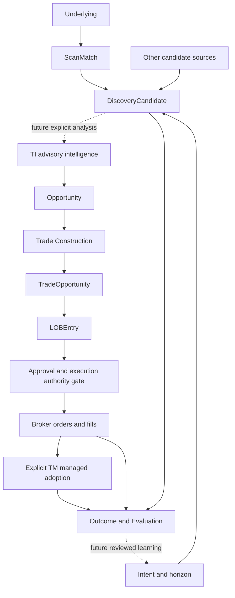
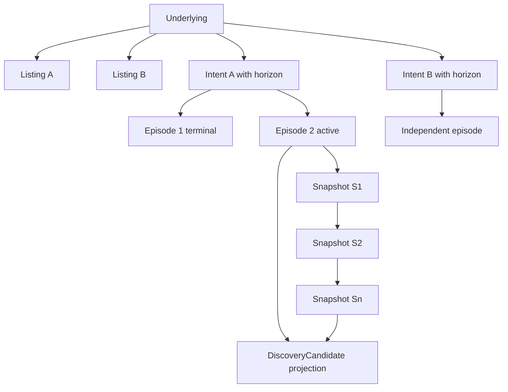
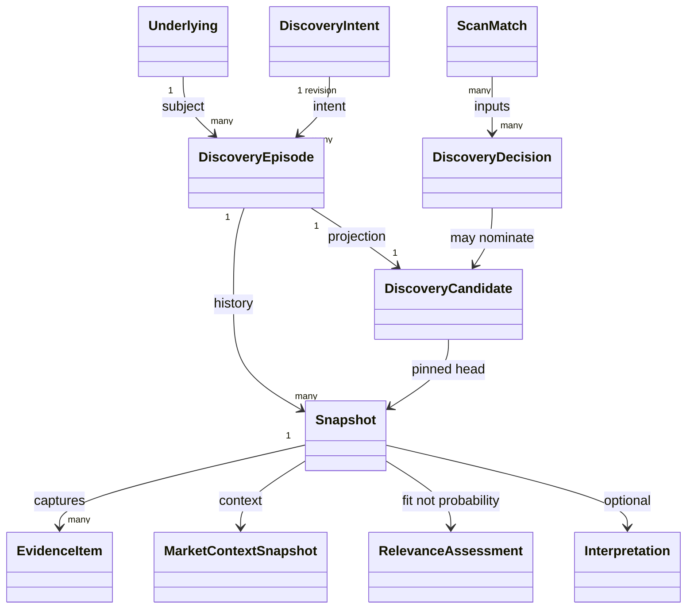
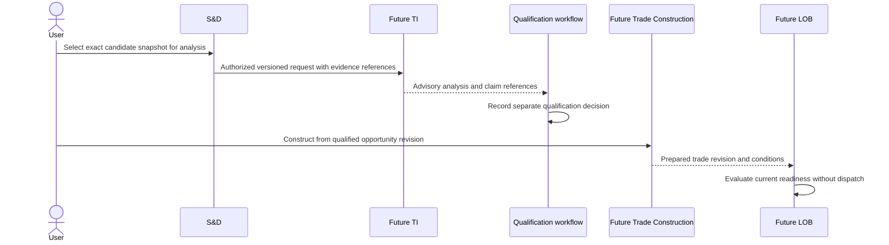

# TWF Opportunity Domain Architecture

## Status and authority

Current status: **ACCEPTED / IMPLEMENTATION AUTHORIZED**. Sprint 2 is **IMPLEMENTED / READY FOR USER VALIDATION** under the [implementation record](TWF_SPRINT2_SCAN_DISCOVER_IMPLEMENTATION.md); final acceptance/freeze remains pending. The [independent acceptance record](TWF_SCAN_DISCOVER_ARCHITECTURE_ACCEPTANCE_REVIEW.md) supersedes v0.1 proposal status. Provider/data/policy gates still apply before their dependent slices; future-stage contracts remain conceptual.

| Version | Date       | Status                                   | Role and change                                                                                                             |
| ------- | ---------- | ---------------------------------------- | --------------------------------------------------------------------------------------------------------------------------- |
| 0.1     | 2026-09-28 | PROPOSED / RECONCILED / READY FOR REVIEW | Normative design proposal for identities, lineage, lifecycle and ownership across discovery and the future trading workflow |
| 0.2 | 2026-09-29 | ACCEPTED / IMPLEMENTATION AUTHORIZED | Independent architecture acceptance and status reconciliation; bounded by the delivery plan and [review](TWF_SCAN_DISCOVER_ARCHITECTURE_ACCEPTANCE_REVIEW.md); no runtime implementation |

This document defines shared domain semantics. [S&D architecture](TWF_SCAN_AND_DISCOVER_ARCHITECTURE.md)
defines discovery policies and providers; the [Sprint-2 plan](TWF_SPRINT2_SCAN_DISCOVER_DELIVERY_PLAN.md)
limits implementation to DiscoveryCandidate. Later objects below are conceptual
contracts, not implemented tables, endpoints or accepted satellite API schemas.
The [reconciliation record](TWF_SCAN_DISCOVER_ARCHITECTURE_RECONCILIATION.md)
records baseline evidence and precedence. Broker V2 is accepted/frozen and unchanged.

## 2026-10-01 temporal-state amendment

The [scan-driven temporal-state architecture](TWF_SND_SCAN_DRIVEN_TEMPORAL_STATE_ARCHITECTURE.md) is the focused normative amendment for future observation, comparability, lifecycle and HOT/COLD work: **ACCEPT WITH REFINEMENT / GO_IMPLEMENTATION / NOT IMPLEMENTED**. It supersedes the earlier time-derived lifecycle rules within S&D; current runtime is still documented in the implementation record. It does not change historical acceptance or implement Opportunity, LOB, U3, Watchlists, custom horizons or background reevaluation. Markdown is authoritative; the existing DOCX remains a historical reference and has not been synchronized to this amendment.

## 1. Domain progression and authority

An arrow conveys a possible relationship, not automatic conversion or authority.
A trader may use Scan alone, never request TI, or never trade a candidate. Many
matches produce no candidate; many candidates produce no qualified opportunity;
one qualified opportunity can support alternative trade constructions. A manual
Broker V2 order may have no discovery lineage. Do not invent a candidate for it.

TM-managed dispatch additionally requires TM assessment and approval **before**
execution. The diagram's post-execution TM node describes supervision/adoption,
not permission to delay risk governance until after a trade. Broker V2 manual
execution retains its separate, explicitly enabled unmanaged authority path.

| Boundary                | Authority                                                         | What TWF may own                                                               | What it must not claim                                                       |
| ----------------------- | ----------------------------------------------------------------- | ------------------------------------------------------------------------------ | ---------------------------------------------------------------------------- |
| Reference identity/data | Identified reference/market data producer                         | Stable IDs, source mappings, captured observations                             | That an ambiguous symbol is a universal security ID                          |
| Scan                    | ScanProvider's declared criteria evaluator                        | Definition revisions, runs, normalized matches                                 | Ownership of a satellite's native algorithms                                 |
| Discovery               | TWF S&D evaluator and versioned policy                            | Intent, episode, snapshots, candidate projection, relevance                    | TI scientific confidence, profit probability, trade approval                 |
| TI                      | TI owns its claims/forecasts/thesis and their versions            | Requests, immutable response references, future qualification decision record  | Editing TI claims or replacing its scientific authority                      |
| Trade Construction      | Future TWF construction workflow, within verified TI/TM contracts | Concrete proposals and alternatives                                            | Execution permission or broker acceptance                                    |
| LOB                     | Future TWF readiness/read-model workflow                          | Prepared-opportunity queue and validity projection                             | An order book, live-order ownership, automatic dispatch                      |
| Execution               | Broker owns execution truth; TWF owns its request/audit           | Existing order intent, idempotency, confirmation and reconciliation references | Acknowledgement means fill, or timeout means no execution                    |
| Managed trading         | TM owns accepted managed scope                                    | References and governed interaction UI                                         | Silent manual fallback or implicit adoption                                  |
| Evaluation              | Named evaluator owns a versioned derived result                   | Captured datasets, labels, lineage, evaluation versions                        | Causality, calibrated probability or learnability from selected trades alone |

## 2. Identity and common record rules

Every TWF-owned object has an opaque stable ID, authorized owner scope, schema
version, creation timestamp and lineage references. Mutable aggregates also have
revision/CAS control; immutable observations have capture IDs and content hashes.
Never use display name, symbol alone, table position or relevance rank as identity.
Personal user ownership is the Sprint-2 boundary. Workspace/tenant membership
must be separately implemented and accepted before a shared scope is enabled.

External IDs retain producer namespace, producer version when relevant and native
identifier; mappings have evidence/version and validity interval. An underlying
can have multiple listings and derivative contracts. A venue-specific observation
keeps its listing/contract basis. NSE and BSE prices do not become duplicate
observations merely because both map to one underlying. Unresolved mappings stay
source-scoped with an explicit ambiguity flag; cross-source underlying merge is
forbidden until resolved. Broker-native execution identity is never replaced by
a discovery ID. Later execution must resolve an exact eligible native contract.

The same underlying and trading intent may recur in a genuinely new episode.
Different intents/horizons can coexist. Same-intent normal price fluctuations do
not create a new episode. Owner, exact subject identity and the complete ScanComparabilityKey participate in the episode identity rule, including criteria compatibility, intent/horizon, observation basis, provider/data mode and admission/context/lifecycle policy. The [temporal amendment](TWF_SND_SCAN_DRIVEN_TEMPORAL_STATE_ARCHITECTURE.md#4-candidate-identity-and-comparability) separates exact configuration provenance from semantic comparability. Scoring-only model changes segment score history without fabricating lifecycle expiry.

All timestamps use UTC instants plus explicit original venue/calendar/timezone
metadata. Preserve `observed_at`, `source_published_at` when supplied,
`available_at` where known, `received_at`, `evaluated_at` and `recorded_at` as distinct
meanings. A missing source timestamp stays missing. Receipt time cannot assert
market freshness. An evaluation records the actual information cutoff; future
labels must not leak backward into the evidence used at nomination time.

## 3. Entity contracts

### 3.1 Underlying

- **Purpose/owner:** stable subject of analysis; TWF reference-identity registry
  owns its mapping record, not the underlying market/security facts.
- **Identity:** `underlying_id`; versioned source mappings and listing relationships.
  Unresolved source subjects have separate source-scoped IDs, not fabricated
  canonical IDs. An ISIN, symbol or provider token is evidence, not a universal key.
- **Mutability/lifecycle:** append reference revisions; ACTIVE, AMBIGUOUS,
  RETIRED/SUPERSEDED mappings. A delisting preserves historical relationships.
- **Authority/time/provenance:** source namespace, mapping evidence, validity
  interval, observed/received/recorded times, resolver version and corrections.
- **Relationships:** universe memberships and observations point here or to an
  unresolved subject. Multiple intents, episodes, listings and contracts may
  follow; historical episode subject IDs are not destructively rewritten.

### 3.2 DiscoveryIntent

- **Purpose/owner:** TWF-owned definition of what attention is sought: direction,
  objective, setup/thesis family and horizon, distinct from an execution instruction.
- **Identity:** `intent_id` plus immutable `intent_revision` and semantic fingerprint.
- **Mutability/lifecycle:** authorable DRAFT; validated ACTIVE revision; RETIRED.
  Editing creates a revision; an episode pins the version it was evaluated under.
- **Authority/time/provenance:** user choice or saved profile, policy definitions,
  created/activated/retired timestamps and actor/configuration revisions.
- **Relationships:** combines with subject and observation basis to form episodes;
  future Opportunity retains this original context even if its own horizon differs.

`HorizonSpec` is a versioned value object: basis (elapsed, trading sessions,
calendar or event-relative), minimum/maximum window, calendar and timezone where
applicable, event anchor where applicable, and evaluation cadence expectation.
Named presets select full values; they are not an exhaustive hard-coded enum.
A 5-session horizon is not 5 calendar days. The existing Settings Foundation's
`default_horizon` values `5d`/`15d` lack these semantics; any migration needs explicit
mapping/user confirmation, not reinterpretation of existing saved preferences.

An episode's `OpportunityWindow` contains an anchored start/end or a resolvable
event-window rule and the resolved calendar revision. It is separate from evidence
freshness, eventual order validity and eventual holding duration. Refresh does not
slide the window forward. A changed objective or substantially changed horizon
requires a new semantic intent/episode decision, not a rewritten past.

### 3.3 DiscoveryEpisode

- **Purpose/owner:** TWF-owned coherent run of a subject/intent thesis through time.
- **Identity:** `episode_id`; subject, observation basis, intent/horizon fingerprint,
  owner, setup semantics, compatible observation/provider/data-mode basis and explicit lifecycle-policy-series key. At most one nonterminal episode per key; EXPIRED and REJECTED release the active slot.
- **Mutability/lifecycle:** revisioned head/decision aggregate; immutable observations
  and explicit control events. Future temporal-policy lifecycle is NEW, CURRENT, STALE, DEFUNCT, EXPIRED, REJECTED; freshness/window validity are separate projections defined below. New policy series is intentional, never accidental duplication.
- **Authority/time/provenance:** evaluator/policy revisions, initial evidence,
  fixed opportunity window, opened/last-evaluated/expired/rejected timestamps,
  previous episode link and reason for opening. Record actor for manual dismissal.
- **Relationships:** contains S1…Sn and decision events, owns one candidate projection.
  May point to prior terminal episode; later episodes cannot erase prior outcome.

### 3.4 Snapshot

- **Purpose/owner:** TWF-owned immutable capture of what was available for a decision.
- **Identity:** `snapshot_id`, episode sequence number and content hash; sequence
  ordering is storage order, not permission to accept a late observation as newer data.
- **Mutability/lifecycle:** append-only; accepted, quarantined or superseded by a
  separately recorded correction. Do not update payload, evidence, score or source
  times in place. Retention/deletion is separately audited, not a revised snapshot.
- **Authority/time/provenance:** original producers remain authoritative for raw
  facts. Capture source mode, identities, observation/availability/receive/evaluation
  times, units, schema/profile/capability/policy versions, evidence references,
  market context, freshness, tolerance result, relevance and optional interpretation.
- **Relationships:** previous snapshot reference; correction can `supersedes` a
  capture while preserving it. Every candidate display pins its last PRESENT snapshot. Under the temporal amendment, a separate head observation may be ABSENT or NOT_EVALUATED and must not inherit that snapshot’s score.

S1 establishes a provisional observation. S2…Sn establish evolution only with at
least two comparable, distinct source observations using compatible identity,
measurement basis, session and policy. Duplicate polls and replayed payloads do
not satisfy this rule. Historical bars can support an initial indicator without
constituting two separate S&D evaluations. Missing or non-comparable history
produces UNKNOWN evolution, never fabricated improvement. Re-scoring past data
under a new policy creates a labelled replay result, not a rewritten live snapshot.

### 3.5 ScanMatch

- **Purpose/owner:** normalized assertion that a subject matched a definition in
  one scan run. Native match semantics belong to the ScanProvider.
- **Identity:** `scan_match_id` plus `scan_run_id`, provider observation key and
  source-scoped/native subject identity; dedup lineage references all contributors.
- **Mutability/lifecycle:** immutable run result; valid, unresolved or quarantined
  normalization outcome. Missing or partial provider responses remain distinguishable.
- **Authority/time/provenance:** criteria/version, actual applied filters, source
  measurements/units and source timestamps, run capture time, provider/capability
  version, normalization version, source mode and completeness.
- **Relationships:** scan-only terminal output, or input to a discovery decision.
  A match can be evaluated for several intents; it need not produce any candidate.

### 3.6 DiscoveryCandidate

- **Purpose/owner:** TWF S&D's attention-worthy subject for one intent/horizon/episode.
- **Identity:** `candidate_id` stable within `episode_id`; owner-scoped. It does not
  reuse `scan_match_id` or eventual `opportunity_id`.
- **Mutability/lifecycle:** revisioned projection of immutable head snapshot and
  transition history. Candidate effective lifecycle follows its episode; save/review
  markers are orthogonal user annotations and confer no trading approval.
- **Authority/time/provenance:** versioned deterministic nomination/relevance policy,
  evidence/context/source lineage, head snapshot, evaluation cutoff, freshness,
  fixed opportunity window, optional separately labelled LLM interpretation.
- **Relationships:** derived from ScanMatch or another CandidateSource; references
  subject/intent/episode/snapshots plus immutable DiscoveryObservation outcome/run relations. ABSENT has no fabricated positive snapshot; NOT_EVALUATED cannot change the market lifecycle. Future explicit TI request references exact
  candidate revision and snapshot, not a moving mutable card.

A declined nomination is retained as a DiscoveryDecision with reason, input and
policy references. It is not a REJECTED candidate if no candidate ever existed.
The queue is a query projection, not the sole historical record.

### 3.7 Opportunity — future

- **Purpose/owner:** a qualified thesis worth constructing, beyond early discovery.
  TWF owns the qualification workflow record; TI owns deeper analysis and claims.
- **Identity:** `opportunity_id` plus immutable qualification revision.
- **Mutability/lifecycle:** proposed ANALYSIS_PENDING, QUALIFIED, NEEDS_REVIEW,
  INVALIDATED/EXPIRED/DECLINED states; exact public schema requires the future TI
  integration gate. Revised analysis yields a new decision revision.
- **Authority/time/provenance:** exact TI request/response/claim IDs and versions,
  evidence as-of, analysis time, qualification policy/actor, decision/validity times.
  No invented universal probability threshold substitutes for TI's contract.
- **Relationships:** one or more explicit candidate/evidence references; separate
  qualified horizon/thesis. Several trade constructions may follow. A returned TI
  response is not automatically a qualified opportunity.

### 3.8 TradeOpportunity — future

- **Purpose/owner:** future construction workflow's explicit proposed trade, with
  structure, native/canonical mappings, direction, entry conditions, risk/exit
  proposal, duration, constraints and expected management mode.
- **Identity:** `trade_opportunity_id` and immutable construction revision;
  alternative structures have distinct IDs with common opportunity lineage.
- **Mutability/lifecycle:** DRAFT, PREPARED, NEEDS_REVIEW, EXPIRED/WITHDRAWN conceptual
  states. Edit after review creates a new revision and invalidates prior readiness.
- **Authority/time/provenance:** constructor/actor and policy, input qualification
  revision, contract resolution, price/risk assumptions, prepared/as-of/valid-until
  times; TI claims and future TM assessments remain separate referenced authorities.
- **Relationships:** derives from Opportunity; can enter LOB; later creates a
  distinct OrderIntent only after explicit authority/confirmation. Not itself an order.

### 3.9 LOBEntry — future

- **Purpose/owner:** future TWF Live Opportunity Book organizes prepared proposals
  that are actionable under their current conditions. It is not a broker order book.
- **Identity:** `lob_entry_id`, linked exact trade-opportunity revision and owner.
- **Mutability/lifecycle:** revisioned projection with proposed WATCHING, READY,
  PAUSED, STALE, EXPIRED/WITHDRAWN and DISPATCH_LINKED states. Readiness can be lost
  without deleting the underlying trade proposal or cancelling an existing order.
- **Authority/time/provenance:** condition evaluator, all input versions, evaluated
  as-of, validity window and last verified checks. Readiness must be checked again
  under current account/capability/authority immediately before a new command.
- **Relationships:** links TradeOpportunity, future TM assessment where managed,
  and any resulting OrderIntent. Multiple entries must not create duplicate dispatch.
  Concurrency/idempotency policy is a future execution gate, not implied by ranking.

### 3.10 ExecutedTrade / OrderIntent reference — existing broker foundation and future linkage

- **Purpose/owner:** reference to the accepted TWF order-intent/audit and broker's
  authoritative orders, fills and positions. “ExecutedTrade” is a future analytical
  grouping; a successful submit is not sufficient to create a filled trade.
- **Identity:** existing TWF intent ID plus exact broker account/provider/order/fill
  identifiers; do not redefine Broker V2's status enum or persisted intent semantics.
- **Mutability/lifecycle:** accepted Broker V2 reconciliation remains authoritative.
  Unknown submission, pending order, rejected order, partial fill and complete fill
  stay distinct. Execution observations are captured with their original status.
- **Authority/time/provenance:** user confirmation, command owner, account policy,
  idempotency reference, request/dispatch/acknowledgement/fill/as-of timestamps and
  provider lineage. Sensitive credentials/payloads never enter domain evidence.
- **Relationships:** optional future TradeOpportunity/LOB lineage; existing manual
  orders need neither. Position adoption into TM is a separate explicit action.

### 3.11 ManagedPosition reference — future

- **Purpose/owner:** reference to a position TM has explicitly accepted into its
  managed scope. TM owns managed lifecycle and policy; broker owns position/fill facts.
- **Identity:** verified TM service/managed-position ID and version, exact broker
  account and adopted position/lot scope under the future committed public contract.
- **Mutability/lifecycle:** TWF stores observations and links; never locally invents
  TM management states. Adoption, updates and termination follow TM's contract.
- **Authority/time/provenance:** adoption request/acceptance, ownership revision,
  approved plan, TM observation/version/time and broker reconciliation as-of.
- **Relationships:** links execution references and, when present, prepared trade
  lineage; produces management/outcome evidence. Manual execution alone is not adoption.

### 3.12 Outcome / Evaluation — future

- **Purpose/owner:** named evaluator's versioned assessment of discovery or trading
  outcomes, including candidates never traded and matches never nominated.
- **Identity:** `evaluation_id` plus evaluator/version, subject episode or execution
  reference, dataset/cutoff and label horizon. Distinguish research from live results.
- **Mutability/lifecycle:** PENDING_DATA, EVALUATED, INCOMPLETE, SUPERSEDED; corrections
  and recalculations append new results. An evaluation cannot alter source snapshots.
- **Authority/time/provenance:** price/return source, corporate-action adjustment
  basis, benchmark/calendar, information and evaluation cutoffs, method/configuration,
  availability and computed times. Missing future observations remain censored/unknown.
- **Relationships:** episode, declined decision, qualification or trade/position
  references. Later reviewed ML/IFL can propose policies; no self-activation in Sprint 2.

Future labels include +1/+3/+5/+10-day returns with an explicit session/calendar
basis, MFE/MAE, thesis validity, episode lifetime and rejection reason. Trade P&L,
fees and execution quality are separate from hypothetical candidate returns.
Avoid survivorship, selection and look-ahead bias; deduplicate dependent episodes
and use temporal/underlying-separated validation. No asserted ML readiness if
retention/licensing has removed the necessary observations.

## 4. Evidence and relevance value objects

EvidenceItem includes typed observation/feature/assertion, subject/observation
basis, value and unit, source/source-version/native reference, source-mode,
observed/available/received timestamps, quality/missingness, lineage/dependence
key and transformation version. MarketContextSnapshot captures benchmark, sector
where available, regime/session and its own freshness. A timestamp without a
known observation basis is not sufficient evidence for a price-derived claim.

RelevanceAssessment captures policy version, intent/horizon, feature contributions,
coverage, required-input result, score or null, band and reasons. It measures fit
to the discovery policy. Example default bands on the displayed quantized score:
LOW <= 0.60, MEDIUM > 0.60 and <= 0.90, HIGH > 0.90. These are configurable starting
thresholds, not calibrated likelihoods. Required input missing means unscored;
optional missing evidence cannot increase relevance through denominator shrinkage.

Interpretation stores actual LLM producer/model/prompt/configuration revision,
input snapshot IDs, server-validated citations, generation time and grounding
classification. GROUNDED, PARTIALLY_GROUNDED and CONTEXT_ONLY describe support from
supplied evidence, not certainty. It has no score weight or transition authority
in Sprint 2. A generated claim never becomes an authoritative raw observation.

## 5. Episode lifecycle and temporal projection

The [scan-driven temporal architecture](TWF_SND_SCAN_DRIVEN_TEMPORAL_STATE_ARCHITECTURE.md#6-lifecycle-freshness-and-windows) supersedes this section's earlier clock-driven STALE/EXPIRED projection for future implementation. It is **design-ready, not implemented**. Existing snapshots/episodes retain their original lifecycle-policy meaning through a forward compatibility migration.

Candidate lifecycle evolves through explicit comparable scan observations and audited owner decisions. First eligible PRESENT creates NEW; a second distinct eligible PRESENT can produce CURRENT; authoritative comparable ABSENT produces STALE with reason NOT_REDISCOVERED and no fabricated relevance. NOT_EVALUATED, provider failure and outside-universe status cannot demote a candidate. Confirmed breach remains DEFUNCT with evidence; recovery requires the pinned policy and fresh comparable observations. No default absence-count terminal threshold is adopted.

Read-time freshness and window validity remain truthful independent fields. A fixed window ending prevents current-attention eligibility, but does not rewrite lifecycle on GET. Explicit comparable scan/owner evaluation can record EXPIRED; a distinct eligible later setup opens a linked episode. REJECTED remains terminal. Owner dismissal is immediate and fenced against older in-flight scan completion. No clock-only market-state update, background re-scoring or perpetual monitoring is introduced in S&D.

The authoritative inputs are immutable observation cores, pinned policies and explicit owner control events; materialized candidate/transition views are rebuildable. HOT history is bounded while COLD cores retain causal/replay inputs. Exact source-time novelty, versioned comparability, ordered finalization and owner-aware idempotency are defined once in the temporal amendment rather than a competing state machine here.

Continuous real-time actionability monitoring belongs downstream, primarily Opportunity/LOB. The conceptual independent flow is Underlying → Universe/Watchlist → S&D → Opportunity/Trade Construction → LOB → Broker → TM. These are optional handoffs; TM-managed execution still requires TM assessment before dispatch, and unmanaged manual broker trading remains separately usable. Watchlists, custom horizons, construction and LOB implementation remain TBD.

## 6. Persistence and transitions

The proposed S&D repository owns logical aggregates, not a new database platform.
Use the accepted SQLAlchemy/Alembic foundation and portable PostgreSQL production /
isolated SQLite local/test behavior. No tables or migrations are created by this
documentation task. Capture schema/data-retention decisions at the implementation gate.

- Persist snapshot, nomination/transition event and head CAS update atomically.
- Enforce active-episode uniqueness with database constraints plus bounded conflict
  handling; no process-local lock is the only multi-worker protection.
- Provider/LLM network calls occur outside DB write transactions. Recheck owner,
  profile revision, run generation and episode head before committing their output.
- Reject or separately retain obsolete responses; never let an old run replace a
  newer head or reactivate cancelled work. Retry correlation survives restarts.
- Use explicit transactions; do not hide commits in repository/session dependencies.
- Keep evidence references and content hashes independent of short-lived caches.
  A cache eviction is not historical deletion; a retention tombstone is not a fact.
- Licensed raw payload retention, normalized evidence and decision history may have
  different limits. Deletion/tombstones and incomplete reproducibility must be visible.

## 7. Cross-stage handoff and invalidation

Each transition validates input version/freshness, actor permission, completeness,
provenance, contract compatibility and correlation. Relevance alone cannot approve
qualification. Qualification alone cannot establish construction suitability;
construction alone cannot grant execution rights. Future gateways must define
invalidation when an upstream snapshot changes, a qualification expires, a contract
mapping changes, account capability is revoked or command ownership transfers.
Previously executed orders are reconciled under the broker contract, not undone
by changing a discovery candidate's status.

Future execution resolves one command owner. TM-managed accounts require the
[TM public-contract and ownership gate](TWF_TM_INTEGRATION_CONTRACT.md); unmanaged
manual orders retain [Broker V2](TWF_BROKER_V2_MANUAL_ORDER_ENTRY.md) safeguards.
Never silently fall back from TM to manual on error. S&D has no broker credentials,
order endpoint, confirmation grant or permission to call an execution adapter.

## 8. Evolution from the older generic Candidate

The TWF-0 “Candidate” was a broad workflow placeholder. It is not discarded or
silently renamed in historical documents. For new work use the narrow stage:

| Historical intent                        | New precise object                                             | Required distinction                                             |
| ---------------------------------------- | -------------------------------------------------------------- | ---------------------------------------------------------------- |
| Instrument matched a scanner             | ScanMatch                                                      | Criteria match may never deserve attention                       |
| Interesting subject to review            | DiscoveryCandidate                                             | Intent/horizon/evidence-relative, no trade recommendation        |
| TI-supported qualified thesis            | Opportunity                                                    | Separate analysis and qualification references                   |
| Fully proposed trade structure           | TradeOpportunity                                               | Exact structure/assumptions, still no execution authority        |
| Actionable prepared item in a live queue | LOBEntry                                                       | Readiness projection, not broker order                           |
| Submitted/filled/managed trade           | Existing OrderIntent/broker references; future ManagedPosition | Execution truth and managed authority remain external boundaries |

There is no implemented generic candidate store to migrate in the inspected
baseline. A later implementation must inspect actual schemas before introducing
migration/backfill rules; ambiguous legacy records remain explicitly unclassified.
Existing broker-native DTOs, IDs and frozen milestone records must not be renamed
to fit this conceptual ladder. New public domain schemas need versioned publication,
compatibility fixtures and the appropriate gate before consumer implementation.

## 9. Acceptance and open decisions

Domain acceptance must prove identity collision/ambiguity handling, same subject
multiple intents, recurrence without resurrection, immutable snapshots, distinct
observation counting, horizon/calendar boundaries, tolerance recovery, expiry,
rejection reasons, null-vs-zero relevance, revision conflict/restart safety,
owner isolation, retention honesty and absence of execution authority. See the
[Sprint-2 acceptance matrix](TWF_SPRINT2_SCAN_DISCOVER_DELIVERY_PLAN.md).

Before production data acceptance, select reference/data/calendar sources and
rights, initial instruments/horizon presets, fixed policy/tolerance parameters,
limits/retention and reconciliation behavior under provider corrections. Future
TI qualification, construction schema, LOB readiness and TM adoption require their
own reviewed public contracts. These are explicit gates, not claims that those
future systems have been implemented or accepted.
