# TWF Scan & Discover Architecture

> **2026-10-02 active-runtime amendment:** TradingView is decommissioned from active S&D. The current authoritative market-data path is Dhan through the provider-neutral [`MarketDataProvider`](TWF_MARKET_DATA_PROVIDER_ARCHITECTURE.md); TapTide is optional context through [`MarketIntelligenceProvider`](TWF_MARKET_INTELLIGENCE_PROVIDER_ARCHITECTURE.md). This amendment supersedes active TradingView runtime/provider guidance below. TradingView passages remain historical design/implementation context and do not authorize calls. Generic MCP, historical rows, and provenance remain preserved.

## Status and authority

Current status: **ACCEPTED / IMPLEMENTATION AUTHORIZED**. Sprint 2 is **IMPLEMENTED / READY FOR USER VALIDATION** under the [implementation record](TWF_SPRINT2_SCAN_DISCOVER_IMPLEMENTATION.md); final acceptance/freeze remains pending. The [independent acceptance record](TWF_SCAN_DISCOVER_ARCHITECTURE_ACCEPTANCE_REVIEW.md) supersedes v0.1 proposal status. Provider/data/policy gates still apply before their dependent slices; future-stage contracts remain conceptual.

| Version | Date       | Status                                   | Role and change                                                                                                                                                                          |
| ------- | ---------- | ---------------------------------------- | ---------------------------------------------------------------------------------------------------------------------------------------------------------------------------------------- |
| 0.1     | 2026-09-28 | PROPOSED / RECONCILED / READY FOR REVIEW | Normative design proposal for Scan & Discover; separates scanning, discovery, evidence and optional interpretation                                                                       |
| 0.2     | 2026-09-29 | ACCEPTED / IMPLEMENTATION AUTHORIZED     | Independent architecture acceptance and status reconciliation; bounded by the delivery plan and [review](TWF_SCAN_DISCOVER_ARCHITECTURE_ACCEPTANCE_REVIEW.md); no runtime implementation |

This is the designated Markdown authority for the accepted S&D subsystem design, not an
implementation or freeze claim. The [Opportunity domain](TWF_OPPORTUNITY_DOMAIN_ARCHITECTURE.md)
owns shared domain identities and cross-stage ownership; the [Sprint-2 plan](TWF_SPRINT2_SCAN_DISCOVER_DELIVERY_PLAN.md)
owns bounded delivery and gates. Their precedence and repository evidence are in
the [reconciliation record](TWF_SCAN_DISCOVER_ARCHITECTURE_RECONCILIATION.md).
The accepted Broker V2 baseline remains unchanged. No S&D runtime, real provider
integration, TI qualification, LOB or TM adoption is claimed implemented by this architecture document. Current Sprint-2 runtime status is owned by the implementation record, not the original 2026-09-28 proposal wording.

## 2026-10-01 temporal-state amendment

The [scan-driven temporal-state architecture](TWF_SND_SCAN_DRIVEN_TEMPORAL_STATE_ARCHITECTURE.md) is the focused normative amendment for observation, comparability, lifecycle and HOT/COLD work: **IMPLEMENTED / PENDING USER VALIDATION AND INDEPENDENT ACCEPTANCE**. Revision `0014_discovery_temporal_state` and the product/API/UI changes implement its immutable PRESENT/ABSENT/NOT_EVALUATED ledger, semantic active slots, durable ordered admission, deterministic reducer, logical HOT/COLD history, checkpoints and bounded temporal views. Earlier time-derived lifecycle rules are superseded for new temporal records; legacy records remain readable without invented absence. This does not change historical acceptance or implement Opportunity, LOB, U3, Watchlists, custom horizons or background reevaluation. Markdown is authoritative; the existing DOCX remains a historical reference and has not been synchronized to this amendment.

## 1. Executive summary and user problem

S&D helps a trader answer: **What deserves attention now, for this intent and
horizon, and why?** A scanner can return many matches without explaining whether
they are timely, sufficiently supported or compatible with the market context.
Discovery performs that separate assessment and may decline to nominate anything.

Scanner is a subsystem; opportunity discovery is its mission. A ScanMatch means
criteria matched. A DiscoveryCandidate means something merits examination, not
that it should be traded. S&D must be independently useful with no LLM, no TI/TM
connection and no connected broker. It must remain usable without TradingView.

Sprint 2 delivers scan-only and Scan + Discover, bounded market context, evidence,
intent-relative relevance, durable history and a finished discovery queue. It
stops at DiscoveryCandidate. External candidate ingestion is a contract seam with
synthetic acceptance coverage; production external/manual/agent feeds come later.

## 2. Architecture principles

1. S&D has independent user value; deeper trading workflow is not a prerequisite.
2. Scan and Discovery are separate, composable operations; scan-only is first class.
3. Discovery accepts normalized candidate sources rather than one scanner's objects.
4. Deterministic operation works with LLM OFF or disconnected.
5. LLM Level-0 is optional explanation and qualitative interpretation.
6. OpenAI, Anthropic/Claude and Google are possible hosted adapter families, not
   mandated vendors or claims of verified integration.
7. A LocalLLMAdapter is experimental/development-only unless separately accepted.
8. One applied primary LLM configuration per authorized context is normal operation.
9. Provider changes are explicit; failures never silently select a different producer.
10. LLM content cannot masquerade as deterministic or current market evidence.
11. Grounding is validated against supplied evidence, not an LLM's self-description.
12. TradingView MCP is an important planned Sprint-2 adapter, not a domain dependency.
13. A small internal scanner proves a genuine alternative execution path.
14. Universe, scan, market context and candidate intelligence have separate contracts.
15. Market intelligence is a first-class Discovery input, not deferred wholesale to TI.
16. No provider, including a possible Tapetide adapter, is mandatory to the architecture.
17. Identity, version, capabilities, health and actual data source survive normalization.
18. Local and remote deployment preserve meaning, errors, lineage and ownership.
19. Provider SDK/MCP payload types remain behind adapters.
20. Every candidate is relative to intent, horizon, opportunity window and evidence.
21. Temporal provenance and freshness are explicit; EOD is never labelled live.
22. Snapshots are immutable and support a series, not a single overwritten row.
23. Missing evidence is unknown, not zero, favorable, or an empty successful result.
24. Correlated evidence is not counted repeatedly as independent agreement.
25. Discovery Relevance is fit to policy, not probability of profit.
26. Discovery may decline when required evidence is insufficient or incompatible.
27. Terminal rejection is reasoned; a later distinct eligible setup creates a new episode. Candidate lifecycle is scan-driven with explicit owner-decision exceptions; clock-only freshness/window validity is separate.
28. History includes untraded and dismissed candidates for future evaluation.
29. Neither settings, LLM output nor a candidate grants trading authority.
30. Contracts preserve future TI, construction, LOB, TM and ML seams without
    implementing those systems or a premature microservice platform.

## 3. Scope, terminology and product context

Sprint 2 includes bounded scanning, normalization, market context, optional Level-0,
DiscoveryCandidate lifecycle/evidence/history/settings and finished discovery UX.
It excludes TI qualification, Opportunity/TradeOpportunity/LOB runtime, TM-managed
integration, automatic execution, full alerts, high-frequency monitoring, production
ML and autonomous agents. The later product progression below establishes handoff
boundaries only; the [delivery plan](TWF_SPRINT2_SCAN_DISCOVER_DELIVERY_PLAN.md)
owns exact slices, initial data/profile gates and acceptance.

| Term               | Meaning                                                                 | Does not mean                                        |
| ------------------ | ----------------------------------------------------------------------- | ---------------------------------------------------- |
| Universe           | Versioned set of exact market/listing identities eligible for a run     | Broker account or executable order routing           |
| ScanDefinition     | Typed criteria and required inputs                                      | Arbitrary code or natural-language execution         |
| ScanProfile        | Owned, versioned configuration selecting definitions/providers/policies | Capability, entitlement or credentials               |
| ScanMatch          | Immutable report that specified criteria matched particular data        | Recommendation or qualified opportunity              |
| DiscoveryIntent    | Direction, setup objective and horizon-relative attention purpose       | Broker order side or execution permission            |
| DiscoveryEpisode   | One time-bounded investigation of a subject under an intent             | Permanent state for a symbol                         |
| Snapshot           | Immutable observation/evidence capture                                  | An always-current quote                              |
| DiscoveryCandidate | Owned attention record with evidence and lifecycle                      | TradeOpportunity or authorized order                 |
| Level-0            | Optional grounded/context-labelled interpretation                       | TI deep intelligence or profit forecasting authority |

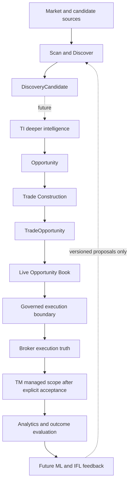

These arrows show information flow, not automatic promotion or delegated trading
authority. TM-managed execution also requires TM assessment **before** dispatch;
post-execution TM adoption is explicit. Broker V2's separately enabled manual
path remains available independently and unmanaged. S&D has no dispatch edge.

## 4. System context and components

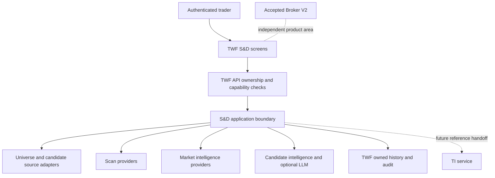

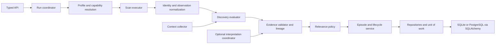

These are logical responsibilities within the existing FastAPI application. Do
not mandate separate services, queues or packages for every box. Domain contracts
must not import HTTP/MCP, a provider SDK, SQLAlchemy or browser state. Application
services own transactions; provider I/O runs outside DB transactions. The web app
uses TWF APIs and the existing session/Origin boundary.

## 5. Three composable workflows

### Scan only

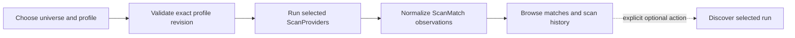

No candidate, episode or LLM invocation is required just to scan. Empty complete
results mean no matches; incomplete results show missing partitions and must not
claim universe-wide absence.

### Scan + Discover

```mermaid
flowchart LR
    Scan[Complete or explicitly partial scan run] --> Input[Candidate input batch]
    Input --> Context[Collect required market and instrument evidence]
    Context --> Check[Validate identity time quality and policy]
    Check --> Assess[Assess intent horizon and tolerance]
    Assess --> Nominate[Nominate or decline with reasons]
    Nominate --> Queue[Discovery queue and immutable history]
    Queue -. optional .-> L0[Level-0 interpretation]
```

Scan + Discover captures both operations under a parent correlation ID, retaining
separate run statuses. A scan succeeding while discovery fails is not total
success. A user can retry Discovery explicitly against the saved eligible input;
new run identity and idempotency rules prevent duplicate episode creation.

### Discovery from another source

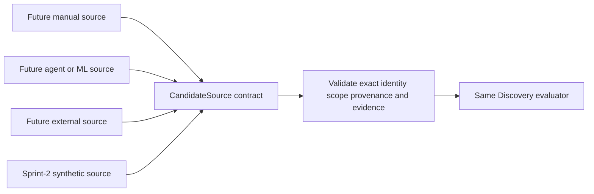

A source nomination is not trusted evidence of fitness. Discovery applies the
same evidence/decline rules and records the actual source. Sprint 2 proves this
seam without shipping autonomous agents or an unrestricted import endpoint.

## 6. Identity, intent, horizon and episode model

Use the [domain identity rules](TWF_OPPORTUNITY_DOMAIN_ARCHITECTURE.md#2-identity-and-common-record-rules).
An Underlying denotes a stable analytical subject; an InstrumentRef denotes the
exact listing/contract observed. Symbol alone is insufficient. Mapping has a
version, evidence and status. Ambiguous mapping remains unresolved; show the
source-qualified scan row but do not merge it into another subject's episode.
Broker tokens are optional foreign references, never canonical identity. S&D
identity cannot bypass later exact broker-native order resolution.

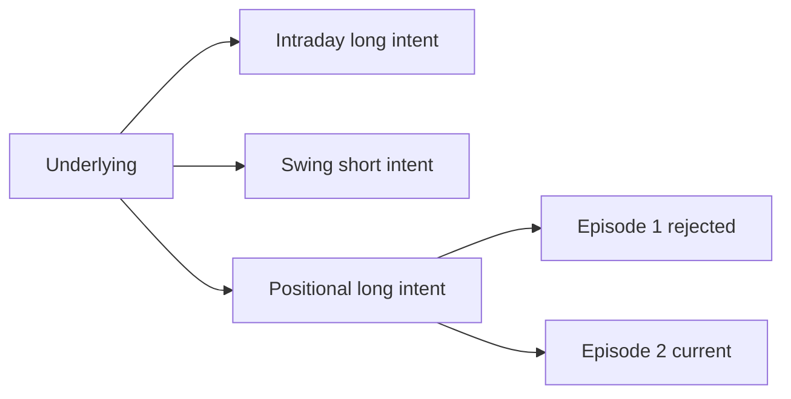

DiscoveryIntent contains direction/objective, setup family, HorizonSpec and policy
series identity. Examples include INTRADAY_LONG, SWING_SHORT, POSITIONAL_LONG and
MEDIUM_TERM_LONG; these are named presets, not a closed domain enum. Opposite
directions and different horizons may coexist and are clearly labelled.

HorizonSpec is a versioned value object: `basis` (elapsed time, trading sessions,
calendar interval, until event/expiry), minimum/maximum duration or count,
calendar/venue/timezone, anchor rule, and optional event reference. It separates
expected evaluation horizon from `OpportunityWindow {opens_at, expires_at}`.
Examples: next 30 minutes; current session; 1–3, 1–5 or 1–15 trading sessions;
2–6 weeks; 1–3 months; explicit custom or event window. Trading days require a
versioned calendar, not division by 24 hours. All persisted instants are aware UTC;
exchange timezone and calendar remain explicit for display and calculations.

An episode pins its profile, definition, horizon/calendar, policy and comparison
basis revisions. Define the active key as owner + exact subject identity + the complete semantic ScanComparabilityKey (including criteria, admission/context policy and lifecycle series), as defined by the [temporal amendment](TWF_SND_SCAN_DRIVEN_TEMPORAL_STATE_ARCHITECTURE.md#4-candidate-identity-and-comparability). At most one nonterminal
episode exists for that key; distinct intentional profiles/policy series may run
in parallel and must be visibly distinguishable. Concurrent nomination uses a
transactional uniqueness/CAS guard. New evidence appends to the same episode.
Routine pullbacks do not create new episodes. A scoring-only version change creates a separate score series, not artificial expiry. A changed admission/lifecycle policy or incompatible observation basis requires
an explicit new evaluation lineage, never reinterpretation of old snapshots. Definition/profile exact fingerprints remain audit identities; semantic comparison additionally requires per-instrument evaluation coverage and distinct source samples.

## 7. Immutable snapshots and temporal provenance

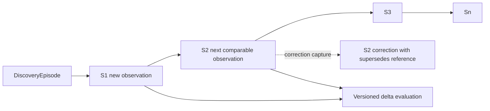

| Field group     | Required semantics                                                                                                                                                                                                                                      |
| --------------- | ------------------------------------------------------------------------------------------------------------------------------------------------------------------------------------------------------------------------------------------------------- |
| Identity        | Snapshot ID, owner, episode, subject, exact observed InstrumentRef and mapping revision                                                                                                                                                                 |
| Time            | `observed_at` / `source_data_time` describe the source observation; `received_at`, `evaluated_at` and `recorded_at` describe TWF receipt, decision and persistence; preserve source publication/availability, timeframe and session/calendar separately |
| Measurements    | Price/currency/adjustment basis, technical values/formula versions, volume/liquidity, market/sector context; nullable with missing reasons                                                                                                              |
| Source          | Provider/service/model identity, dataset/revision, operation/run IDs, source observation IDs, upstream provenance, synthetic/live/EOD/delayed label                                                                                                     |
| Policy          | Profile/scan/ranking/tolerance/freshness versions and effective non-secret configuration digest                                                                                                                                                         |
| Reproducibility | Evidence references or licensed immutable captures, input digest, correction lineage and completeness                                                                                                                                                   |

Never substitute receipt time for an unknown source time. Unknown or future source
times fail required freshness checks; bounded clock-skew handling is a named policy,
not silent timestamp rewriting. A provider response that arrives later can still
describe old data. For a composite snapshot, freshness is evaluated per item and
required category, not by the newest single item.

S1 may support a provisional candidate if static eligibility is satisfied. Claims
about improvement or deterioration of this episode require at least two comparable
observations. Historical bars can support an initial indicator/trend measurement,
but bars supplied to one scan are not automatically two S&D observations.
S2 must have distinct underlying source observations/times, same compatible units,
adjustment basis and timeframe. Repeated polling of the same source sample is not
evolution. Different cadences/bases remain separate comparison series. Corrections
append new captures and supersession links; they never overwrite what was known.

Record source publication/availability when possible as well as capture time so
future backtests cannot use information published after their decision cutoff.
Late evidence cannot retroactively change a historical relevance or decision.

The temporal amendment adds immutable `DiscoveryObservation` outcomes (`PRESENT`, `ABSENT`, `NOT_EVALUATED`) around this rich snapshot model. Only PRESENT may link a positive ScanMatch and scored snapshot. ABSENT requires proven complete predicate evaluation and has null relevance; unavailable inputs and outside-universe instruments never constitute absence. Neither compact history nor a late scan rewrites stored matches/scores.

## 8. Evidence and agreement

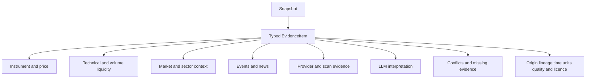

EvidenceItem contains `evidence_id`, category, typed claim/value/unit, subject,
support/oppose/neutral orientation, source reference, producer/version, source and
capture times, applicable horizon, quality flags, completeness and upstream lineage.
LLM evidence additionally carries verified grounding and input citation IDs.
MissingEvidence contains category, reason and attempted provider; absence is not a
zero-valued measurement. ConflictingEvidence links the disagreeing items and the
incompatibility (direction, timestamp, units, methodology or subject).

The policy marks categories REQUIRED, OPTIONAL or NOT_APPLICABLE per intent. A
missing required category prevents a current eligible attention result. Optional
absence is visible and lowers coverage; it cannot silently improve the score.
News/flows/breadth are not mandatory for every profile and may remain unavailable.

Agreement compares like-for-like claims only. Evidence sharing an upstream feed,
same bar series, copied report or LLM summary forms one dependence group. Provider
count is not independent vote count. Keep all sources visible; cap group influence
and disclose unknown independence. Never average incompatible price adjustment
bases, different listings or times into fictitious consensus. A useful result can
be “Technically interesting; market environment unfavorable,” retaining both sides.

## 9. Market intelligence and candidate intelligence

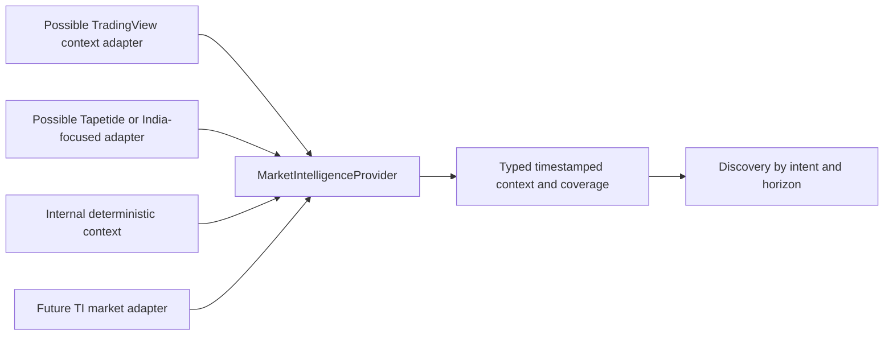

Market context is bounded environmental evidence: benchmark direction/regime,
NIFTY/BANKNIFTY where licensed data supports them, sector/industry strength,
relative strength, volatility, breadth, session, institutional flow or event/news
context. All carry source-data time, market calendar and methodology. S&D does
not claim availability of any named vendor's API, dataset or redistribution rights.

Sprint 2 requires one useful deterministic market-context path: benchmark trend,
volatility and session context from approved input bars/calendar. Sector relative
strength is optional where an authoritative sector mapping and data exist. Flow,
news and breadth are capability-gated optional enrichments, not fabricated zeros
or mandatory new providers. If mandatory benchmark context is unavailable, show a
decline or stale candidate, not a falsely complete market assessment.

MarketIntelligenceProvider returns market/sector observations; a
CandidateIntelligenceProvider returns subject-specific annotations. LLM Level-0
can implement the latter via LLMService. Future TI deep intelligence remains a
separate handoff with typed claims and scientific semantics; bounded context
does not make S&D a TI replacement.

## 10. Provider contracts and capability negotiation

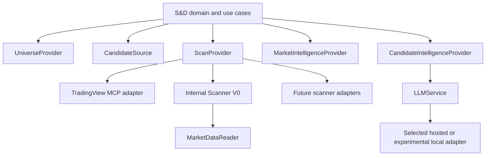

The six named families are logical protocols, not additions to the implemented
`foundation.health.v1` payload. Domain contract IDs such as `sd.scan.v1` are
proposed, separately versioned; exact wire schemas are a Sprint-2 contract gate.
`MarketDataReader` is a supporting read port for internal calculations, not a new
market-data warehouse or a reuse of ephemeral Broker V2 quote history.

| Family                        | Bounded operation                                     | Result and constraints                                                                                          |
| ----------------------------- | ----------------------------------------------------- | --------------------------------------------------------------------------------------------------------------- |
| UniverseProvider              | Resolve a versioned universe at an as-of cutoff       | Exact identities, selection definition, membership revision, coverage and pagination                            |
| CandidateSource               | Read nominated subjects since cursor/as-of            | Input IDs, exact identity, intent hints, evidence references and source provenance; hints confer no eligibility |
| ScanProvider                  | Execute validated ScanRequest                         | ScanMatch batch, criteria revision, input times, completeness and typed unsupported fields                      |
| MarketIntelligenceProvider    | Observe market/sector at requested basis and cutoff   | Typed context observations, coverage, freshness and methodological limits                                       |
| CandidateIntelligenceProvider | Annotate bounded subjects and evidence                | Cited annotations, declared limitations and grounding where applicable                                          |
| LLMService                    | Interpret an immutable bounded evidence packet        | Structured interpretation or decline; provider/model/prompt/tool versions and citations                         |
| MarketDataReader              | Read bars/observations for explicit identities/window | Timestamped licensed data, units, adjustment/session basis, gaps and provenance                                 |

Common metadata: provider/service ID and implementation version; supported contract
versions; capability IDs and parameter schemas; allowed universes/exchanges/classes,
timeframes/operators/indicators, data mode/delay, retention rights, limits and safe
health/connection operations. Capability support, entitlement, configuration,
enabled state, active binding, health and data freshness remain separate.

A run resolves an authorized applied profile revision, intersects its requirements
with advertised capabilities and deployment policy, and pins the actual provider
set. Unknown mandatory parameters/capabilities or breaking versions fail before
execution. A preview explains unsupported combinations; adapters never silently
drop filters. Optional enrichments can fail partially with explicit coverage.

Typed failures include INVALID_REQUEST, UNSUPPORTED_CAPABILITY, PROVIDER_UNAVAILABLE,
TIMEOUT, AUTHENTICATION_FAILED, AUTHORIZATION_FAILED, RATE_LIMITED, STALE_DATA,
CONTRACT_VERSION_MISMATCH, INVALID_RESPONSE, PROVENANCE_MISMATCH and CANCELLED.
Errors carry safe retryability/operation correlation, not raw bodies, secrets or
endpoints. Timeout covers the whole operation, streaming/decoding included, with
bounded bytes, items, fan-out and pages. Health cannot promise fresh data.

## 11. Historical TradingView MCP design (superseded for active runtime)

TradingView MCP is planned as the rich scan adapter. The repository contains no
accepted TradingView MCP server identity, release, authentication or tool schema.
The name is a provider candidate, not proof of an official TradingView service.
Before its live adapter gate, select and pin the actual server implementation,
review its provenance/security, permitted read-only tools, schema, data access
terms, costs, timestamps, completeness and rate limits. Record vendor evidence
and contract fixtures. MCP transport is not itself a scanner domain contract.

The server-side adapter maps a typed ScanDefinition to a supported allowlisted
tool request and validates its result. No provider-specific DSL or MCP session
objects enter the core. Arbitrary tool discovery does not authorize invocation,
and no order, shell, browser-login or credential-extraction tool is exposed to
Discovery. A local subprocess, if used, must be operator-packaged and fixed; users
cannot configure executable commands. A remote endpoint follows approved egress,
authentication and TLS policy. No silent fallback to scraped/browser data.

If the adapter is unavailable, show that provider's failure. A user may explicitly
select an eligible internal profile and start a new labelled run. A preconfigured
multi-provider run can finish PARTIAL with surviving source identity; it must not
pretend the missing provider participated. Tapetide/equivalent market context and
future scanner/data vendors use the same admission gates; none is a hard dependency.

## 12. Internal Scanner V0 and input data

The bounded V0 computes a small deterministic subset over approved OHLCV bars:
price/volume thresholds, SMA, relative volume and one simple close-above-prior-range
breakout. Pin definitions: SMA uses N completed closes; relative volume compares
the completed bar's volume with the mean of N prior comparable completed bars;
breakout excludes the tested bar from its prior range. No intrabar/EOD comparison,
look-ahead, zero-denominator division or implicit gap filling is allowed.

Required input validation covers ordering, duplicates, missing bars, exchange
sessions, corporate-action adjustment, currency, nonfinite values and sufficient
warm-up. Missing inputs yield unavailable measurements, not a fabricated match.
Deterministic internal market context uses a similarly versioned benchmark
SMA/trend and historical-return-volatility calculation, with its lookback,
annualization/session convention and thresholds recorded in the policy.

EMA, RSI, ATR, momentum/crossovers, 52-week high/low and pullbacks are compatible
future capabilities, not all mandatory V0 work. Their formulas/seeding and input
coverage need independent contract fixtures before advertisement. Do not build a
TradingView clone.

Fixture bars provide an offline, genuinely independent path in CI. A useful real
V0 deployment additionally needs an approved non-TradingView data source or a
licensed, operator-imported, versioned EOD dataset. An external data-source choice
is an explicit delivery gate; a synthetic demo alone does not accept live S&D.
Dataset import is bounded server/operator ingestion, not arbitrary user uploads
or executable data. Reuse existing infrastructure only behind the new read port;
do not persist Broker V2's ephemeral LTP batches as bar history.

## 13. Scan definitions, profiles and execution

ScanDefinition is immutable per revision: universe predicate, required timeframes,
typed indicator parameters, bounded boolean/comparison expression tree, required
data modes and completeness policy. Reject arbitrary expressions/code/SQL, unknown
operators and excessive depth/width. Units are part of operands; explain validation
failures before running. Natural language can only propose a draft definition for
human review, never run a model-generated query directly.

ScanProfile selects definitions, universe revision, providers, intent presets,
ranking/tolerance/freshness policies and optional enrichment. It is configuration
under the existing settings architecture, not a second profile framework. Editing
creates a new revision; runs pin the applied revision, not a mutable pointer.

A ScanRun records request ID/idempotency key, owner, revision set, source cutoff,
actual providers, limits and status: QUEUED → RUNNING → SUCCEEDED / PARTIAL /
FAILED / CANCELLED / INTERRUPTED. Persist before dispatch and use a bounded
coordinator. Explicit cancellation aborts supported local/network work and fences
late responses; it has no broker meaning. Completed partition captures are retained
but cannot be misrepresented as a complete universe. Restart marks in-flight work
INTERRUPTED and retains committed observations; retry is an explicit new attempt
linked to the prior run, never an automatic paid-provider storm.

Sprint 2 uses user-triggered bounded batches and explicit Refresh, not an always-on
scanner or high-frequency monitor. State/history must survive restart without
requiring Redis, a distributed event bus or a scheduler. A single-process task
runner is acceptable only with bounded concurrency and recoverable run state.

## 14. Normalization, merge and deduplication

Normalize units, exact identity, timestamps, source mode and criteria semantics
before comparison. Preserve raw vendor IDs as namespaced references; retain safe
source captures only where permitted. Unknown currency, adjustment basis,
timeframe or mapping is explicit, not guessed from a ticker.

Idempotency removes repeated delivery of the same source observation using owner,
provider, external observation ID/revision (or deterministic input digest), run
attempt and exact instrument. It does not discard distinct timestamps or correction
versions. Merge membership groups matches for the same resolved subject, intent,
horizon and compatible observation basis; it links all evidence without replacing
the original ScanMatch records. Cross-listing mapping can group an underlying in
the UX but does not blend NSE/BSE price/volume or derivative and underlying data.

Different provider scores remain labelled raw measures. Only a versioned TWF
relevance policy can compare normalized measures within a declared cohort.
Provider refresh order cannot change tie-breaking or hide a negative observation.
Pagination uses a stable run/snapshot revision and deterministic key; source
pagination must be bounded before declaring run completeness.

## 15. Discovery relevance and calibration

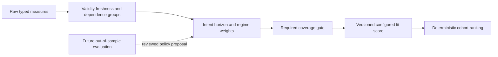

Display **Discovery Relevance**, a numeric 0–1 score plus named band and reasons.
It means current fit to the configured intent/criteria/context, never success odds.
A displayed 0.94 is not a 94% probability of profit. Scores across different
intents, horizons or incompatible policy versions are not globally comparable.

For an initial transparent policy, approved raw measures map to fit values with
documented monotonic transformations, units, direction and saturation. Weights,
quality/reliability treatment, dependence-group caps, penalties and required
coverage are versioned. A possible initial weighted fit uses the original total
weight as denominator; optional missing evidence contributes no support and is
reported as missing. Do not renormalize missing weights to inflate fit. Required
missing/invalid evidence produces `score=null`, not LOW/0 by default. A genuinely
evaluated zero fit is different from an unavailable score.

The policy must explain each contribution, opposing evidence, coverage and decline
reason. LLM interpretation does not supply deterministic price/indicator measures
or override eligibility/tolerance. Sprint-2 LLM output has zero ranking weight;
qualitative annotations remain separately visible. Later learned weighting needs
an explicit versioned validation gate, not an invisible live feedback update.

Illustrative initial bands are LOW [0, 0.60], MEDIUM (0.60, 0.90], HIGH (0.90, 1].
Use a documented decimal quantization (initially two places) before assigning the
displayed band, so number and band agree. The original 0.60/0.61 example is not a
gap in continuous domain values. Thresholds are profile/policy configuration,
not permanent market truth. Rank within a comparable cohort by relevance, then
required coverage and stable subject/episode ID; show stale/unscored results in
separate groups rather than pretending they are current top picks.

Future calibration retains raw measures, available-at times, policy versions and
all evaluated candidates including declines/non-trades. Test by time-separated
out-of-sample cohorts and regime/horizon, preserving held-out results. No ML or
automatic policy promotion is included in Sprint 2.

## 16. Freshness, horizon and after-market operation

The [2026-10-01 temporal amendment](TWF_SND_SCAN_DRIVEN_TEMPORAL_STATE_ARCHITECTURE.md#6-lifecycle-freshness-and-windows) replaces the original clock-derived effective lifecycle for the implemented temporal layer. Last-observed lifecycle, freshness and fixed-window validity are three separate values. Clock passage can change displayed freshness (`FRESH`, `STALE`, `UNKNOWN`) and window status (`OPEN`, `ENDED`, `UNKNOWN`), but cannot change lifecycle, relevance, tolerance or snapshot history. GET is read-only.

Source time, receive time, evaluation cutoff and recording time retain distinct meanings. LIVE_SNAPSHOT, DELAYED, EOD and SYNTHETIC remain explicit; successful HTTP does not establish freshness. A thirty-day-old five-day candidate can retain last-observed CURRENT while visibly window-ended and ineligible for current attention. Explicit comparable scanning or an audited owner closure materializes window expiry; no background monitor is required.

Horizon basis, exchange/session calendar, timezone and anchor are pinned. EOD data remains labelled EOD; holidays do not manufacture observations, and a source refresh cannot extend a fixed window. Current elapsed-time presets must not silently become trading-session semantics. Custom typed horizon expansion remains separately designed.

## 17. Tolerance envelope and lifecycle

Lifecycle is a persisted, rebuildable projection over immutable comparable observations and explicit owner decisions. The [normative reducer](TWF_SND_SCAN_DRIVEN_TEMPORAL_STATE_ARCHITECTURE.md#6-lifecycle-freshness-and-windows) defines precedence and versioned state semantics; the [recovery protocol](TWF_SND_SCAN_DRIVEN_TEMPORAL_STATE_ARCHITECTURE.md#8-ordering-concurrency-and-recovery-protocol) defines ordering and fencing.

| State    | Meaning under future scan-driven policy                                                                              |
| -------- | -------------------------------------------------------------------------------------------------------------------- |
| NEW      | First eligible observation; no claim of temporal evolution.                                                          |
| CURRENT  | Subsequent comparable distinct eligible PRESENT observations within the fixed window.                                |
| STALE    | Authoritative comparable ABSENT / NOT_REDISCOVERED; not a synonym for clock-aged evidence.                           |
| DEFUNCT  | Evidence-backed material breach or explicitly labelled owner override; preterminal, with pinned recovery rules.      |
| EXPIRED  | Explicit window-closure decision; no reactivation or timestamp extension.                                            |
| REJECTED | Explicit terminal decision/dismissal with actor/policy and reason; later distinct setup requires a linked successor. |

NOT_EVALUATED is neutral. No default number of absences automatically proves a terminal thesis failure. Missing or old evidence cannot prove a breach/recovery. Tolerance dimensions preserve units, reference basis, thresholds, required evidence, confirmation and recovery policy; only an explicit scan assesses them. Repeated polling of the same sample does not satisfy multi-observation confirmation.

Material-breach DEFUNCT remains preterminal as in the accepted domain. Fresh comparable evidence may recover it before window end; positive scan presence alone is insufficient. Manual dismissal is a control-event exception to scan-driven lifecycle, never a trade cancellation. Save/review remain annotations. A dismissed source sample cannot immediately create a replacement episode.

Current runtime still has the prior lifecycle contract, including its different STALE representation and owner recovery behavior. Migration must preserve that history as legacy-policy truth, not relabel old records under the new semantics.

## 18. Optional LLM Level-0 and grounding

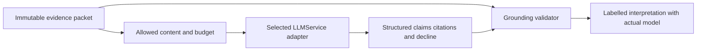

LLM OFF invokes no model and is fully useful. ON requires an eligible connected
profile, applied provider/model revision, owner-authorized secret and explicit
data-egress policy. Connect/disconnect, select model and activate profile are
separate settings actions. Disconnect stops new calls and fences late responses;
it does not erase historical interpretations or block deterministic Discovery.
Only one primary binding is used for an operation; there is no hidden ensemble.

Level-0 can explain matches, summarize supporting/opposing evidence, describe
setup characteristics, identify missing evidence, compare qualitatively and
propose a structured scan draft for human validation. It can decline. It cannot
execute tools outside a read-only allowlist, grant authority, promote into LOB,
invent missing data, mutate snapshots or declare a probability of profit.

| Grounding          | Verification and user-facing meaning                                                                                                                                                       |
| ------------------ | ------------------------------------------------------------------------------------------------------------------------------------------------------------------------------------------ |
| GROUNDED           | Every material factual market claim cites supplied, compatible evidence eligible under the current profile; interpretations are still labelled model inference, not guaranteed correctness |
| PARTIALLY_GROUNDED | Some claims have eligible evidence but others lack it or depend on stale/incompatible items; per-claim gaps are shown                                                                      |
| CONTEXT_ONLY       | No eligible deterministic market evidence supports the material claims; “LLM context only — not grounded in current deterministic market data”                                             |

EOD can be eligible for an EOD/positional profile but must retain its EOD source
label. GROUNDED never implies tick-live data. The adapter's/model's claimed grounding
cannot override server validation. Unknown citation IDs or malformed output are
rejected or explicitly downgraded, not accepted as factual evidence. Unsupported
numeric factual claims cannot fill typed deterministic fields.

Citation membership is necessary but not sufficient: verify cited subject, timestamp,
measurement/unit and numeric value against the packet. Reject contradictory or
unsupported factual assertions; keep qualitative interpretation explicitly labelled
as model inference. If support cannot be validated, downgrade/decline rather than
assign GROUNDED. This does not claim an automatic proof that arbitrary model prose
is true, and no interpretation can write back to deterministic evidence.

Store interpretation ID, immutable input packet digest and evidence IDs, actual
provider/model and available revision, prompt/template/tool/orchestration versions,
generation and source times, grounding result and validation version, declared
limitations/decline and bounded output. Do not claim reproducibility beyond a
provider's disclosed model version. Keep private prompts/evidence access-controlled;
operational logs store metadata, not raw prompts or responses. A model's hidden
reasoning is not required or requested as audit evidence.

## 19. Persistence, transactions and future evaluation

| State                                       | Owner                                 | Storage policy                                                           |
| ------------------------------------------- | ------------------------------------- | ------------------------------------------------------------------------ |
| Definition/profile/policy revisions         | TWF configuration                     | Immutable versions plus authorized active binding                        |
| Scan/discovery runs and decisions           | TWF S&D                               | Durable owner-scoped status, limits, completeness and correlation        |
| Source observations/matches                 | External producer; TWF capture record | Immutable bounded licensed capture/reference, not vendor truth rewritten |
| Episodes, candidate projection, transitions | TWF S&D                               | Durable lifecycle; revision/CAS; immutable linked history                |
| Snapshots/evidence/evaluations              | TWF S&D capture/evaluation            | Append-only, with explicit correction links and retention policy         |
| LLM interpretation                          | Producer attribution; TWF capture     | Separate from deterministic evidence and eligible ranking measures       |
| TI response / TM position / broker order    | External authoritative owner          | Typed references and explicitly permitted snapshots only                 |
| Live Broker V2 quotes                       | Existing ephemeral overlay            | No new persistence or S&D history inference                              |

Use existing SQLAlchemy/Alembic foundations; do not create tables in this task.
Sprint-2 migrations must specify foreign keys, owner-aware uniqueness, indexes,
bounded JSON schemas and portable decimal/timestamp handling. Personal user ownership
is supported first; sharing/workspace claims require implemented membership and
ownership checks, not an invented tenant ID. Referenced snapshots must belong to
the same authorized scope; exports, histories, caches and jobs enforce it too.

Commit run intent, release transaction, collect bounded I/O, then atomically append
accepted captures/evaluation/transition under expected episode revision. Late or
cancelled generation results cannot replace the current projection. Idempotency
keys are scoped to owner/operation/request digest; same key with different inputs
conflicts. Duplicate input does not duplicate a candidate. SQLite contention is
bounded and sanitized; verify the same semantics with PostgreSQL concurrent writers.

The [temporal storage and ordering amendment](TWF_SND_SCAN_DRIVEN_TEMPORAL_STATE_ARCHITECTURE.md#7-hot-and-cold-representations) adds ordered run admission/finalization, owner-aware idempotent observations, an active-scope guard, a logical HOT window (default 20), compact durable COLD cores and replay-safe compaction. It replaces completion-order head updates. Revision `0014_discovery_temporal_state` and the temporal product service now provide these mechanisms; final acceptance remains pending validation.

Retention is class-specific and licensed: derived evaluation, audit metadata, raw
captures and provider references have different permitted lifetimes. Immutable
does not mean stored forever. Authorized retention/deletion records a tombstone
and reproducibility limitation; no silent recreation of erased data from caches
or backups. Legal/data-rights periods must be fixed before real-data acceptance.
User records cannot promise indefinite vendor-data retention.

Future Outcome/Evaluation includes every eligible episode, not just executed ones:
+1/+3/+5/+10 trading-session returns, favorable/adverse excursion, thesis validity,
episode lifetime and rejection reason. Define basis, corporate actions, calendar,
availability cutoff and missing/censored outcomes. These are hypothetical discovery
outcomes, not realized broker P&L. Preserve TI claim evaluation and trade/execution
quality as different targets. ML/IFL is future work, never an automatic ranking
update or a background trading loop in Sprint 2.

## 20. Settings and authorization

Use [configuration architecture](TWF_CONFIGURATION_SETUP_CAPABILITY_ENTITLEMENT_PLUGGABILITY_ARCHITECTURE.md)
classes, scopes, capability policy, secret references and desired/effective/applied
revisions. Do not append arbitrary S&D keys to the finite accepted TWF-1.5 schema.
Introduce separately versioned descriptors under the same logical settings boundary.
`5d`/`15d` legacy preferences may seed a new HorizonSpec only after the user sees
and confirms the calendar/basis; their prior undefined day semantics are not
silently reinterpreted or migrated.

| Settings area                    | Class / initial authority                                                | Behavior                                                                                            |
| -------------------------------- | ------------------------------------------------------------------------ | --------------------------------------------------------------------------------------------------- |
| General / result density         | Presentation, personal user                                              | HOT; no impact on eligibility or authority                                                          |
| Universe / scan profiles         | User-workflow, personal user                                             | Versioned selections; apply to new runs; allowed universe constrained by capability/data rights     |
| Scan providers                   | System/integration; operator registration, authorized personal selection | WARM bind; only registered adapters; no arbitrary endpoints/code                                    |
| Market-intelligence providers    | System/integration                                                       | Same eligibility/secret/version rules; independent coverage requirements                            |
| Candidate-intelligence providers | System/integration                                                       | Optional bounded enrichment; cannot change execution rights                                         |
| LLM                              | System/integration plus user selection                                   | OFF/ON, connect/disconnect, select profile/model; one applied binding; egress consent and budgets   |
| Discovery/ranking                | User-workflow within platform policy                                     | Typed weights/bands/intents; pinned revisions; no invisible historical reranking                    |
| Freshness/tolerance              | User-workflow within safe bounds                                         | Horizon/calendar-aware; cannot relabel unknown evidence as fresh                                    |
| Persistence/retention            | System/security/data-rights policy                                       | Operator-controlled limits; user may choose less within legal policy, not exceed licensed retention |
| Experimental                     | Platform capability + environment                                        | Local LLM and experimental measures unavailable in production unless separately accepted            |

Future WORKSPACE/ACCOUNT scopes use existing descriptor precedence only after
verified ownership/membership exists. Security settings (destinations, TLS, secret
material, deployment keys), platform capability installation and subscriber
entitlement are not personal preferences. Read/configure/enable/apply/use permissions
are distinct. A finite policy can gate initial capabilities without implementing
commercial billing. Unknown grants deny use; revocation blocks new calls and fences
late data while retaining authorized history under retention policy.

## 21. Security and failure behavior

Treat provider/MCP/news/LLM text as untrusted data, including embedded instructions.
Do not follow source instructions, execute generated code, render unsanitized HTML
or fetch arbitrary cited URLs. Server-owned tool/destination allowlists, bounded
schema parsing and egress controls apply even when a model requests a tool.
No browser cookie, broker token or unrelated portfolio/account data is sent to a
scanner/LLM. Minimum evidence disclosure, licensing and per-provider data-egress
approval precede hosted LLM calls. Secrets remain server-side behind authorized
references; do not reuse broker tokens as scanner credentials.

Every read and mutation authenticates and checks owner, capability and current
profile generation. Cookie-authenticated writes use the existing trusted Origin
policy. Rate/cost budgets apply per owner/provider and operation; cancellation and
timeouts fence results. Error/log fields are allowlisted correlation metadata;
no raw responses, credentials, endpoints or private evidence blobs in logs.

| Failure                              | Required behavior                                                                                       |
| ------------------------------------ | ------------------------------------------------------------------------------------------------------- |
| Scan provider down/auth expired      | Provider-specific safe error; no invented empty result or silent replacement                            |
| One selected provider fails          | PARTIAL only if policy permits; show covered/missing universe partitions                                |
| Required market data stale/missing   | Decline new nomination or show historical/stale candidate; no false current score                       |
| Optional context missing             | Continue with explicit gap/coverage; never synthesize neutral evidence                                  |
| LLM unavailable/OFF/budget exhausted | Deterministic results remain usable; interpretation unavailable/context labelled                        |
| Version/provenance mismatch          | Reject payload; preserve last accepted historical record with stale/unknown status                      |
| Lost response / restart              | Run INTERRUPTED/unknown completion metadata; inspect committed partitions; explicit bounded new attempt |
| Revoked profile/session              | Block new work; cancel/fence in-flight results; never redirect to a different owner/provider            |

This read/analysis retry policy must never be reused for Broker V2 order dispatch.
Its OrderIntent, unknown-submission and reconciliation behavior remain unchanged.

## 22. UX architecture and text wireframes

Provide three explicit entry actions: **Scan**, **Discovery**, **Scan + Discover**.
Discovery can select a saved eligible scan/input batch; only the synthetic external
source seam is required in Sprint 2. The queue is not an order ticket and contains
no Buy/Sell, Confirm Order, automatic TI qualification or LOB promotion action.

```text
Scan & Discover                                      History   Settings
Universe [owned selection]  Profile [revision]  Mode [Scan | Scan + Discover]
Provider badges and capabilities   As-of/data mode   LLM [OFF | applied model]
Validated filters / unsupported reasons              Run   Cancel run
Run status • coverage • observed/source times • provider failures
Matches | Discovery queue
Instrument + listing | Intent / horizon | Relevance + band | Freshness | Why now
Selected candidate: evidence / context / conflicts / gaps / snapshots / history
Actions: Save for review • Reviewed • Refresh evidence • Dismiss with reason
```

```text
Candidate details
Exact subject/listing • intent • horizon • fixed opportunity window
Lifecycle + freshness separately • last evaluated and source-data timestamps
Discovery Relevance 0.74 MEDIUM • policy revision • coverage • not profit odds
Support / concerns / missing evidence • provider and upstream lineage
Market / sector context • EOD/delayed/live-snapshot labels
Optional interpretation: grounding badge + citations + actual model
Snapshot timeline S1 ... Sn • comparable delta • prior episode/rejection link
```

At desktop widths show results and evidence side by side; tablet uses a collapsible
detail pane; mobile uses readable result cards and a dedicated detail view with
back-navigation preserving filters. Ultrawide adds context/history without endless
stretched prose. Use accepted theme tokens and eight shell states, keyboard-focus
order, labelled inputs, semantic headings, live run-status announcements, accessible
tables/cards, and number plus band/text rather than color alone. Do not add a
docking/chart framework. Keep actions disabled with reasons for missing capability.

Scan history and Discovery history are distinct, owner-scoped and paginated.
Failed/empty runs, partial coverage, LLM OFF and no previous snapshot have useful
empty-state copy. A stale result remains inspectable with last-known labels and
explicit Refresh; it does not disappear as though it never existed.

## 23. Use cases and sequences

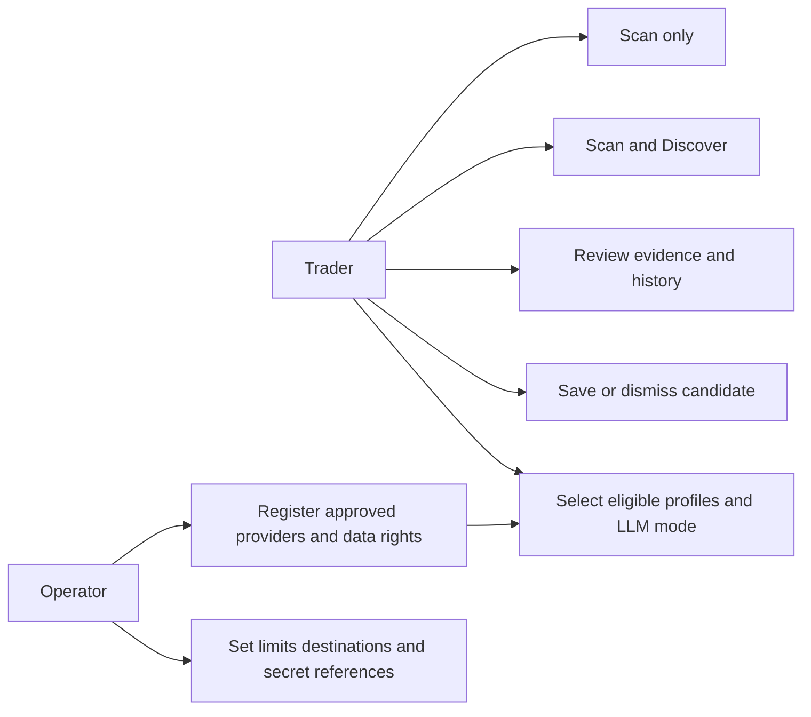

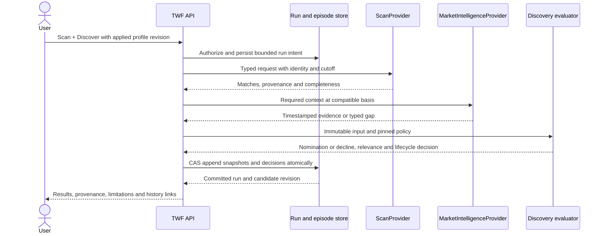

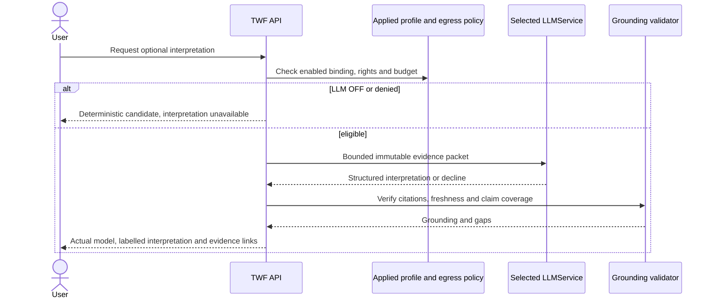

Representative scenarios: EOD swing review without LLM; intraday candidates with
stale benchmark context; technically positive but sector-negative results; repeated
same-source observations; bounded pullback within tolerance; defunct recovery;
expired episode followed by a new next-session setup; unavailable TradingView with
explicit internal-profile selection; context-only LLM explanation; conflicting
providers sharing a feed; dismissed candidates retained for future evaluation.

## 24. Deployment and local/remote equivalence

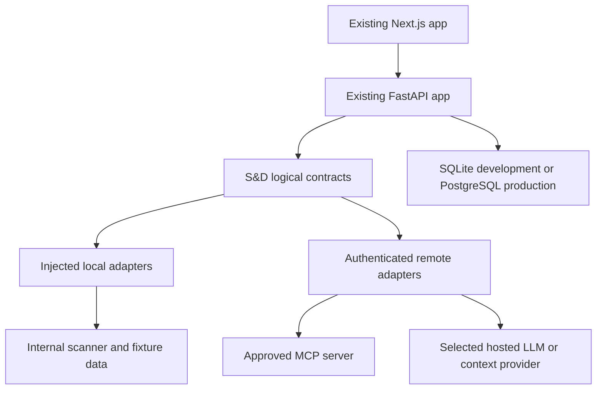

Local code receives typed context and runs under the same deadline/cancellation,
ownership and result validation rules as remote code. No blocking provider work on
the API event loop; choose a bounded executor for CPU-bound local indicators when
measured. Network details are adapter-only. Remote authentication and egress must
be reviewed before activation; health-only TWF-1.6 support is not sufficient.

Single-process/local deployment is the initial target. Multi-process admission,
paid-provider quotas, job claims, revocation and cancellation require shared
coordination before horizontal scaling; no process-local limiter is presented as
cloud-wide enforcement. `/ready` stays application-only; S&D availability is a
separate capability observation. No mandatory Redis, Kubernetes or worker fleet.

## 25. Future handoffs and authority boundaries

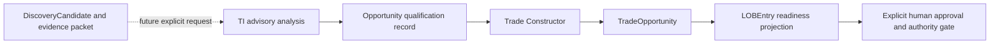

The domain ladder does not cast one object into the next. TI response/claim IDs
remain external authoritative references. Opportunity qualification links TI
evidence and a versioned decision; it does not mutate TI claims. Construction adds
exact structure, entry/risk/targets/duration/conditions and its own validity window.
LOB later projects actionable prepared trades; disappearing from its current
view is not deletion of lineage or cancellation of an existing order.

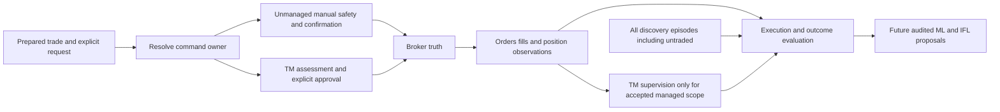

No S&D screen performs these future handoffs in Sprint 2. TM's committed public
contract gate, exclusive account command ownership and explicit adoption remain.
TM outage cannot enable a manual fallback. A manual trade is not automatically
protected by SL/TP or TM simply because discovery evidence exists.

## 26. FAQ

| Question                                     | Answer                                                                                                                              |
| -------------------------------------------- | ----------------------------------------------------------------------------------------------------------------------------------- |
| Why isn't every ScanMatch a candidate?       | Matching criteria alone may lack timely context, sufficient evidence or intent-relative relevance. Discovery may decline.           |
| Is a candidate a trade recommendation?       | No. It means worth examining now; it has no constructed trade or authority.                                                         |
| Why split Scan and Discovery?                | Scan tests criteria; Discovery evaluates attention-worthiness using intent/context and can accept other sources.                    |
| Can Scan be used alone?                      | Yes; matches and run history are useful without candidates or an LLM.                                                               |
| Can Discovery run without Scan?              | Yes through CandidateSource; Sprint 2 proves this with a synthetic source, with real external feeds later.                          |
| Can S&D run without an LLM?                  | Yes; eligibility, relevance, snapshots and lifecycle are deterministic.                                                             |
| Can I replace the hosted LLM?                | Yes through an explicit eligible profile/model rebind; actual old/new provenance remains.                                           |
| Can S&D run without TradingView?             | Yes through the internal scanner and approved independent data input; no silent provider substitution.                              |
| What if TradingView MCP is unavailable?      | Its run fails or is explicitly partial; select the internal profile for a new run if desired.                                       |
| Why build an internal scanner?               | To prove replacement seams and provide a small native deterministic capability, not reproduce every vendor feature.                 |
| What is Level-0?                             | Optional explanation, comparison and evidence-gap identification, not deep TI qualification or execution.                           |
| What is grounded versus context-only?        | Verified citations to eligible supplied evidence versus no such factual grounding; neither guarantees correctness.                  |
| Why market intelligence in S&D?              | Attention-worthiness depends on current regime, sector/session and other available context.                                         |
| How does this differ from TI?                | S&D uses bounded contextual measures; TI owns deeper claims, forecasts, thesis and scientific evaluation.                           |
| Why can a candidate become STALE?            | Under the temporal amendment, a comparable evaluated non-match yields NOT_REDISCOVERED; evidence age is a separate freshness field. |
| What does DEFUNCT mean?                      | Material tolerance breach requiring a pre-terminal evaluation; verified recovery can occur before expiry/rejection.                 |
| What does EXPIRED mean?                      | An explicit scan/owner decision closed the ended window; clock-only window-ended status is separate and a quote cannot extend it.   |
| Why preserve rejection reason?               | To explain terminal decisions and evaluate failures, dismissals and expirations separately later.                                   |
| Can the same stock reappear?                 | Yes under another intent or a genuinely new episode after the prior one ends.                                                       |
| Why a new episode?                           | To preserve the old outcome instead of rewriting/resurrecting failed history.                                                       |
| Why immutable snapshots?                     | They preserve exactly what was observed and available at each decision.                                                             |
| Why at least two observations for evolution? | Change requires comparable distinct samples; S1 alone cannot establish improvement.                                                 |
| What does relevance mean?                    | Fit to this versioned intent/horizon/context policy, with coverage and reasons.                                                     |
| Is 0.94 a 94% chance of profit?              | No. Relevance is not a calibrated return probability.                                                                               |
| Why horizon-relative scores?                 | The same evidence can matter differently over minutes, sessions or months.                                                          |
| Can one underlying have several intents?     | Yes; each has explicit horizon, basis and independent episode history.                                                              |
| What happens after market hours?             | Use labelled completed-session evidence; show ended windows independently of last-observed lifecycle.                               |
| How does ML fit?                             | Later evaluate all candidates including non-trades and propose versioned calibrated policies; no live self-learning in Sprint 2.    |
| How will LOB consume trades?                 | Future LOB references qualified, constructed TradeOpportunity revisions and derives readiness without granting authority.           |
| Where does TI begin?                         | At an explicit deeper-analysis handoff carrying immutable Discovery evidence and exact horizon/identity.                            |
| Where does TM begin?                         | At managed-risk/authority assessment before managed execution or explicit adoption; never from a discovery score.                   |

## 27. Risks, TBDs and acceptance

No unresolved ownership contradiction blocks this documentation proposal. These
decisions still gate implementation/live acceptance: exact MCP server/tool contract;
independent input data and retention rights; approved universe/identity/sector
mapping; calendar and initial horizon presets; numeric limits/latency/cost budgets;
initial ranking/tolerance thresholds and required coverage; hosted LLM provider/model
and egress policy; production vault and operational retention. The Sprint-2 plan
assigns decision gates rather than claiming these integrations already exist.

Acceptance must prove scan-only, Scan + Discover, synthetic external-source
Discovery, no-LLM operation and TradingView-removed internal operation. It must
exercise typed failures/capability mismatch, normalization/deduplication, correlated
evidence, ranking determinism/missingness, immutable snapshot series, lifecycle and
tolerance boundaries, horizon/calendar/after-market behavior, grounded/context-only
LLM output, ownership/secret isolation, persistence/restart, responsive accessible
UX and Broker V2 regression isolation. Use injected clocks and deterministic
providers; acceptance must not depend solely on a live third-party service.

The [2026-09-29 independent review](TWF_SCAN_DISCOVER_ARCHITECTURE_ACCEPTANCE_REVIEW.md) accepts the three-document architecture. Begin with the bounded S2-1 domain/contracts and synthetic-fixture gate; resolve provider/data/policy decisions before their dependent slices. Architecture acceptance is not provider acceptance, live deployment permission, runtime completion or a new Git freeze. The review records the non-blocking relevance-palette follow-up for S2-6.

## Scan evidence chart amendment — 2026-10-02

The product may render an explanatory **Scan Evidence Chart** for a `PRESENT` match. Its immutable identity is `owner_id + run_id + scan_match_id`; a ticker alone never resolves historical evidence. **As scanned** is authoritative and contains only completed bars available at the run cutoff. **Current chart** is a separate latest-data projection and may never overwrite or relabel historical evidence.

Revision `0015_discovery_evidence_series` retains one bounded source series per matched result rather than copying chart payloads into every observation. The chart response includes pinned profile/definition revisions, source provenance, OHLCV bars, profile-relevant indicator series, threshold overlays, normalized predicate evaluations, concise metrics, bar-finality semantics and explicit retention capabilities. The API recomputes each displayed rule with the scanner's accepted algorithms and rejects reconstruction when the retained series does not reconcile with persisted evidence within the scanner tolerance.

Rendering remains explanatory: candles, aligned volume, scan marker and only indicators used by the pinned profile. It adds no arbitrary studies, drawings, trade construction, order controls, Opportunity or LOB authority. Synthetic fixtures are retained and reconstructable. Real-provider bars require an explicit licensing/capability decision; unavailable, rate-limited, authentication-required, restricted, legacy and integrity-failure states remain typed and never cause synthetic substitution.

## Historical TradingView real-evidence amendment — superseded 2026-10-02

The implemented real-evidence path uses a hybrid provider strategy:

1. Internal Scanner V0 is the `ScanProvider` and performs deterministic matching over the requested universe.
2. TradingView is the `EvidenceProvider` and `ChartDataProvider` for only the matched identities. Its proven watchlist-read capability remains future scope and its broad screener is neither required nor called.
3. Synthetic and real modes remain separate provenance classes. Real-mode provider failure never substitutes fixture evidence.

Exact-symbol enrichment uses `mcp-tv-get-symbol-data-batch`, minimum columns (`close`, `volume`), deterministic chunks of at most 50 and durable requested/returned/missing/chunk lineage. Each exact hit receives a bounded `mcp-tv-get-ohlcv` request according to an explicit horizon mapping: intraday→15m/260, 1d→1h/260, 5d→1D/260, and 15d→1D/320. Unsupported mappings fail explicitly. No aggressive retry or per-symbol fallback fan-out is permitted.

Provider OHLCV is normalized with the provider bar timestamp and a separate TWF receipt time. The provider supplies no finality flag, so finality is `PROVIDER_UNSPECIFIED`; the product does not claim realtime or delayed delivery. Metric verification conservatively excludes the newest returned bar; the presence of a following bar is the minimum evidence used to treat a prior interval as ended. Scanner predicates are recomputed with the accepted scanner algorithms. Verification is `CONFIRMED`, `PARTIALLY_CONFIRMED`, `CONTRADICTED`, `UNVERIFIED`, or `UNAVAILABLE`. Contradicted and unverified matches are excluded from initial candidate admission, conflicting evidence remains explicit, and real evidence drives deterministic relevance and coverage.

Real provider/auth/rate/missing failures become `NOT_EVALUATED`, never `ABSENT`. Current Chart fetches TradingView market data on demand. Because retention rights are unknown, provider OHLCV is not stored durably for real runs: As Scanned preserves normalized numerical evidence, timestamps and lineage and reports a retention-restricted historical chart. These constraints preserve immutable run/match identity and add no Opportunity, LOB, trading, watchlist, or background-monitoring authority.

## 2026-10-02 authoritative provider amendment

The active domain flow is now `Dhan → normalized MarketSeries → Internal Scanner V0 → ScanMatch/evidence → deterministic relevance → DiscoveryObservation/Candidate → Evidence Chart`. Synthetic fixtures implement the same market-data contract. There is no active TradingView enrichment or verification phase. The exact Dhan series evaluated by the scanner is the immutable As Scanned chart input; Current Chart is an independent on-demand Dhan read. Dhan failure records `NOT_EVALUATED`; only a successful evaluated non-match records `ABSENT`.

TapTide supplies optional normalized Market Intelligence claims through generic MCP. Its claims are separately attributed context and cannot redefine technical predicates or block a Dhan scan. Zero MI providers is supported. The renderer remains provider-neutral. Future Zerodha market data fits the same contract without changing S&D domain objects. Watchlists, Opportunity, LOB, Trade Construction, and trading authority remain outside Sprint 2.
