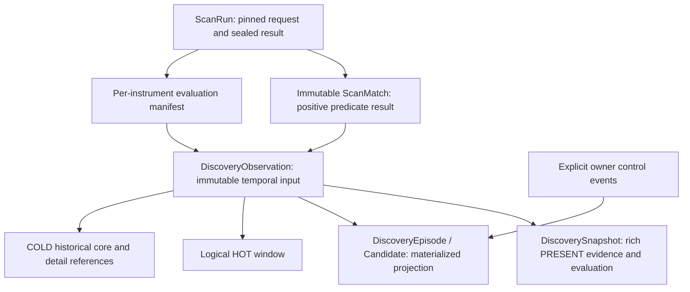

# Scan & Discover — Scan-Driven Temporal State Architecture

## 1. Decision, scope and authority

**Decision date:** 2026-10-01
**Decision:** **ACCEPT WITH REFINEMENT / GO_IMPLEMENTATION**  
**Implementation date:** 2026-10-02
**Status:** **IMPLEMENTED / PENDING USER VALIDATION AND INDEPENDENT ACCEPTANCE**
**Implementation baseline:** `main`, `461fae487c978e3391b32b127832456d172d9d86`; implementation remains uncommitted in this task.

Yes: TWF can remain a lean, scan-driven observation system. Accept immutable scan results, derived candidate state, bounded recent history and a compact historical core. Reject interpreting missing rows as failed conditions, replacing the historical record with a twenty-item ring, and treating a tiny score/state tuple as sufficient replay evidence.

This is a focused amendment to the [S&D architecture](TWF_SCAN_AND_DISCOVER_ARCHITECTURE.md) and [Opportunity domain](TWF_OPPORTUNITY_DOMAIN_ARCHITECTURE.md). It supersedes their time-driven effective lifecycle, STALE meaning, comparison-series and temporal storage rules **for the implemented scan-driven temporal layer**. All other domain, ownership, provider, security and execution boundaries remain. In particular, the dated [data architecture section 28](TWF_DATA_ARCHITECTURE.md#28-discovery-data-ownership-and-immutable-history--2026-09-28) reference to GET-derived expiry becomes a separate `window_status`, not a change to lifecycle. No accepted historical review is rewritten.

The [implementation record](TWF_SPRINT2_SCAN_DISCOVER_IMPLEMENTATION.md) describes the current runtime and validation evidence. Sprint 2 remains **IMPLEMENTED / READY FOR USER VALIDATION**; this implementation does not accept or freeze Sprint 2, change U1/U2 acceptance history, or start U3. Existing S2-3 live-provider and licensing gates remain in force.

### Normative principle

> S&D candidate lifecycle, score, tolerance and observation history change through explicit comparable scan observations or narrowly defined, audited owner decisions. Clock passage changes only a separately labelled freshness/window-validity projection. Continuous real-time opportunity/actionability monitoring belongs downstream, primarily to Opportunity/LOB.

A view, background quote update, provider reconnect, compaction, archive action or settings edit cannot create a market observation or silently re-score a candidate. Explicit owner dismissal is a necessary exception to “only scans change state.” Authorized correction/replay and migration are separate, labelled control processes, never disguised live scans.

## 2. Repository findings and reconciliation

The table records the pre-implementation findings that motivated the accepted design. The implementation reconciliation after the table records how those gaps are now addressed; it does not rewrite the historical baseline.

| Existing implementation                                                                                                                 | Reusable foundation                                                                                        | Gap / future change                                                                                                                                                                                                                                   |
| --------------------------------------------------------------------------------------------------------------------------------------- | ---------------------------------------------------------------------------------------------------------- | ----------------------------------------------------------------------------------------------------------------------------------------------------------------------------------------------------------------------------------------------------- |
| [domain.py](../apps/api/src/twf/discovery/domain.py), `ScanRun`, `ScanMatch`, `ScanLineage`                                             | Frozen contracts; exact definition/profile fingerprints, owner, evidence, source provenance                | `ScanRun` is a request description, not a complete immutable execution result. Persist the pinned request plus sealed execution manifest. Exact fingerprints remain audit identities; they are not the new compatibility key.                         |
| [infrastructure/discovery.py](../apps/api/src/twf/infrastructure/discovery.py), `ScanRunRecord`, `ScanMatchRecord`                      | Durable run/match/context rows and owner scope                                                             | Product run payload is primarily `ScanSummary`; no durable per-instrument evaluated/non-matched outcome ledger. Keep archive metadata outside immutable execution truth.                                                                              |
| [internal_scanner/scanner.py](../apps/api/src/twf/discovery/internal_scanner/scanner.py), `ScanExecution`, `SeriesCapture`              | Exact universe and input captures exist for successful evaluations, including non-matches                  | Product path calls `scan()` and persists match rows; retain the richer evaluation manifest. Current scanner raises on data failure; a future partial result must explicitly account for each requested instrument.                                    |
| [tradingview/provider.py](../apps/api/src/twf/discovery/tradingview/provider.py), `Capture`, `Execution`                                | Exact batch identity accounting, unresolved symbols, schema/plan provenance                                | Missing/unresolved symbols mean NOT_EVALUATED, never ABSENT. A broad/top-N screener cannot establish exhaustive absence. Live exact-row hardening is still carried separately.                                                                        |
| [product_service.py](../apps/api/src/twf/discovery/product_service.py), `run_scan`, `capture_candidate`                                 | Match capture and candidate snapshots commit in one local transaction; provider-specific evidence retained | Only admitted matches update candidates. Lookup uses owner/instrument/intent/horizon and omits profile semantics. Product provider merge is not an equivalence proof. New protocol must process positive and negative coverage under a precise scope. |
| Same file, `capture_candidate`, `candidates`, `detail`                                                                                  | Immutable snapshot payloads; pinned relevance; origin/latest run IDs; owner actions                        | `len(prior_rows)+1` loads all history; list sorts all owner candidates before pagination. Snapshot sequence is completion/storage order; active-key index is not a unique guard. Add database uniqueness/CAS and bounded projection queries.          |
| [memory.py](../apps/api/src/twf/discovery/memory.py), `_validate_snapshot`, `candidate`                                                 | Strict provenance checks, duplicate/source-time checks, useful deterministic reference path                | In-memory lock is not durable multi-worker authority. Exact provider/configuration matching can be too strict; rejection of late samples needs an explicit recording/finalization policy.                                                             |
| [lifecycle.py](../apps/api/src/twf/discovery/lifecycle.py), `effective_state`; `domain.py`, `DiscoveryEpisode`                          | Pure guards; material breach cannot be inferred from missing data; fixed window                            | Foundation GET can derive STALE/EXPIRED from clock; episode validator forbids durable STALE. Future scan-driven STALE must be a versioned contract change, not a silent reinterpretation.                                                             |
| `product_service.py`, `summary`, `lifecycle`                                                                                            | Context reason, tolerance, revision, transition payloads                                                   | Product freshness currently uses source timestamp presence; stored context can project STALE. Product owner RECOVER sets CURRENT. Replace with independent freshness and an evidence-required recovery decision; preserve old records.                |
| [0012](../apps/api/alembic/versions/0012_sprint2_scan_discover.py), [0013](../apps/api/alembic/versions/0013_discovery_scan_archive.py) | SQLAlchemy/Alembic ownership, durable history and reversible archival                                      | Additive migration needed later; never rewrite these accepted revisions. No HOT/COLD, observation coverage or durable processing frontier exists today.                                                                                               |

Current ScanMatch payloads are not rewritten by later scans in the inspected product path. However, a historical detail view reformats stored evidence through today's `match_view`; exact historical presentation requires a pinned rendering/normalization version or the original stored explanation. A live-rendered explanation must not be mislabelled the original text.

### Implementation reconciliation — 2026-10-02

- Alembic revision `0014_discovery_temporal_state` adds comparison scopes, ordered temporal lanes, durable scan admission, immutable observations, semantic active slots and projection checkpoints without rewriting revisions 0012/0013 or inventing negative legacy history.
- `DiscoveryObservation` accepts exactly `PRESENT`, `ABSENT` and `NOT_EVALUATED`. Coverage, comparison decision, sample novelty, admission and lifecycle effects remain separate typed facts. ABSENT is created only for a complete successful predicate evaluation; provider gaps, partial failures and instruments outside the requested universe remain NOT_EVALUATED.
- Run admission allocates a durable owner/scope sequence before provider I/O. Provider work runs without a database transaction or lock. Finalization is idempotent, late/out-of-order observations remain immutable audit truth, and only the ordered authoritative frontier advances the current projection.
- The semantic active-slot constraint fences concurrent episode creation by owner, exact instrument and comparison scope. Owner controls remain revisioned/audited reducer inputs. Clock passage changes freshness/window projections only; it does not create a lifecycle observation.
- Candidate pages use bounded SQL ordering and batched temporal summaries. The configured HOT window defaults to 20 and is bounded to 5–100; older immutable cores stay queryable as logical COLD rows in the same SQL store. Physical archive publication is not part of this implementation.
- Candidate inspection exposes exact observation tuples and truthful score gaps/model breaks. Historical runs expose distinct **As scanned** and **Current state** views. Pre-temporal runs remain readable and are explicitly labelled as lacking reconstructed temporal observations.
- Projection rebuild replays retained immutable cores and records a versioned checkpoint. Ordinary archive visibility never deletes temporal truth. Retention is an explicit seam only; no automatic purge or time-driven background monitor was introduced.

## 3. Minimal domain model

Use existing names and add only the missing observation concept. Do not introduce a parallel `DiscoveryTrack` aggregate.



- **ScanRun:** stable run ID, owner, pinned configuration, requested universe, execution status and complete per-instrument accounting. Request/attempt progress may be mutable until finalization; the sealed result is immutable. Retries do not replace a sealed result.
- **ScanMatch:** immutable positive result under the exact definition/provider contract. Preserve exact instrument, profile/definition versions, metrics/units, predicates, source mode, observed/source/received times, normalization revision, source observation key and evidence references. It has no mutable lifecycle or current relevance.
- **DiscoveryObservation:** an immutable relation between a run, instrument, comparison scope and episode when one exists. Includes an outcome, comparison decision and immutable discovery admission/evaluation. ABSENT requires no fabricated ScanMatch or positive snapshot.
- **DiscoverySnapshot:** retains its existing role as rich PRESENT evidence/relevance capture. It is referenced by an observation; do not clone it wholesale into every HOT/COLD row.
- **DiscoveryEpisode:** owns a fixed window, one stable `candidate_id`, current materialized projection, revision and predecessor link. Its history and control events are authoritative inputs, not the mutable head.
- **Scan evaluation manifest:** a logical part of the sealed run, not a new monitoring service. Every requested identity has an accounted result. Include planned/requested, actually evaluated, failed and unresolved identity sets with reason/contract evidence.

Owner-scoped references include authenticated personal user scope now. Do not invent shared-workspace authorization. Archive manifests, exports, checkpoints, histories and internal recovery use the same owner checks. No provider credentials or raw authorization payloads belong in observations or logs.

## 4. Candidate identity and comparability

### Identity

`CandidateScopeKey = (owner, exact analytical listing/contract identity, ScanComparabilityKey)`. The complete comparison descriptor below participates in identity, including criteria compatibility and discovery admission/context policy; the setup family alone is insufficient. This keeps active-slot uniqueness aligned with the definition of comparable observations.

An episode adds an `episode_id`, immutable anchored window and reason for opening. At most one nonterminal episode owns a scope's active slot. `NEW`, `CURRENT`, `STALE`, and preterminal `DEFUNCT` are nonterminal. `EXPIRED` and `REJECTED` release the slot. A separately retained legacy slot is never silently merged.

Do not identify by symbol, underlying alone, UI profile label, provider account, or broker token. NSE/BSE listings and derivative expiries retain separate identities. A verified mapping may relate them for display; it does not make their prices/evaluations equivalent. Provider brand is provenance; an unproven provider semantic class separates histories until equivalence is established. Credentials, connection IDs and reconnect generations remain provenance, not new candidate identities.

Relevance model is **not** the lifecycle identity: a scoring-only revision can continue the episode, with a new score series. A change to admission, tolerance or lifecycle rules starts an explicitly versioned scope/episode lineage. The existing implementation's policy-change expiry behavior remains historical; the implemented model does not call a configuration change market deterioration or elapsed expiry.

### Comparison key and per-instrument predicate

`ScanComparabilityKey` is the digest of a canonical, versioned semantic descriptor: setup family and criteria compatibility revision (including thresholds and ALL/ANY), direction/objective, typed horizon, observation basis (timeframe, units, adjustment, session/calendar), provider-equivalence class, data-mode class, discovery admission/context-policy compatibility class and lifecycle-policy series. Store the descriptor and digest, not just an opaque hash.

The horizon anchor **rule** participates in the key; an episode’s concrete opening instant does not. A shared intent/horizon can therefore produce successive episodes without creating a different comparison scope on every run. Comparison requires owner/scope equality **and** an explicit per-instrument membership/coverage/novelty decision. A matching hash alone never proves that an instrument was evaluated. Preserve the original exact configuration fingerprint separately.

| Dimension                                                           | Rule                                            | Rationale                                                                                                                                  |
| ------------------------------------------------------------------- | ----------------------------------------------- | ------------------------------------------------------------------------------------------------------------------------------------------ |
| Owner; exact listing/contract and instrument type                   | MUST MATCH                                      | Prevent cross-owner, equity/index and listing/derivative contamination.                                                                    |
| Direction, intent objective, setup family                           | MUST MATCH                                      | Breakout positional-long absence cannot come from relative-volume intraday-short.                                                          |
| Horizon normalized value, anchor rule, unit, calendar/timezone      | MUST MATCH                                      | `1d` label alone is insufficient; no automatic horizon-class collapsing.                                                                   |
| Timeframe, formula, adjustment, currency/units, session basis       | MUST MATCH or certified version compatibility   | A split adjustment or daily/intraday change is not rediscovery.                                                                            |
| Criteria/thresholds/ALL-ANY and profile semantics                   | MUST MATCH or certified version compatibility   | Threshold changes default to a new comparison family. Cosmetic edits may be compatible.                                                    |
| Admission/context policy and tolerance/lifecycle series             | MUST MATCH or certified version compatibility   | Optional context and require-complete are not interchangeable lifecycle observations.                                                      |
| Provider semantic class and source mode                             | MUST MATCH or certified version compatibility   | Synthetic/live cannot mix. EOD and live intraday do not become comparable because both are timestamped.                                    |
| Relevance model, thresholds and evidence coverage                   | MAY DIFFER, explicitly versioned                | Preserve score/coverage provenance; never invent a conversion or cross-model delta. Lifecycle eligibility still follows its pinned policy. |
| Entire universe ID, revision, hash and size                         | MAY DIFFER                                      | Only the target instrument's requested/evaluated membership determines negative evidence.                                                  |
| Profile ID, display name, UI selection, sort, history archive state | IRRELEVANT to semantics                         | Equivalent copied configurations need not fragment history. Retain IDs for audit.                                                          |
| Run ID, request ID, receive/finish time, provider auth generation   | MAY DIFFER                                      | Operational provenance is not a new setup.                                                                                                 |
| Sample identity/data cutoff                                         | Must establish freshness and novelty separately | Duplicate polls must not create confirmation or absence streaks.                                                                           |

A compatibility registry is a small server-controlled, versioned mapping with reviewed evidence/tests, never a user-controlled “compatible” toggle. Classes must be equivalence classes: no accidental A~B, B~C, A!~C chain. All live cross-provider pairs default to incompatible. Internal/TradingView synthetic fixture parity alone is not proof of real-provider equivalence. When equivalence is proven, capture the registry revision on the observation; later registry edits do not reinterpret history.

Universe-relative rules (e.g. top decile within a basket) must include the universe's semantic membership fingerprint in the observation basis. The MAY DIFFER rule applies to existing instrument-local predicates. A truncated top-N result is not a negative-membership manifest.

## 5. Outcomes, completeness and novelty

Accepted `ObservationKind`: **PRESENT, ABSENT, NOT_EVALUATED**. Reasons and admission status are separate fields; do not multiply lifecycle enums for transport failures.

| Situation                                                                                           | Kind / relation                                        | State effect                                                                                                      |
| --------------------------------------------------------------------------------------------------- | ------------------------------------------------------ | ----------------------------------------------------------------------------------------------------------------- |
| All required mechanical inputs evaluated and predicate true                                         | PRESENT; link ScanMatch                                | Apply discovery admission and pinned lifecycle/tolerance policy if authoritative and novel.                       |
| Predicate definitively false after successful evaluation                                            | ABSENT, `NOT_REDISCOVERED`                             | Comparable, fresh, novel negative observation may set STALE; score and band are null.                             |
| Missing data, unsupported filter, timeout, provider failure, unresolved identity or incomplete page | NOT_EVALUATED with typed reason                        | No promotion, demotion, rejection, absence count or invented relevance.                                           |
| Instrument outside requested universe                                                               | NOT_EVALUATED / `OUTSIDE_UNIVERSE` relation            | Derive from immutable manifest on inquiry; do not write one row for every candidate outside each run.             |
| Scan semantic mismatch                                                                              | `comparison = INCOMPARABLE`                            | Preserve run result; no input into this episode's reducer.                                                        |
| Matched but discovery admission blocked by required context                                         | PRESENT, `admission = HELD`, score null if unevaluable | Keep positive scan truth; no new candidate or negative lifecycle evidence. Existing projection remains unchanged. |
| Match rejected for direction/identity policy                                                        | PRESENT plus typed exclusion                           | Do not turn a match into ABSENT; inconsistent declared semantics cannot update the earlier scope.                 |

The per-instrument mechanical outcome is distinct from Discovery's decision. NOT_EVALUATED is not score zero. `last_known_relevance` references the last scored PRESENT and retains its time/model; it is a display lookup, never the score of an ABSENT observation.

For a partial 80/100 run, record the 80 definite predicate outcomes and twenty NOT_EVALUATED reasons. Only true negative outcomes among the eighty can create ABSENT. Finalization validates disjoint accounting: requested identities equal PRESENT + ABSENT + NOT_EVALUATED; extras/duplicates/conflicts fail safe. Requested does not imply evaluated. A complete zero-match scan is valid only with a complete negative manifest.

Deduplicate source samples separately from run replay. `sample_key` includes exact subject, provider observation identity or validated data cutoff/input digest, basis and compatible producer class. Repeating the same source observation across different run IDs is stored as `novelty = DUPLICATE` but cannot increment confirmation/breach/absence counters. Unknown source time or unverified novelty remains explicit; initial static eligibility may create NEW, but no evolution is asserted from repeated unknown samples. Stale/regressing source data never proves current absence or tolerance breach. Unknown time cannot be replaced by receive time.

## 6. Lifecycle, freshness and windows

### Authority and reducer

Choose **HYBRID**: persist a fast projection, derive its truth from ordered immutable observations plus explicit owner control events and pinned policy. Cache transition rows only as rebuildable reducer output. Each transition records input event/observation ID, prior/next state, reason, policy revision, projection revision, effective time and recording time. Owner decisions are original audit inputs and cannot be reconstructed from market observations alone.

`temporal-policy-v1` defines the following conservative default. There is **no automatic terminal absence count**. Absence frequency has no calibrated terminal meaning; arbitrary scan cadence must not decide rejection. Preserve counters for later explicitly versioned policies.

| Prior state / input                                                                     | Result                                                                         | Constraints                                                                                                                                                 |
| --------------------------------------------------------------------------------------- | ------------------------------------------------------------------------------ | ----------------------------------------------------------------------------------------------------------------------------------------------------------- |
| No episode; eligible PRESENT                                                            | NEW                                                                            | Anchor a fixed typed window at the accepted run cutoff. One captured historical bar series is one observation.                                              |
| NEW; second eligible, comparable distinct PRESENT                                       | CURRENT                                                                        | Required evidence/novelty satisfied; no repeated-poll promotion.                                                                                            |
| NEW or CURRENT; authoritative ABSENT                                                    | STALE                                                                          | Reason `NOT_REDISCOVERED`; relevance null for this observation.                                                                                             |
| STALE; eligible novel PRESENT within window                                             | CURRENT if at least two eligible distinct PRESENT samples exist, otherwise NEW | Same episode; absence is not terminal.                                                                                                                      |
| STALE; further ABSENT                                                                   | STALE                                                                          | Increment distinct absence count, retain first-absence marker; no automatic rejection.                                                                      |
| Any nonterminal state; NOT_EVALUATED, held admission, stale/unverified/duplicate sample | Unchanged                                                                      | Retain reason and last effective observation; do not reset or increment confirmation counters. An explicitly triggered window-closure decision is separate. |
| Eligible observations establish material breach under pinned tolerance policy           | DEFUNCT                                                                        | Preterminal; existing two-observation confirmation is preserved only for two fresh, distinct, fully assessable breach inputs. Absence is not a breach.      |
| DEFUNCT; fresh comparable PRESENT satisfies recovery policy                             | CURRENT or NEW by distinct eligible count                                      | Same episode before window end; a positive match alone does not prove recovery. ABSENT cannot hide DEFUNCT.                                                 |
| Owner dismisses                                                                         | REJECTED, `USER_DISMISSED`                                                     | Actor, reason, expected revision and control-event ID required; market score/history unchanged.                                                             |
| Explicit reasoned terminal decision                                                     | REJECTED                                                                       | Require admissible evidence/policy; no missing-data shortcut or opaque repeated-absence threshold.                                                          |
| Explicit comparable scan crosses pinned window boundary                                 | EXPIRED for old episode                                                        | Expiry is an audited window decision, not an invented ABSENT or new relevance value.                                                                        |
| Eligible PRESENT after EXPIRED/REJECTED                                                 | New linked episode, NEW                                                        | Never revive terminal episode. Require a new accepted source sample; replay of a dismissed sample is insufficient.                                          |

Within one observation, apply terminal/owner fences first, then explicit window closure, then material-breach/verified-recovery rules, then presence rules. No score threshold alone terminates a candidate. A fully evaluated non-breach breaks a breach streak; UNKNOWN/NOT_EVALUATED does not prove recovery and cannot complete a streak. ABSENT resets no recovery claim and supplies no new tolerance value. The reducer carries counters beyond the HOT window.

Manual mark-defunct can remain an explicit owner review override with reason, visibly distinguished from market-proven breach. Manual “Recover” must request a comparable assessment or create an annotation; it must not fabricate fresh CURRENT evidence. This is a future behavioral amendment, not a claim about current U2 runtime.

### Clock-only behavior

**Time-only lifecycle transitions are DISALLOWED.** Freshness and window validity are allowed pure read-time projections with `as_of`, `freshness_policy`, and `window_status = OPEN | ENDED | UNKNOWN`. No GET writes, hidden cron re-scoring, or background quote reevaluation.

A five-day candidate observed thirty days ago retains its last observed lifecycle/score, but is displayed as “last observed CURRENT; window ended; last observation 30 days ago.” Current-attention eligibility is false; Active/history remains reachable with explicit validity labels. This prevents an old CURRENT label from implying current actionability without changing history. Current-scan membership remains a run relation, not an age-dependent rewrite of a prior result.

A subsequent explicit comparable scan may close an ended episode even if its instrument was NOT_EVALUATED, using a separate `WINDOW_ELAPSED` control decision triggered by that run. That is not negative market evidence. A scan of a different setup/universe must not sweep unrelated episodes. Without another scan or explicit owner closure, the expired-window projection can remain pending materialized closure indefinitely. Time-sensitive downstream handoffs always check `window_status`; no background market monitor is required.

Do not extend a window on rediscovery. Interpret typed horizon basis/calendar/anchor exactly. The current product uses elapsed-seconds presets; do not silently relabel them trading sessions. Custom horizons and real exchange-calendar expansion remain separately scoped.

## 7. HOT and COLD representations

### Storage choice

Choose **append-only database observations with a logical HOT window and COLD detail tiering**. No mutable linked-list pointers or in-memory authoritative ring. Every accepted observation has a permanent identity and compact immutable core from creation. HOT is a bounded query, not an independently editable truth store. Terminal episodes need no pinned HOT cache, but their latest twenty cores remain queryable.

Default `hot_observation_count = 20`, deployment-configurable from 5 to 100; per-owner preferences may lower it within operator limits. Count is the primary bound, not elapsed time or horizon. Twenty scans can span minutes or months. Keep horizon/window and lifecycle counters independently; never derive all state solely from those twenty records.

### Canonical core retained in both tiers

Minimum logical fields (physical normalization may share run/scope/policy dictionaries):

- Schema version; observation ID; owner; exact instrument and mapping revision; episode/candidate relation when established; run ID; comparison scope/descriptor revision; manifest outcome ID.
- Ordered run position and event ID; run evaluation cutoff; `observed_at`; optional source time and publication/availability time; received/evaluated/recorded times; source mode, sample key and novelty decision.
- Outcome/reason; comparison result/reason; discovery admission; score/band/coverage when actually computed; relevance model, thresholds and score-series ID.
- Lifecycle/tolerance/admission policy references and the bounded typed inputs required by their reducer: eligibility, evaluated dimensions/confirmation outcome, window anchor, quality/coverage, recovery/terminal reasons and evidence IDs. Capture explicit UNKNOWN values.
- Snapshot/evidence/context refs and content hashes; exact profile/definition/provider/normalization refs; correction links; input digest; retention/replay-availability classification.

Immutable policy/configuration bodies and dictionary entries referenced by these IDs must survive as long as their core records. A hash or URI alone does not supply vanished evidence. Store evaluated inputs for replay of **state decisions**; full re-execution of provider algorithms requires retained licensed source data and may be unavailable. Distinguish these capabilities in every archive.

**HOT detail** joins the core to rich PRESENT snapshots/evidence/context and derived transitions for the last N observations. Required head/last-present references remain addressable even if twenty NOT_EVALUATED runs have displaced them. Last-effective input, present count, absence/breach counts and window are in the materialized projection and versioned checkpoints.

**COLD** retains the same authoritative core plus resolvable immutable detail references where retention permits. The proposed eight-field `(run, time, kind, score, band, state, reason, model)` tuple is a useful chart/export projection but **not sufficient authority**: it loses owner, identity, admission, sample novelty, comparison policy, manual decisions and replay inputs. `lifecycle_after` is derived/cache data, never a second independent fact.

## 8. Ordering, concurrency and recovery protocol

### Ordered run admission and finalization

Use a small durable ordered lane per `(owner, ScanComparabilityKey)`; instrument identity remains per outcome. This is a transactional sequencing/checkpoint field, not a queue framework or continuous scanning scheduler. Universe membership can differ within a lane. Equivalent provider requests share a lane; incompatible scopes do not block each other.

1. In a short transaction, authorize owner, pin non-secret config/compatibility/policies/universe, reserve storage, allocate `run_id` and `lane_sequence`, and persist the run admission. A server-assigned evaluation cutoff `as_of` must be nondecreasing in that lane. Equal cutoffs are ordered by sequence. Clock rollback cannot silently backdate a live run: reject/retry admission or label a historical import. Commit before any provider I/O.
2. Perform bounded provider work outside every database transaction/lock. Capture actual source/observation times separately; a response's receive time cannot redefine its market cutoff.
3. Persist and seal the result/coverage manifest under run revision CAS. Duplicated identical delivery is a no-op; same identity/different digest is a conflict. Per-instrument observations are committed only from a sealed authoritative result.
4. Advance the lane's durable finalization cursor through settled admissions in order. In a short per-run transaction, attach observations, apply reducer/window/control decisions, change active slots/heads by CAS, cache transitions, and advance the cursor atomically. Commit. No queue page can observe half an episode update.
5. If an earlier run is still pending, a later completed run's matches may be viewed, but its candidate projection is labelled `PENDING_PREDECESSOR`. The run's provider success and candidate-projection status are distinct. Do not claim its candidates are applied yet.

The run admission pins a finite total collection deadline using the configured provider budget, with no unbounded retries; a deployment default is 30 seconds, maximum 120 seconds unless a separately reviewed provider contract changes it. At deadline/recovery, CAS-seal a typed incomplete/cancelled result: preserve already durably validated per-instrument outcomes and mark unresolved ones NOT_EVALUATED. This is a statement about TWF's accepted result, not proof that a remote process stopped. Late completion can be quarantined as a diagnostic/correction capture but cannot replace the sealed manifest or mutate its original outcome. Existing MCP permits and provider cleanup continue to own their safety obligations.

Recovery may advance sealed/past-deadline runs in bounded batches; it does not perform new market scans. A process crash before deadline leaves a durable pending admission. After restart, inspect durable receipts/finalization state; never automatically repeat ambiguous provider operations. No process-local mutex is sufficient authority.

### Out-of-order example

A is admitted at 10:00 (position 41), B at 10:02 (42). B completes at 10:03; A at 10:05. If both are within their pinned deadlines, store B but wait to apply its candidate projection until A is sealed, then fold A followed by B. B is HEAD. In the default short deadline, A would already have sealed incomplete; B advances after that neutral terminal run, and the late A result is quarantined. Both cases prevent completion order from redefining market history.

Use run cutoff plus durable sequence for causal evaluation order; source times establish freshness/novelty and displayed market time. A newer run containing older source data cannot update the effective market head or increment counters. A provider's arbitrary source timestamp cannot reorder already published decisions. Historical/backdated imports and corrections use a separate labelled replay branch; they may produce new replay projections but cannot rewrite “as scanned.” This is deliberately stricter than simply sorting all records by `source_data_time DESC` after the fact.

### Owner decisions and episode boundaries

Owner control events carry their own ID, expected candidate revision, effective/recorded time and the lane admission high-water mark. Dismissal installs a terminal fence immediately in the same short transaction. Pending observations admitted before that fence may be recorded as historical relations but cannot resurrect the dismissed head or open a replacement episode. Replay orders them before the owner decision; any historical calculated transition is labelled with its actual recorded time. A new episode requires a run admitted after the fence and a distinct eligible source sample. Concurrent dismissal/projection uses CAS: loser rereads, never overwrites the decision.

Episode closure, new active-slot allocation and first observation must be atomic. A unique owner/scope active-slot row works on both SQLite and PostgreSQL; do not rely on an index that merely includes `state`. DEFUNCT remains in that slot until verified recovery or explicit/window closure.

### Idempotency and indices

- Run request key: `(owner, client_request_key)` plus pinned request digest; a different payload under the same key conflicts. Retry returns the same run, never redispatches blindly.
- Observation key: **`(owner, comparison_scope_id, instrument_id, run_id)`**, unique independently of episode selection. This prevents duplicate episode allocation on replay; `(episode_id, run_id)` alone is insufficient when two workers could create different episodes.
- Additional unique `(owner, episode_id, observation_sequence)` and immutable content digest; control events deduplicate by owner/event key. One run contributes at most one aggregate temporal observation per instrument/scope.
- Composite foreign keys/validation must prevent references across owners; uniqueness alone is not authorization.
- Indices: `(owner, scope_id)` active slot; `(owner, lane_id, sequence)` unique; `(owner, run_id, instrument_id)` outcomes; `(owner, episode_id, observation_sequence DESC)` history; `(owner, run_id, episode_id)` run relation; materialized queue keys beginning with owner and ranking cohort/lifecycle. Use cursor pagination pinned to a projection revision for stable history reads.
- SQLite uses short serialized writes with bounded busy/conflict retry and safe typed retryable errors. PostgreSQL uses row/CAS locking for the same boundaries. Neither holds a transaction while provider calls or archive object uploads occur. Conflicts retry local persistence/reduction only, not provider dispatch.

## 9. Rollover, retention and restart

**Rollover is logical first.** Observation N+1 makes the oldest item fall outside HOT after the append/projection transaction commits. Its core already exists; no delete-and-reinsert race occurs. Cold-tier rich detail compaction is optional and asynchronous bounded storage work.

For physical detail/archive movement: select a stable sealed sequence range; build an immutable owner-scoped segment outside the DB transaction; verify count, IDs, schema, hashes and replay prerequisites; then CAS-publish a manifest and location references in one short transaction. Only after verified publication may redundant hot detail be removed. Never remove the core or sole evidence copy as a “ring overwrite.” Failed publication leaves the original authoritative. An unreferenced staged segment can be garbage-collected after a grace period. Repeating a batch keyed by `(owner, episode, sequence range, format version, digest)` is idempotent. Readers pin a manifest generation; retain old locations until in-flight reader leases/grace have ended.

Initial COLD implementation may simply retain compact core rows in the same SQL database. Do not require object storage to ship phase A. Maintain per-owner quotas; all DB/segment copies count during compaction.

Recommended defaults, configurable by an operator and captured with policy revision:

| Policy                          | Default / bound                                                       | Behavior                                                                                      |
| ------------------------------- | --------------------------------------------------------------------- | --------------------------------------------------------------------------------------------- |
| HOT count                       | 20; range 5–100                                                       | Rich recent detail, not all replay history.                                                   |
| History response                | 50, maximum 100 rows                                                  | Cursor plus optional time range; never load years for a queue row.                            |
| COLD online planning horizon    | 24 months                                                             | Older core/detail eligible for verified archive; no automatic loss at the date.               |
| Long-term planning horizon      | 7 years of permitted derived metadata                                 | Export/retention review target, not a legal or provider-license entitlement.                  |
| Per-owner online history budget | First of 1,000,000 observation cores or 1 GiB actual retained history | Reserve capacity before scan admission; bound rich blobs separately within the byte budget.   |
| Managed archive budget          | First of 5,000,000 cores or 10 GiB actual archive bytes per owner     | Explicit operator capacity change/export required at limit. Include manifests/dictionaries.   |
| Raw vendor data                 | Provider-specific licensed policy                                     | No blanket seven-year raw-data retention. Missing rights disable that capture, not its label. |

These are engineering starting defaults, not measured production sizing. Account for other history storage and reserve capacity for finalization/control records. If no archive destination exists, keep SQL cores until quota, then reject new admission with a typed capacity error before I/O. Never drop observations or silently continue candidate updates without history. Operator-managed durable export can release online capacity after verification; a browser download is not authoritative archive storage.

Archive visibility (the existing user Archive/Restore action) is orthogonal to temperature and retention. It does not delete, stop a run's historical meaning, or change candidate lifecycle. No permanent user-delete workflow is introduced. Automatic expiry deletion is disabled in the initial implementation. Any future authorized purge/license-mandated erasure needs audited tombstones, survivor checkpoints, replay-boundary disclosure, and backup/cache erasure rules under the data/security architecture. Do not promise full evidence replay after erasure.

A checkpoint is a verified, versioned fold through an immutable sequence prefix: state, fixed window, latest effective/present/absent refs, counters, owner fences, policy versions and input-prefix digest. It accelerates restart and survives raw-detail loss, but is not a substitute for retained core truth. Rebuild from core+control events while retained; validate checkpoint by replay before using it. If prior core retention has been lawfully truncated, disclose that only checkpoint-forward reconstruction is available. An active episode's reducer inputs and required policies must not be removed by ordinary compaction.

## 10. Provenance, score series and views

Preserve original `originating_run_id`, `latest_effective_comparable_run_id`, `latest_present_run_id` and `head_observation_id` as rebuildable projection pointers. `latest_attempted_comparable_run_id` is separate so NOT_EVALUATED cannot imply a new market observation. `latest_absent_run_id` can be queried by indexed kind; materialize only if measured need warrants it. Corrected/replayed origin is separately labelled, never overwrites the first published origin.

“As scanned” reads the sealed run's matches, decisions, observation linkage and policy versions. “Current state” joins those stable episode/candidate IDs to their latest projection with its revision/as-of; it does not reinterpret the old matches. If an episode has a successor, show a separate successor link. Run-to-candidate relations include PRESENT updates and ABSENT observations; not every row is a matched/admitted candidate. History viewers never run scans or write projections.

Sparkline contract: timestamp, kind, optional actual relevance/band/model, score-series ID, reason, novelty and source quality. PRESENT gives a measured point only when scored; ABSENT is a gap/absence marker; NOT_EVALUATED is an unknown marker/gap. Never interpolate a line through either gap. Duplicate samples remain inspectable without implying independent confirmation. A model/version change starts a new score segment. Delta is defined only between comparable scored PRESENT observations of the same score series, with intervening absence/unknown disclosed.

Queue contract separates `lifecycle_as_observed`, cause observation/control event, `last_observed_at`, nullable `source_data_time`, last scored relevance/time/version, freshness, window validity, pending projection state, and legacy/replay limitations. Current v2-first/legacy-labelled ranking remains a presentation cohort policy; no cross-version mathematical conversion is invented. The implemented sparkline and run-navigation views are bounded temporal inspection surfaces and do not start U3, Opportunity, Watchlists or continuous monitoring.

For analytics retain full nomination/decline universe accounting, source availability times, exact identities/bases, model/profile versions, context references and censoring/retention reasons. Future +1/+3/+5-day returns, MFE/MAE, survival and calibration require a separately licensed outcome price series, pinned trading calendar, corporate-action and entry-reference basis. These cannot be computed from relevance tuples alone. Do not prepopulate invented outcome values. `evaluation_id` may later reference observation/episode IDs without changing their originals. Include untraded, rejected and archived episodes to avoid survivorship bias.

## 11. Scale and bounded queries

Illustrative engineering estimates, not benchmarks: assume a normalized core averages 0.5–1 KiB and rich detail 4–16 KiB before database/index overhead. Real sizes must be measured with representative fixtures; shared dictionaries/evidence references avoid large repeated JSON blobs.

| Candidate/episode count | Twenty-item HOT cores | Core bytes  | Rich HOT detail if all active |
| ----------------------- | --------------------- | ----------- | ----------------------------- |
| 100                     | 2,000                 | 1–2 MiB     | 8–32 MiB                      |
| 1,000                   | 20,000                | 10–20 MiB   | 80–320 MiB                    |
| 10,000                  | 200,000               | 100–200 MiB | 0.8–3.2 GiB                   |

Ten thousand **historical** episodes need not retain ten thousand active HOT detail windows. At ten new observations per candidate per day, 1,000 continuously active candidates create 3.65 million observations/year: about 1.8–3.7 GB core bytes before indices, captures and backups. “Small tuples” are not infinite free storage. Capacity quotas can bind well before seven years; volume assumptions, archive costs and data rights must be explicit.

Queue pages read at most 100 materialized projections via indexed filters, not all episodes plus N+1 historical payload scans. A selected timeline reads at most N HOT cores; older pages use stable keysets. Compaction/recovery uses bounded batches (initial 100 observations), byte limits and restart cursors. Count/sum counters are checkpointed, never reconstructed from all COLD history on each GET. Full replay is an explicit bounded streaming maintenance operation, not an interactive endpoint.

## 12. Additive migration and legacy cutover

Revision `0014_discovery_temporal_state` implements this additive cutover. It keeps legacy rows readable, creates no synthetic negative history and leaves accepted revisions 0012/0013 unchanged.

1. Add versioned manifests, observation cores, active-scope/lane progress, control-event references and projection/checkpoint fields with a **new** Alembic revision. Preserve all accepted IDs and historical 0012/0013 migrations. Test PostgreSQL and SQLite upgrades, repeat upgrade, backup/restore and safe downgrade before enabling writes.
2. Take a consistent migration boundary; use bounded per-owner backfill with durable progress. Import stored snapshots as legacy PRESENT observations only where run/identity linkage is authoritative. Preserve scores, thresholds, model IDs, evidence, lifecycle-at-recording and bytes/hashes of original payloads. Derive original/latest pointers using stored lineage, not today's UI selection.
3. Never backfill ABSENT from missing match rows, old provider failures, excluded candidates or an assumed full universe. Missing comparability/source/coverage becomes `LEGACY_UNVERIFIED`. Legacy profile recovery uses originating run, latest run, snapshot metadata, candidate metadata, then explicit unavailable. Display recovery is not proof all episode snapshots share that profile.
4. An old episode may already mix profiles/providers. Do not rewrite/split its historical records into newly invented truth. Keep it as a legacy projection with its old policy/version. A first new compatible observation opens a labelled successor temporal-policy-v1 episode; the transition is a migration/control boundary, not EXPIRED or negative evidence. Old DEFUNCT/REJECTED decisions and replay-limited origin remain intact.
5. Import explicit owner decisions as immutable control events with original actor/reason when available. Preserve unattributed legacy transitions as such; do not invent an actor or claim replay reproduces missing inputs. A legacy checkpoint preserves last recorded state and explicitly states reconstruction limits.
6. Retain archived flags and run/match/context graphs. Preserve v1/v2 scores in separate score series with no conversion. No backfill is entitled to make a real-data claim from synthetic data.
7. Shadow-read the new projection and compare against the known old policy plus intentional semantic changes. Cut over per owner with a write fence: no simultaneous old/new projection writers. Either briefly pause admissions at cutover or persist new-version run intents behind the fence. Rollback before new writes is straightforward; after novel ABSENT/control events exist, old code cannot truthfully represent them. Refuse destructive downgrade without verified export and a specifically approved compatibility plan.

The runtime now extends contracts for nullable negative observations and independent freshness/window fields, persists coverage, uses a semantic active-slot guard, and applies a deterministic bounded reducer. It reuses authentication, MCP/ScanProvider ports, identity, snapshots, context, relevance values, revision patterns, archive UI ownership and error envelopes. Broker V2, TI/TM, execution and provider credential lifecycle remain untouched. Legacy backfill, physical COLD publication and destructive downgrade remain deliberately absent.

## 13. Failure and corner-case matrix

| Case                                           | Required behavior / recovery                                                                                                                    |
| ---------------------------------------------- | ----------------------------------------------------------------------------------------------------------------------------------------------- |
| Run sealed, observation not committed          | Durable projection status remains pending. Recovery folds sealed result exactly once; no new provider call.                                     |
| Observation persisted, projection update fails | Same transaction rolls both back. Staged run result remains; retry CAS. A published half-update is a defect.                                    |
| Same scan/retry processed twice                | Unique observation key and digest deduplicate before allocating episode; mismatched duplicate conflicts.                                        |
| Concurrent comparable scans/workers            | Durable lane order and active slot serialize projection commits; bounded local retry. Network work holds no DB lock.                            |
| Older A completes after B                      | B waits for A sealing or deadline finalization; fold ordered prefix. Late result after sealed deadline is quarantined.                          |
| Provider evaluates 80/100                      | Only eighty definite outcomes can influence state; twenty neutral NOT_EVALUATED reasons.                                                        |
| Symbol removed from new universe               | OUTSIDE_UNIVERSE relation only; no ABSENT, state change or fabricated row per unrelated candidate.                                              |
| Crash during HOT/COLD movement                 | Original detail authoritative until verified manifest CAS; retry batch; ignore/clean unreferenced staging.                                      |
| Crash closing/opening episode                  | Atomic slot/closure/first-observation transaction rolls back or commits; replay cannot create a second active episode.                          |
| Old profile revision arrives late              | Use pinned registry/scope, never current settings. Incompatible result belongs to old history or a labelled replay; never overwrites new scope. |
| Archive/history read during compaction         | Stable snapshot/manifest generation; retain readable source location through switch; no disappearing or duplicate timeline point.               |
| Owner dismisses while scan pending             | Immediate terminal fence; pre-fence admissions cannot recreate a candidate. Historical relation does not restore head.                          |
| Same data polled twenty times                  | Retain delivery evidence; one distinct sample for promotion/absence/breach.                                                                     |
| PRESENT → ABSENT → PRESENT within window       | Same episode; absent point unscored; recover CURRENT only with adequate distinct evidence.                                                      |
| Same pattern beyond fixed window               | Close old episode on explicit evaluation; distinct valid sample opens NEW successor.                                                            |
| No scan for thirty days                        | Last lifecycle intact; old source age/window-ended badge, excluded from current-attention eligibility.                                          |
| Provider A PRESENT, provider B disagrees       | No temporal merge without equivalence. Future aggregate must record conflict; disagreement is not unanimous absence.                            |
| Capacity/archive failure                       | Reject new admission before I/O or retain already reserved pending work; never silently drop observation history.                               |
| Corrupt/missing archive policy/evidence        | Typed history/replay limitation; verified core/checkpoint can support only its stated replay level. No fabricated clean reconstruction.         |

## 14. Multi-provider and downstream boundaries

Provider equivalence is a seam, not permission to combine separate observations by brand or symbol. For a future multi-provider run, keep each provider's source capture/evaluation; one aggregate temporal observation per instrument/scope/run references them. Pin the arbitration policy before admission. Conservative default: conflicting present/absent sources or required-provider failure yields HELD/NOT_EVALUATED for aggregate state; ABSENT requires all required compatible sources to establish false. Never count correlated same-cutoff sources as two temporal samples. Single-provider runs remain the minimum implementation.

```text
Underlying → Universe / Watchlist → S&D → Opportunity / Trade Construction
           → LOB → Broker → TM
```

This is optional information flow, not compulsory orchestration. Each component remains independently usable. S&D works with an explicit instrument list, no Watchlist, LLM, broker or downstream service. Opportunity/Trade Construction may later accept other authorized inputs. LOB owns continuously monitored opportunity/actionability, exact structures, competitive readiness, entry/SL/TP/quantity and validity under its future design. It grants no automatic execution authority. Existing unmanaged manual broker trading remains independent; TM-governed execution still requires TM assessment before dispatch and explicit adoption afterward. Discovery has no execution edge.

## 15. Acceptance tests and implementation evidence

| ID  | Test                        | Required oracle                                                                                                                |
| --- | --------------------------- | ------------------------------------------------------------------------------------------------------------------------------ |
| A   | PRESENT → PRESENT           | Distinct samples promote NEW to CURRENT once; identical source poll does not.                                                  |
| B   | PRESENT → ABSENT            | Complete evaluated manifest; STALE/NOT_REDISCOVERED with null score and unchanged last score.                                  |
| C   | PRESENT → NOT_EVALUATED     | Same lifecycle/counters/head; typed unavailable reason visible.                                                                |
| D   | ABSENT → PRESENT            | Same episode within window; explicit source novelty and recovery rule.                                                         |
| E   | Repeated absence            | Streak persists across HOT rollover; no default automatic terminal rejection.                                                  |
| F   | Terminal → new setup        | Distinct post-fence observation creates one successor; old episode bytes unchanged.                                            |
| G   | Incomparable scan           | No change across profile, direction, horizon, context policy and basis mismatches.                                             |
| H   | Universe exclusion          | No ABSENT when removed from requested set; universe-relative rule identity differs.                                            |
| I   | Partial failure             | Eighty typed decisions plus twenty unknown; no false negative from truncated/top-N response.                                   |
| J   | Out-of-order completion     | Both completion permutations have same settled projection/head; test deadline sealing and late quarantine.                     |
| K   | Duplicate/replay            | Same request returns same run; different digest conflicts; restart cannot allocate duplicate episode.                          |
| L   | HOT rollover                | N bounded, core count preserved, late/neutral records do not lose last-present reference.                                      |
| M   | COLD archive                | Hashes/counts/source refs/policies/control events intact; injected failures at every publication boundary.                     |
| N   | Restart reconstruction      | Delete only rebuildable cache in disposable DB, replay core/control/checkpoint, equal state/revision causality.                |
| O   | Score version change        | v1/v2 original bytes unchanged; no cross-version delta; current cohort ranking explicit.                                       |
| P   | Provider compatibility      | Default deny; certified exact equivalence only; synthetic never contaminates live scope.                                       |
| Q   | Owner isolation             | Guessed run/episode/archive/checkpoint IDs cannot be read, joined, replayed or mutated across owners.                          |
| R   | Large-history bounded query | 10,000 historical episodes, multi-year fixture; instrumented rows/read count, query plans, no all-history queue load.          |
| S   | Idle clock/window           | Inject +30 days; lifecycle bytes/head unchanged, freshness/window-ended explicit, no GET writes.                               |
| T   | Dismissal race              | Two sessions/processes; pre-fence late PRESENT cannot revive; new post-fence distinct sample can nominate.                     |
| U   | Migration                   | Preserve legacy/archived/mixed-profile/unknown-time fixtures, no invented ABSENT, repeat backfill idempotent; downgrade guard. |
| V   | No transaction across I/O   | Block provider/segment upload; DB inspection proves other short writes progress and locks are released.                        |

The implementation suite exercises the deterministic core on SQLite, including PRESENT→ABSENT→PRESENT, repeated absence, owner-fenced successors, explicit window closure, universe exclusion as NOT_EVALUATED, run views, replay/idempotency, HOT rollover, checkpoint rebuild, late/out-of-order completion, partial coverage, model-series transitions and owner isolation. PostgreSQL 16 validation completed the 0013→0014 upgrade, repeat upgrade, downgrade and re-upgrade cycle with legacy-data preservation, then independently exercised two-session admission, same-run replay, concurrent comparable runs, monotonic finalization, duplicate-observation convergence, late-result quarantine and rebuild/append serialization. A scale probe covered 1,000 candidates and 20,200 observations; the 100-row temporal-summary page and 100-row COLD page each used two SQL statements. Repository validation also retains U1/U2 queue/history/owner/no-trading regressions.

## 16. Adversarial findings

Severities describe the original unrefined proposal and pre-implementation gaps. The accepted design resolved the architecture questions, and the 2026-10-02 implementation reconciliation above records the delivered controls. Final acceptance remains pending validation.

| ID     | Severity              | Area                  | Concern                                                                                                | Recommendation                                                                                           |
| ------ | --------------------- | --------------------- | ------------------------------------------------------------------------------------------------------ | -------------------------------------------------------------------------------------------------------- |
| TSD-01 | BLOCKING_ARCHITECTURE | Negative evidence     | Missing row conflates non-match, not requested and failed input.                                       | Sealed per-instrument coverage; only definitive false predicate is ABSENT (§5).                          |
| TSD-02 | BLOCKING_ARCHITECTURE | Identity/comparison   | Product active lookup can merge different setups; foundation exact fingerprints can overfragment them. | Explicit semantic scope and certified equivalence separate from exact audit digest (§4).                 |
| TSD-03 | BLOCKING_ARCHITECTURE | HOT/COLD              | A ring plus eight-field tuple loses replay inputs and manual decisions.                                | Append-only core plus referenced rich evidence, policies/control events and verified checkpoints (§7–9). |
| TSD-04 | BLOCKING_ARCHITECTURE | Out-of-order          | Last completed update and naive timestamp re-sort give unstable episode boundaries.                    | Durable admission order/finalization cursor, bounded missing-run settlement and late quarantine (§8).    |
| TSD-05 | IMPORTANT             | Time                  | “Only scans” omits dismissal and conflicts with current read-time lifecycle.                           | Owner control exception; freshness/window projection separate; no clock-only lifecycle write (§6).       |
| TSD-06 | IMPORTANT             | Absence terminal rule | Scan frequency or outage can spuriously reject a setup.                                                | No automatic terminal absence threshold; explicit policy/evidence or fixed-window closure (§6).          |
| TSD-07 | IMPORTANT             | Novelty               | Many scans of the same bar can masquerade as confirmation.                                             | Source sample keys and uncertainty preserve one-sample truth (§5).                                       |
| TSD-08 | IMPORTANT             | Scale                 | Pagination currently occurs after all-owner sorting; COLD is not infinitely cheap.                     | Indexed materialized projections, bounded pages, measured byte/count quotas (§8–11).                     |
| TSD-09 | IMPORTANT             | Migration             | Legacy lineage and historical mixed profiles cannot be reconstructed by assumption.                    | Preserve originals, legacy checkpoints, conservative successor scopes and no negative backfill (§12).    |
| TSD-10 | DESIGN_REFINEMENT     | Relevance             | Score policy evolution needlessly creates lifecycle expiry.                                            | Independent score series; split scope only if admission/lifecycle semantics change (§4, §10).            |
| TSD-11 | DESIGN_REFINEMENT     | Archive meaning       | User archive can be confused with COLD/purge.                                                          | Visibility annotation independent of storage temperature and retention (§9).                             |
| TSD-12 | IMPORTANT             | Analytics             | Tiny historical tuples alone cannot produce unbiased returns/MFE/MAE.                                  | Preserve denominators, timestamps, identity and licensed outcome-series seam (§10).                      |
| TSD-13 | FUTURE                | Multi-source/LOB      | New monitoring/aggregation machinery could swallow S&D.                                                | Single-provider minimum; explicit aggregate seam; continuous actionability downstream (§14).             |
| TSD-14 | NOTE                  | Validation            | Previous runtime acceptance counts are not evidence of a new schema/protocol.                          | Execute and report §15 against the implemented schema/protocol before independent acceptance.            |

## 17. Implemented phases and bounded follow-up

Three coherent phases; each includes portable persistence, failure tests and documentation. No micro-gate framework and no new message-bus dependency are required.

1. **Temporal truth and safe cutover — IMPLEMENTED:** immutable outcomes, semantic scopes, durable admission/finalization, observation core, semantic active slots, deterministic reducer and additive migration.
2. **Bounded operational history — IMPLEMENTED:** indexed/batched projection reads, configurable 5–100 logical HOT window (default 20), retained same-SQL COLD cores, checkpoints and explicit rebuild. Physical archive/export remains a later capacity-driven option and cannot weaken retained truth.
3. **Temporal product views — IMPLEMENTED:** distinct observation/lifecycle/freshness/window facts, accessible gaps/model segments, exact inspector history and run **As scanned** versus **Current state**. This bounded surface does not authorize U3, Watchlists, custom horizons or background monitoring.

Deferred/separately designed: Watchlists / Universe Management; Custom Typed Time Horizon; Opportunity; Trade Construction; LOB implementation; event-driven continuous monitoring; background candidate reevaluation (outside S&D, not an implied phase); ML calibration; calibrated absence-terminal policies; multi-provider arbitration beyond the conservative seam. Their absence does not block the explicit-list, single-provider implementation.

Operational decisions before a particular deployment enables relevant capabilities: provider-specific retention/license limits; verified cross-provider equivalence mappings; archive destination/access/restore policy if SQL quotas require tiering; measured capacity tuning; real calendar support for session-based horizons. Defaults above support bounded synthetic/local implementation without asserting these integrations are ready. Do not waive existing live-data hardening or licensing gates.

## 18. Explicit decisions

```text
PROPOSED_PRINCIPLE = ACCEPT_WITH_REFINEMENT
SCANMATCH_STATELESS = YES
DISCOVERY_STATE_SCAN_DRIVEN = YES
BACKGROUND_CANDIDATE_MONITORING = OUT_OF_SCOPE
OBSERVATION_KINDS = PRESENT, ABSENT, NOT_EVALUATED
COMPARABILITY_MODEL = versioned semantic scope + per-instrument coverage + source novelty
ABSENCE_RELEVANCE = NULL
HOT_MODEL = logical bounded window over append-only durable observation cores
HOT_DEFAULT_SIZE = 20; deployment range 5..100
COLD_MODEL = retained compact immutable cores + versioned policy/detail references + verified archive
STATE_TRANSITION_AUTHORITY = HYBRID
TIME_ONLY_LIFECYCLE_TRANSITION = disallowed; freshness/window validity are separate pure projections
OUT_OF_ORDER_POLICY = ordered admitted-run finalization; newer pending result waits; sealed late results quarantined
IDEMPOTENCY_KEY = owner + comparison_scope_id + instrument_id + run_id
MIXED_PROVIDER_COMPARABILITY = denied unless versioned semantic equivalence is certified
MIXED_PROFILE_VERSION_COMPARABILITY = same semantic class only; changed criteria default incompatible
IMPLEMENTATION_STATUS = IMPLEMENTED_PENDING_USER_VALIDATION_AND_INDEPENDENT_ACCEPTANCE
ARCHITECTURE_DECISION = GO_IMPLEMENTATION
```

The central implementation question is answered **YES** by repository implementation and internal evidence. Observation truth, precise absence, bounded storage, deterministic recovery and the S&D/LOB boundary are implemented. This does not accept or freeze Sprint 2; user validation and independent acceptance remain pending.
