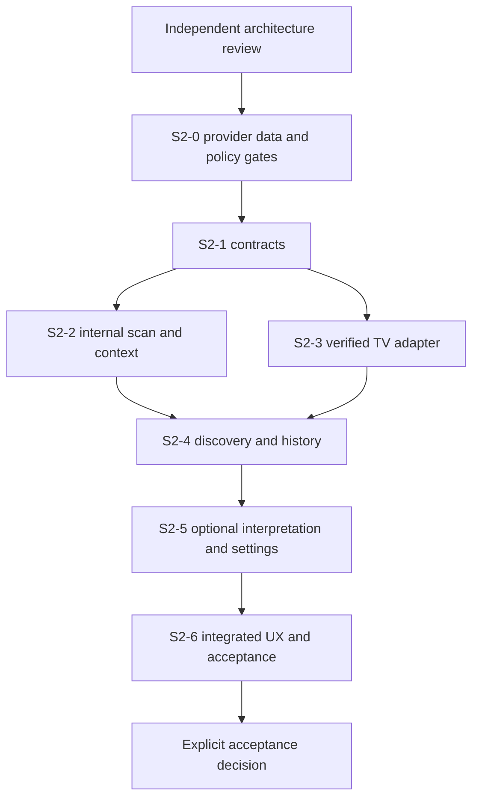

# TWF Sprint-2 Scan & Discover Delivery Plan

## Status and authority

Current status: **ACCEPTED / IMPLEMENTATION AUTHORIZED**. Sprint 2 is **ACTIVE / NEXT; implementation not started**. The [independent acceptance record](TWF_SCAN_DISCOVER_ARCHITECTURE_ACCEPTANCE_REVIEW.md) supersedes v0.1 proposal status. Provider/data/policy gates still apply before their dependent slices; future-stage contracts remain conceptual.

| Version | Date       | Status                                   | Role and change                                                                                                                                 |
| ------- | ---------- | ---------------------------------------- | ----------------------------------------------------------------------------------------------------------------------------------------------- |
| 0.1     | 2026-09-28 | PROPOSED / RECONCILED / READY FOR REVIEW | Normative delivery proposal with bounded slices, dependencies and acceptance gates; no runtime implementation authorized by this document alone |
| 0.2 | 2026-09-29 | ACCEPTED / IMPLEMENTATION AUTHORIZED | Independent architecture acceptance and status reconciliation; bounded by the delivery plan and [review](TWF_SCAN_DISCOVER_ARCHITECTURE_ACCEPTANCE_REVIEW.md); no runtime implementation |

Read with the [S&D architecture](TWF_SCAN_AND_DISCOVER_ARCHITECTURE.md),
[Opportunity domain](TWF_OPPORTUNITY_DOMAIN_ARCHITECTURE.md) and
[reconciliation record](TWF_SCAN_DISCOVER_ARCHITECTURE_RECONCILIATION.md).
“Sprint 2” names this accepted delivery workstream, not a promised two-week estimate,
not a renaming of TWF-2, and not a retrospective “Sprint 1” acceptance claim.

## 1. Objective and starting point

Deliver an independently useful Scan & Discover system: a user can select an
approved universe/profile, scan, inspect matches, optionally discover candidates,
understand their evidence/context/freshness/relevance, refresh them and review
history without TI, TM, an LLM or a broker connection. Broker V2 remains independently
useful and unchanged. No trade can be submitted from S&D in this scope.

Repository reconnaissance at this proposal: `main`,
`69a643e372c48a6d3d85ce57962ca05c38c4c3dc`, clean before documentation edits,
`twf-broker-v2` at HEAD. TWF-0/TWF-1 and Broker V1/V2 acceptance are preserved.
The accepted API, auth, SQLAlchemy/Alembic, frontend/theme, settings and service-client
foundations are reusable. The current service-client implementation is health-only;
it does not already provide scans, intelligence, MCP or LLM inference. Existing
settings contain bounded personal preferences, not all proposed S&D configuration.

## 2. Explicit scope

| In this delivery               | Boundary                                                                                                                                                                   |
| ------------------------------ | -------------------------------------------------------------------------------------------------------------------------------------------------------------------------- |
| Provider-neutral S&D contracts | UniverseProvider, CandidateSource, ScanProvider, MarketIntelligenceProvider, CandidateIntelligenceProvider, LLMService; synthetic implementations prove seams              |
| Scan definitions and profiles  | Versioned bounded typed expression tree; capability validation before execution; no arbitrary code/SQL/provider tool text                                                  |
| Candidate-source seam          | Internal normalized scan source and a synthetic external-source contract proof; production external/manual/agent ingestion remains later                                   |
| TradingView MCP scan adapter   | Important first external adapter, gated by verified service/tool/auth/data-rights contract; never mandatory for core startup or internal scans                             |
| TWF internal scanner V0        | Bounded price/volume, SMA trend, relative volume and breakout rules over an approved independent data input; not a TradingView clone                                       |
| Normalization/merge/dedup      | Typed identities, units/time semantics, lineage and uncertainty; no symbol-only merges or duplicate-source confidence inflation                                            |
| Bounded market intelligence    | Benchmark trend, historical-volatility/regime measure and venue/session context; optional sector context if supported; not full TI                                         |
| Optional LLM Level-0           | Evidence-grounded explanations/comparisons/gap summaries; human-reviewed NL-to-definition drafts; one applied active binding; deterministic results unchanged with LLM OFF |
| Discovery                      | Intent/horizon, immutable snapshots, relevance, evidence, tolerance, freshness, recurrence and lifecycle                                                                   |
| Durable history                | Scan/discovery runs, outcomes/declined nominations, episodes, annotations and revisioned configuration references; restart and retention behavior                          |
| First-class settings           | Existing settings/capability/security model extended with approved typed descriptors and bounded UI                                                                        |
| Finished UX                    | Scan, Discovery and Scan + Discover; results, queue, details, evidence/history and settings; both themes and responsive layouts                                            |
| Verification                   | Deterministic offline coverage, disposable DB/browser/container checks and explicitly authorized read-only provider smoke                                                  |

**Out:** full TI/deep intelligence, Opportunity qualification, Trade Construction,
LOB implementation, TM managed integration, broker order entry from discovery,
automatic execution, alerts/notification platform, continuous/high-frequency
monitoring, production ML ranking, autonomous agents and self-learning activation.
Architectural hooks do not authorize endpoints/tables/UI for these later stages.

## 3. Baseline acceptance scenario and bounded configuration

The proposed initial product lane is listed cash-equity underlyings with an explicit
reference listing, initially NSE/BSE subject to approved data rights and reliable
identity/calendar coverage. A versioned completed-session swing profile (for example
1–5 trading sessions) provides meaningful deterministic use outside market hours.
An intraday/current-session profile is enabled only when verified fresh-data and
session-calendar capability is available. Do not describe EOD data as live.

This initial universe/profile selection is a **proposal requiring S2-0 approval**,
not a claim about data already licensed or available. The core accepts extensible
HorizonSpec values; synthetic contract tests cover session, elapsed, calendar and
event windows regardless of initial live entitlements. Additional live assets or
profiles require explicit capability/data acceptance, not new hard-coded domain types.

An internal scanner without an independent approved data source is not a completed
provider-independent live product. A fixture-only demonstration satisfies contract
checks but cannot close the final real-data delivery gate. The plan therefore
requires the data-source choice before implementation of the corresponding adapter.

Pin a small initial definition set: a price/liquidity filter; a price-above-SMA
trend filter; a relative-volume condition; and a breakout against a bounded prior
window. Select exact window lengths, missing-bar rules, adjustment basis and numerical
tolerances in S2-0/S2-2 fixtures. EMA/RSI/ATR/crossovers/52-week/pullback criteria are
extension targets unless separately selected by replacing, not endlessly expanding,
this bounded initial set. No universal “profitable” thresholds are asserted.

For a live adapter, complete a reviewed profile manifest with explicit limits:
maximum universe size, result/page count, historical rows, concurrent calls, response
bytes, total deadline, retry budget for safe reads, active runs per owner, LLM token/
cost cap, data-freshness thresholds, tolerance policy and retention classes. Missing
limits fail capability activation; defaults may not silently mean unlimited. Exact
operating values depend on the selected provider contract and deployment budget.

## 4. Gate S2-0 — architecture and external-contract resolution

The architecture part of S2-0 is accepted by the [2026-09-29 review](TWF_SCAN_DISCOVER_ARCHITECTURE_ACCEPTANCE_REVIEW.md). S2-0 is not wholly closed: the decisions below remain gates for the listed dependent work. Next prepare the bounded S2-1 domain/contracts and deterministic synthetic-fixture implementation prompt. It may proceed without real-provider bindings; it must fix its schema/fixture policy decisions before coding. Resolve these additional inputs before their dependent slices:

| Decision                | Required evidence and owner                                                                                                                                                                | Blocked dependent work if unresolved                                                                 |
| ----------------------- | ------------------------------------------------------------------------------------------------------------------------------------------------------------------------------------------ | ---------------------------------------------------------------------------------------------------- |
| TradingView MCP service | Maintainer/repository/service URL, pinned version, auth, permitted tools and exact request/response schemas, capability and rate limits; integration owner verifies authoritative material | Real TV adapter; no assumption that a service branded TradingView is official or has a universal API |
| TV/data licensing       | Rights to query, store, derive, display and send context to an LLM, including retention and redistribution; product/security owners record approval                                        | Real data ingestion/retention/egress claims                                                          |
| Independent market data | Approved historical/current data producer independent of TV, calendar and benchmark coverage, correction/adjustment policy; data/integration owners                                        | Live internal scanner and market-context acceptance                                                  |
| Reference identity      | Initial universe/listing keys, mapping ambiguity behavior and canonicalization source; domain owner                                                                                        | Cross-provider identity merge beyond explicit exact mappings                                         |
| Initial profiles        | Universe, horizons/calendar, bounded scan set, market-context requirement, scoring features/weights, coverage, tolerance/freshness thresholds; product/domain owners                       | Reproducible live nomination and lifecycle acceptance                                                |
| Optional hosted LLM     | One permitted adapter/model binding, data-egress policy, budgets and grounding schema; security/integration owners                                                                         | LLM-enabled production mode; LLM OFF remains valid                                                   |
| Retention/operations    | Licensed capture rules, user deletion/tombstones, retention periods, limits and interrupted-run recovery; engineering/security owners                                                      | Production persistence/operational acceptance                                                        |

No source/server or vendor-specific schema was verified in this documentation task.
Do not invent a dependency or promise real integration from diagrams. If TV cannot
be contracted, explicitly re-scope that slice through review; do not silently omit
it and claim all Sprint-2 acceptance criteria passed. Likewise a missing LLM provider
may leave deterministic S&D useful but must be reflected in feature acceptance.

Exit: reviewed architecture decisions, resolved gates for the next slice, approved
implementation prompt, and explicit known limitations. Documentation readiness is
not runtime GO or permission to contact paid/live providers with stored credentials.

## 5. Delivery slices and acceptance evidence

Slices are dependency groups, not new permanent milestone IDs. Each needs a bounded
implementation prompt, isolated tests and independent acceptance before claiming
completion. Preserve prior accepted work rather than resetting its status.

| Slice                                     | Delivery                                                                                                                                                   | Dependencies                                             | Acceptance evidence                                                                                                                                                       |
| ----------------------------------------- | ---------------------------------------------------------------------------------------------------------------------------------------------------------- | -------------------------------------------------------- | ------------------------------------------------------------------------------------------------------------------------------------------------------------------------- |
| S2-1 Domain and contracts                 | Shared subject/intent/horizon, typed evidence/run/result envelopes, provider manifests, capability/entitlement checks and deterministic synthetic fixtures | S2-0 core decisions                                      | No scan-provider types in core; absent provider healthy app startup; schema/unknown-field/version/error/ownership tests; non-scan CandidateSource exercised               |
| S2-2 Native scan and definitions          | Universe resolution, approved independent data reader, versioned profiles, safe expressions, V0 scanner and bounded internal market context                | S2-1 and data/calendar/profile gates                     | Known inputs yield expected matches/context; bad/missing/late data and unsupported criteria fail honestly; full scan-only without TV/LLM                                  |
| S2-3 External adapter and normalization   | Verified TradingView MCP adapter, local/remote contract parity, normalized results and merge/dedup with actual provenance                                  | S2-1 and verified TV contract; S2-2 provides alternative | Adapter fixtures and authorized read-only smoke; TV unavailable scenario still permits explicit internal run; no silent fallback; schema/timeout/size/rate/security cases |
| S2-4 Discovery and history                | Durable runs, episodes/S1…Sn, context/evidence, deterministic configurable relevance, tolerance/lifecycle, save/review/dismiss and history                 | S2-2; S2-3 exercises multi-provider inputs               | No-LLM Scan + Discover; immutable history; same subject multiple intents and recurring episodes; concurrency/restart/isolation/retention tests                            |
| S2-5 Optional interpretation and settings | Existing configuration model extensions, one active hosted LLM binding, validated grounding, NL draft review, costs/egress safeguards                      | S2-4 and selected LLM/security gate                      | LLM OFF/failure leaves deterministic results usable; two interchangeable synthetic adapters; factual citation rejection, context-only UX and safe schema migration        |
| S2-6 Finished UX and acceptance           | Coherent Scan/Discovery/Scan + Discover screens, queue/details/history/settings, accessibility/responsiveness and release documentation                    | Prior slices with accepted required external gates       | User journeys, negative/security tests, browser matrix, production/container build, review and explicit milestone decision                                                |

UI contracts and accessibility fixtures should be developed with each slice; S2-6
is integration/quality closure, not permission to leave unusable intermediate controls.
S2-5 needs one real hosted binding when that feature is accepted, not three commercial
integrations. Replaceability is demonstrated with contract fixtures; experimental
local inference is not a production prerequisite.

## 6. Run, persistence and deployment boundary

Start within the existing modular FastAPI application and Next.js frontend. No
separate scanner microservice, message broker, Redis, distributed scheduler or
market-data warehouse is prescribed. Local in-process adapters and approved remote
adapters have the same typed semantics. A future dedicated worker requires an
operational decision, not an accidental framework side effect.

A user-triggered bounded run records QUEUED/RUNNING and terminal SUCCEEDED, PARTIAL,
FAILED, CANCELLED or INTERRUPTED state. Restart reconciliation marks abandoned work
interrupted; an explicit retry creates a linked attempt. Generation fencing rejects
late responses. Provider I/O happens outside DB write transactions; snapshot/events/
head changes commit atomically under ownership/revision checks. No implicit perpetual
background refresh is required. GET can compute time-based STALE/EXPIRED projections
without mutating storage, while explicit bounded evaluation persists decisions.

Alembic owns schema evolution. Exercise disposable SQLite and PostgreSQL migrations,
repeat upgrades and downgrade/re-upgrade as appropriate. Isolate tests from developer
and production DBs; do not import live broker credentials. `/ready` retains accepted
application-only meaning; provider/data degradation is a typed S&D result and UI state.
No discovery failure should disable otherwise healthy Broker V2 access.

## 7. UX acceptance journeys

1. **Scan only:** choose permitted universe/profile, inspect criteria and available
   provider capabilities, run, see normalized matches with source/as-of/completeness,
   open a match and review run history. No candidate creation is forced.
2. **Scan + Discover, LLM OFF:** run a profile, see eligible candidates or an explained
   no-nomination result, relevance/coverage, intent/window, market context and evidence.
   No blank dependency panel implies TI/LLM is required.
3. **Discovery queue:** filter by intent/horizon/relevance/freshness/status, save/review/
   dismiss with clear consequences, inspect S1…Sn and transition reasons, refresh a
   selected candidate without silently extending its opportunity window.
4. **Temporal behavior:** show provisional S1, genuine subsequent evolution, ordinary
   pullback in the same episode, stale without invalidity, defunct recovery, expiry,
   rejection and a later new episode linked to history.
5. **Optional interpretation:** distinguish GROUNDED/PARTIALLY_GROUNDED/CONTEXT_ONLY,
   open actual input evidence citations, see missing/old context, disable/rebind LLM
   without changing deterministic scores. NL drafts require explicit review/validation.
6. **Provider failure/settings:** unsupported criteria disabled with reason, revoked
   entitlement cannot run, timeout/partial/empty separated, switch explicitly to an
   eligible internal profile, saved settings revision and applied revision visible.

Use existing theme tokens, eight surface-state primitives and keyboard/focus patterns.
Review 390, 768, 1024, 1440, 1920 and 2560+ widths in both themes. Recompose result
lists/detail panes; allow contained tabular overflow while preserving source identity
and primary actions. Do not show fake dashboard metrics, invented probability or
Buy/Sell/Send to LOB controls. Existing shell navigation placeholders are not evidence
of implemented S&D. Specify final nav/route names during the UX implementation gate.

## 8. Test and acceptance matrix

Tests must verify failure behavior and invariants, not mirror implementation or rely
on a real service being online. Use fixed clocks, controlled calendars, known units,
source availability timestamps and seeded deterministic fixtures.

| Category                   | Required regressions / meaningful oracle                                                                                                                                                  |
| -------------------------- | ----------------------------------------------------------------------------------------------------------------------------------------------------------------------------------------- |
| Domain                     | Ambiguous symbols; listing vs underlying; owner collision; multiple intents; horizon basis/event/window semantics; no discovery execution authority                                       |
| Scan definition            | Typed operator/units/window validation; unsupported capability; bounded AST; no arbitrary expression execution; versioned drafts vs applied profile                                       |
| Provider contracts         | Local/remote/synthetic same envelope; actual source mode; capabilities vs health vs entitlement; missing vs empty vs partial; schema/version mismatch                                     |
| Synthetic providers        | Repeatable clocks/scenarios; delayed/partial/conflicting/malformed observations; external CandidateSource without scanning                                                                |
| TV MCP adapter             | Pinned tool/schema fixtures; allowed tools only; auth redaction; total deadline including streaming/parsing; byte/page bounds; rate limit; no arbitrary URL/tool invocation               |
| Internal scanner           | Hand-checkable features, missing bars, zero volume/divisor, unadjusted vs adjusted basis, trading calendar, insufficient lookback, unavailable data; no TV dependency                     |
| Market context             | Benchmark trend/volatility/session expected values; stale/missing benchmark; sector optional; incompatible context basis and provider conflict surfaced                                   |
| Normalization              | Decimal/units/time conversion; unknown IDs; future timestamps; exact native references preserved; correction and out-of-order handling                                                    |
| Dedup                      | Same observation replay not new evidence; cross-source syndicated lineage not independent confirmation; same underlying across listings not blindly collapsed                             |
| Relevance                  | Deterministic contributions, null vs zero, required-input refusal, optional missingness not inflation, dependence caps, exact band edges/display rounding, no-LLM invariance              |
| Snapshot/history           | Append-only/correction links, head CAS, two comparable distinct observations required; replays do not rewrite history; raw-retention limit shows incomplete reproducibility               |
| Lifecycle/tolerance        | Normal pullback, multidimensional breach, recovery, no timer-only defunct, stale projection, fixed expiry, reasoned terminal rejection, no resurrection/new episode linkage               |
| LLM OFF                    | No inference call, credential requirement or missing-LLM failure; useful scans/context/candidates with same deterministic output                                                          |
| Grounded LLM               | Valid eligible citations; fabricated/wrong-owner/stale citations fail validation; prompts untrusted; generated facts cannot fill raw evidence; no lifecycle/score control                 |
| Context-only LLM           | Clear label and no current-fact presentation; no verified-grounded badge; qualitative output not substituted for missing measurements                                                     |
| Capability/config/security | Existing descriptor/scopes/apply semantics; stale revision conflict; provider rebind/secret rotation; owner denial; revocation checked at use; endpoint SSRF/egress and no secret leakage |
| Failure/degraded UX        | Offline provider, timeout, cancelled run, partial data, invalid response, quota and stale cache; retain prior valid history with explicit age; no fabricated empty success                |
| Persistence/restart        | SQLite and PostgreSQL, concurrent nomination uniqueness, atomic snapshot+head, interrupted recovery, fencing, repeated retry correlation, non-mutating GET, isolated migrations           |
| Frontend                   | Keyboard labels/focus, state primitives, filter ownership, pagination under dataset revision, view pinned to snapshot, responsive panes, theme contrast, safe rendering of untrusted text |
| Browser E2E                | Scan-only and Scan + Discover with no LLM/TV; optional LLM grounding, lifecycle/history/settings, authentication/isolation; Chromium and WebKit where environment permits                 |
| Scope/regression           | Broker V2 read/manual flow unchanged, no live orders submitted by tests, no TI/TM/LOB runtime claimed, dependency/secret/docs checks                                                      |

Do not infer WebKit compatibility from Chromium. Recheck the known host/runtime
limitation with an application-independent probe if it recurs; report an environmental
block and residual uncertainty separately from a TWF defect. Never silently mark a
browser passed when it did not execute.

## 9. Validation and evidence required at implementation acceptance

- Backend: pytest, Ruff lint/format, strict mypy, Python compilation, dependency
  consistency/audit, OpenAPI/schema construction and contract snapshots.
- Database: disposable SQLite/PostgreSQL migrations and behavior, contention and
  owner isolation, restart recovery, no production auto-migration.
- Frontend: type-check, lint, unit/interaction tests, Prettier, production build,
  deterministic browser suites and representative rendered UX checks.
- Operations: Compose validation, clean relevant image builds, app health/readiness,
  bounded run/provider smoke and interruption recovery; no unintended remote writes.
- Documentation/security: links, architecture/contract/settings accuracy, secret and
  dependency review, clean diff checks, recorded limitations and exact test counts.

Counts from earlier Broker V2 validation are historical evidence, not acceptance
of future S&D. Tests for this documentation-only task are structural/link/diagram/
consistency and scope checks; runtime suites are not rerun to imply nonexistent
S&D implementation passed them.

## 10. Milestone mapping and final gate

Sprint 2 contributes to TWF-3 scanning/discovery and the bounded TWF-2.3 candidate
workspace, with extensions of TWF-1.5 settings/TWF-1.6 client seams. It does not
reopen those frozen foundations or mark all TWF-2/TWF-3 complete. LLM Level-0 is a
bounded early interpretation slice, not acceptance of TWF-4 TI/deep intelligence.
It advances UX-B2's independent discovery usefulness, not full UX-B2 or UX-B3 closure.
TWF-5 managed authority, TWF-6 complete workflow and TWF-7–10 keep separate gates.

The join means final external-provider scope must be reviewed; discovery development
and deterministic use do not wait on TV runtime availability. Implementation may
parallelize independent slices after contracts are fixed, without weakening gates.

Final review must independently demonstrate: useful scan-only and Scan + Discover;
viable internal path with no TV and no LLM; truthful source/freshness/grounding;
immutable lineage and correct lifecycle; configurable deterministic relevance;
provider replacement and safe failure; finished responsive UX; isolation and
operational recovery; and zero expansion into trade authority or later-stage runtime.

**Current decision:** architecture **ACCEPTED / IMPLEMENTATION AUTHORIZED** under the [independent review](TWF_SCAN_DISCOVER_ARCHITECTURE_ACCEPTANCE_REVIEW.md). Sprint 2 is **ACTIVE / NEXT; implementation not started**. The next implementation gate is a bounded S2-1 domain/contracts and synthetic-fixture prompt, with the slice-specific S2-0 decisions recorded first. External adapters, real-data use and LLM egress remain blocked on their own unresolved gates; no runtime acceptance or freeze is claimed.
